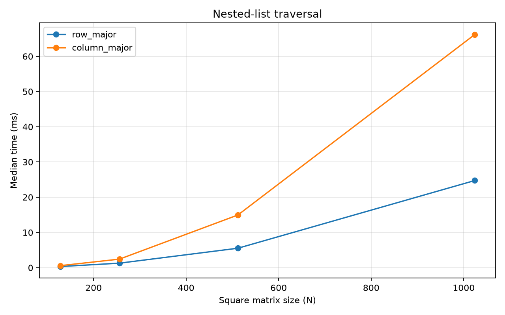

# Experiment 01 — Python Nested-List Traversal

[English](#english) · [한국어](#한국어)



---

## English

### 1. Research Question

How does traversal order affect the execution time of a square Python `list[list[int]]`?

### 2. Background

#### What is a CPU cache?

The CPU can execute instructions much faster than main memory can supply data. A CPU cache is a small, fast memory between the CPU cores and RAM that keeps recently used data. Modern CPUs usually have multiple levels: L1 is the smallest and fastest, L2 is larger, and L3 is larger again and often shared by cores.

Data normally moves from memory to a cache in fixed-size blocks called **cache lines**, commonly 64 bytes. When a program reads one address, nearby bytes arrive in the same cache line. Reading nearby data soon afterward can therefore be cheap (**spatial locality**), while reusing recently accessed data benefits from **temporal locality**. If the required cache line is absent, a cache miss must be served from a slower cache level or RAM.

#### How is a nested Python list stored?

A `list[list[int]]` is not one contiguous two-dimensional numeric buffer. The outer list contains references to separate row-list objects. Each row list contains references to Python integer objects. In this benchmark, values are limited to `0..255`, so CPython commonly reuses its cached small-integer objects; the row lists still contain separate reference arrays.

Row-major traversal keeps consuming references from the current row list. This is friendly to spatial locality and uses the row object already held by the loop. Column-major traversal repeatedly selects a different row and then indexes one element from it. This touches many row-list storage areas and performs `matrix[row][column]` on every element.

#### Why might row-major be faster?

- Consecutive entries in one row's reference array are close together and may share cache lines.
- Column-major access jumps among separate row lists, potentially requiring more cache lines and translation lookups.
- `for value in row` directly iterates a list, whereas `matrix[row][column]` performs two indexed lookups per element.
- Python bytecode dispatch, reference handling, integer unboxing/checking, and addition are expensive relative to a native numeric loop.

The measured difference therefore combines memory-access behavior with different Python-level work. Timing alone cannot prove that CPU cache misses caused the difference. Hardware performance counters or a lower-level implementation would be needed to isolate cache effects more directly.

### 3. Hypothesis

Row-major traversal will have a lower median time, with a larger relative difference as matrices grow. Cache locality may contribute, but interpreter and indexing overhead will also affect the result.

### 4. Experimental Setup

- CPython 3.13.5, 64-bit Windows 11 for the reference run
- Square sizes: 128, 256, 512, and 1024
- `time.perf_counter()` timer
- 2 untimed warmups and 15 timed repetitions per method
- Identical matrix and integer values for both methods
- Method order randomized within every repetition using seed `20260711`
- Garbage collection disabled only during timed sections
- Raw CSV, summary CSV, environment metadata, and a figure generated locally

The randomized order means the column method sometimes runs first and the row method sometimes runs first. This reduces systematic warm-cache, CPU boost, and first-run bias; it does not assume that either method must always run first.

```bash
uv run python experiments/exp01_list_traversal/benchmark.py
uv run python experiments/exp01_list_traversal/benchmark.py --quick
```

### 5. Variables

- Independent: traversal method and matrix size
- Dependent: elapsed seconds
- Controlled: matrix object, values, data type, repetitions, warmups, timer, and process
- Recorded: Python version, operating system, seed, timestamp, and all individual timings

### 6. Implementation

`benchmark.py` creates one matrix per size and verifies that both traversals produce the same checksum. Every measurement is saved to `results/raw.csv`. `results/summary.csv` records mean, median, sample standard deviation, minimum, and maximum. The median is the primary statistic because it is less sensitive to occasional scheduling or background-process delays.

### 7. Results

Reference run on 2026-07-11; values below are medians of 15 repetitions.

| Size | Row-major | Column-major | Column / row |
| ---: | ---: | ---: | ---: |
| 128 | 0.328 ms | 0.579 ms | 1.76× |
| 256 | 1.287 ms | 2.432 ms | 1.89× |
| 512 | 5.528 ms | 14.961 ms | 2.71× |
| 1024 | 24.746 ms | 66.193 ms | 2.67× |

Row-major traversal had the lower median at every tested size. The relative gap was larger for sizes 512 and 1024.

### 8. Discussion

The result is consistent with better row-wise locality, but it does not isolate locality. Row-major iteration also executes a cheaper Python access pattern. Running column-major first can change an individual pair because of cache warming, CPU frequency, or scheduling, but always running it first would merely replace one order bias with another. Randomizing each pair and comparing distributions is the more reliable control.

Python nested lists and NumPy arrays must not be treated as equivalent. NumPy can store unboxed numbers in a contiguous C-order or F-order buffer and run loops in compiled code, making memory layout much more directly observable.

### 9. Conclusion

In the reference environment, row-major traversal was 1.76–2.71 times faster by median. The experiment shows that traversal implementation matters, but cannot claim CPU cache as the sole cause because Python indexing and interpreter costs differ between the methods.

### 10. Limitations

Results vary with CPU, Python build, thermal state, CPU frequency, operating-system scheduling, and background work. Only square matrices and small cached integers were tested. No hardware counters were collected, and the two methods do not execute identical Python operations.

### 11. Next Experiment

Compare NumPy C-order and F-order arrays. Explicit contiguous layouts and compiled iteration will make the relationship between memory layout and traversal order clearer.

---

## 한국어

### 1. 연구 질문

Python의 정사각형 `list[list[int]]`를 순회할 때 행 우선과 열 우선 접근 순서가 실행 시간에 어떤 영향을 주는가?

### 2. 배경

#### CPU 캐시란?

CPU는 메인 메모리에서 데이터를 가져오는 속도보다 훨씬 빠르게 명령을 실행할 수 있다. CPU 캐시는 CPU 코어와 RAM 사이에서 최근 사용한 데이터를 보관하는 작고 빠른 메모리다. 일반적으로 가장 작고 빠른 L1, 더 큰 L2, 여러 코어가 공유하기도 하는 L3 캐시가 있다.

데이터는 보통 **캐시 라인**이라는 고정 크기 블록으로 이동하며, 흔한 크기는 64바이트다. 한 주소를 읽으면 그 주변 데이터도 함께 캐시로 들어온다. 따라서 가까운 데이터를 연속해서 읽는 것은 **공간 지역성**, 최근 읽은 데이터를 다시 사용하는 것은 **시간 지역성**의 이점을 얻을 수 있다. 필요한 데이터가 캐시에 없다면 더 느린 상위 캐시나 RAM에서 가져와야 한다.

#### Python 중첩 리스트는 어떻게 저장되는가?

`list[list[int]]`는 숫자가 하나의 연속된 2차원 버퍼에 저장되는 구조가 아니다. 바깥 리스트는 서로 분리된 각 행 리스트의 참조를 저장하고, 각 행 리스트는 다시 Python 정수 객체의 참조를 저장한다. 이번 구현은 값을 `0..255`로 제한하므로 CPython이 캐시한 작은 정수 객체가 일반적으로 재사용되지만, 각 행의 참조 배열은 여전히 서로 분리되어 있다.

행 우선 순회는 현재 행 리스트 안의 참조를 연속해서 소비한다. 이는 공간 지역성에 유리하며 이미 가져온 행 객체를 계속 사용할 수 있다. 열 우선 순회는 매번 다른 행을 선택한 뒤 그 안의 한 원소를 인덱싱한다. 따라서 여러 행 리스트의 저장 영역을 오가며 모든 원소마다 `matrix[row][column]` 연산을 수행한다.

#### 왜 행 우선이 더 빠를 수 있는가?

- 한 행의 연속된 참조들은 메모리상 가까워 같은 캐시 라인에 들어올 가능성이 있다.
- 열 우선 접근은 서로 분리된 행 리스트 사이를 이동하므로 더 많은 캐시 라인과 주소 변환이 필요할 수 있다.
- `for value in row`는 리스트를 직접 반복하지만 `matrix[row][column]`은 원소마다 두 번의 인덱스 조회를 수행한다.
- Python 바이트코드 실행, 참조 처리, 정수 객체 확인과 덧셈 비용은 네이티브 숫자 반복문보다 크다.

따라서 측정된 차이에는 메모리 접근 패턴뿐 아니라 서로 다른 Python 연산 비용도 함께 들어 있다. 실행 시간만으로 CPU 캐시 미스가 원인이라고 증명할 수는 없다. 캐시 효과를 더 직접적으로 분리하려면 하드웨어 성능 카운터나 저수준 구현이 필요하다.

### 3. 가설

행 우선 순회의 중앙값이 더 낮고, 배열이 커질수록 상대적인 차이가 커질 것이다. 캐시 지역성이 영향을 줄 수 있지만 인터프리터와 인덱싱 비용도 결과에 포함될 것이다.

### 4. 실험 환경

- 기준 실행 환경: CPython 3.13.5, 64비트 Windows 11
- 정사각형 크기: 128, 256, 512, 1024
- `time.perf_counter()` 사용
- 조건별 워밍업 2회, 측정 15회
- 두 방식에 동일한 행렬과 정수 값 사용
- 각 반복에서 실행 순서를 seed `20260711`로 무작위화
- 측정 구간에서만 가비지 컬렉션 비활성화
- 원시 CSV, 요약 CSV, 환경 정보와 그림 생성

무작위화했기 때문에 어떤 반복에서는 열 우선이 먼저 실행되고, 다른 반복에서는 행 우선이 먼저 실행된다. 이는 캐시 워밍, CPU 부스트와 첫 실행 편향을 줄이기 위한 것이다. 어느 한 방식을 항상 먼저 실행하는 것도 또 다른 순서 편향을 만든다.

```bash
uv run python experiments/exp01_list_traversal/benchmark.py
uv run python experiments/exp01_list_traversal/benchmark.py --quick
```

### 5. 변수

- 독립 변수: 순회 방식과 행렬 크기
- 종속 변수: 실행 시간
- 통제 변수: 행렬 객체, 값, 데이터 타입, 반복 횟수, 워밍업, 타이머와 프로세스
- 기록 정보: Python 버전, 운영체제, seed, 시각과 모든 개별 측정값

### 6. 구현

`benchmark.py`는 크기별로 행렬 하나를 만들고 두 순회의 체크섬이 같은지 검증한다. 모든 측정값은 `results/raw.csv`에, 평균·중앙값·표본 표준편차·최솟값·최댓값은 `results/summary.csv`에 저장한다. 일시적인 스케줄링과 백그라운드 작업의 영향을 덜 받는 중앙값을 주요 통계로 사용한다.

### 7. 결과

2026-07-11 기준 실행 결과이며, 아래 값은 15회 측정의 중앙값이다.

| 크기 | 행 우선 | 열 우선 | 열 / 행 |
| ---: | ---: | ---: | ---: |
| 128 | 0.328 ms | 0.579 ms | 1.76× |
| 256 | 1.287 ms | 2.432 ms | 1.89× |
| 512 | 5.528 ms | 14.961 ms | 2.71× |
| 1024 | 24.746 ms | 66.193 ms | 2.67× |

시험한 모든 크기에서 행 우선 순회의 중앙값이 낮았다. 512와 1024에서는 상대적인 차이가 더 크게 나타났다.

### 8. 논의

결과는 행 방향의 지역성이 더 좋다는 설명과 일치하지만 지역성만을 분리해 측정한 것은 아니다. 행 우선 구현은 Python 수준에서도 더 저렴한 접근 패턴을 사용한다. 열 우선을 먼저 실행하면 캐시 워밍, CPU 주파수 또는 스케줄링 때문에 개별 측정 쌍이 달라질 수 있다. 하지만 열 우선을 항상 먼저 실행하면 반대 방향의 순서 편향이 생긴다. 매 반복마다 순서를 무작위화하고 전체 분포를 비교하는 것이 더 안정적인 통제 방법이다.

Python 중첩 리스트와 NumPy 배열은 동일한 구조로 해석하면 안 된다. NumPy는 박싱되지 않은 숫자를 연속된 C-order 또는 F-order 버퍼에 저장하고 컴파일된 반복문을 사용할 수 있으므로 메모리 배치의 영향을 더 직접적으로 관찰할 수 있다.

### 9. 결론

기준 환경에서 행 우선 순회는 중앙값 기준 1.76~2.71배 빨랐다. 순회 구현이 성능에 중요하다는 결과지만, 두 방식의 Python 인덱싱과 인터프리터 비용도 다르므로 CPU 캐시만을 유일한 원인으로 단정할 수 없다.

### 10. 한계

CPU, Python 빌드, 발열 상태, CPU 주파수, 운영체제 스케줄링과 백그라운드 작업에 따라 결과가 달라질 수 있다. 정사각형 행렬과 캐시된 작은 정수만 시험했으며 하드웨어 카운터를 수집하지 않았다. 두 구현이 수행하는 Python 연산도 완전히 동일하지 않다.

### 11. 다음 실험

NumPy의 C-order와 F-order 배열을 비교한다. 명시적인 연속 메모리 배치와 컴파일된 반복을 이용하면 메모리 배치와 순회 순서의 관계를 더 분명하게 확인할 수 있다.
