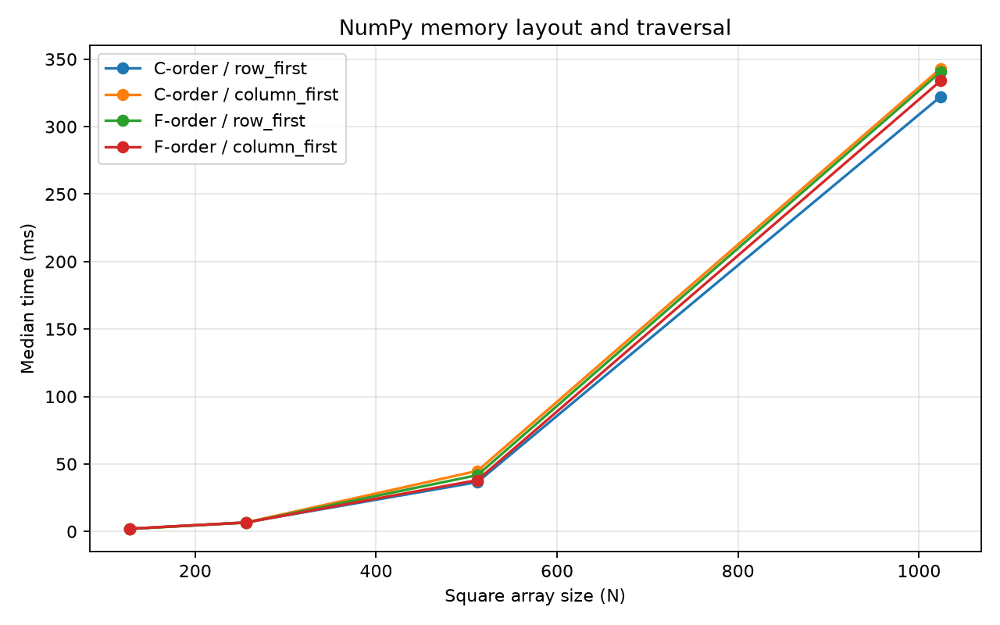

# Experiment 02 — NumPy Memory Layout

[English](#english) · [한국어](#한국어)



---

## English

### 1. Overview

This experiment tests whether traversal becomes faster when its direction matches the contiguous dimension of a NumPy array. It compares C-order and F-order `int64` arrays using row-first and column-first scalar access.

### 2. Background

NumPy stores an array's numeric values in a flat memory buffer. A C-order `(N, N)` array keeps adjacent columns next to each other, while an F-order array keeps adjacent rows next to each other. The `strides` tuple gives the byte jump for moving one position along each axis. For an `int64` array, the expected strides are `(8N, 8)` in C order and `(8, 8N)` in F order.

Accessing the dimension with an 8-byte stride should make better use of cache lines than repeatedly jumping `8N` bytes. However, this benchmark performs explicit scalar indexing in Python. Interpreter, loop, bounds-checking, and NumPy-scalar conversion costs can mask part of the memory-layout effect, especially for small arrays.

### 3. Research Question

Are row-first traversals faster on C-order arrays and column-first traversals faster on F-order arrays?

### 4. Hypothesis

The layout-matched combinations—C/row-first and F/column-first—will have lower median execution times. The difference should become more visible once the array is large enough that memory access matters relative to Python loop overhead.

### 5. Experimental Setup

- CPython 3.13.5, NumPy 2.5.1, 64-bit Windows 11 for the reference run
- Square `int64` arrays with sizes 128, 256, 512, and 1024
- Four conditions: C/row-first, C/column-first, F/row-first, F/column-first
- `time.perf_counter()` timer
- 2 untimed warmups and 15 timed repetitions per condition
- Condition order randomized within each repetition using seed `20260712`
- Garbage collection disabled only during timed sections
- Identical values and checksums across layouts and traversal directions

```bash
uv run python experiments/exp02_numpy_memory_layout/benchmark.py
uv run python experiments/exp02_numpy_memory_layout/benchmark.py --quick
```

Independent variables are memory layout, traversal direction, and array size. Elapsed time is the dependent variable. Data type, shape, values, timer, repetitions, warmups, and process are controlled. Raw timings, mean, median, sample standard deviation, extrema, slowdown ratio, strides, and environment metadata are recorded.

### 6. Benchmark Methodology and Implementation

`make_arrays()` creates value-identical C-order and F-order arrays. `traverse_rows()` and `traverse_columns()` use the same scalar indexing operation but reverse the nesting of the two loops. Checksums are verified before and during measurement. The median is the primary statistic because it is less sensitive to transient operating-system delays.

`slowdown_vs_matched` divides each condition's median by the median of the traversal expected to match that layout: row-first for C order and column-first for F order. A value above 1 indicates a slowdown relative to the matched traversal; measurement noise can produce a value below 1.

### 7. Results

Reference run on 2026-07-12; values are medians of 15 repetitions.

| Size | C / row | C / column | F / row | F / column |
| ---: | ---: | ---: | ---: | ---: |
| 128 | 1.926 ms | 1.964 ms | 1.968 ms | 2.053 ms |
| 256 | 6.725 ms | 6.647 ms | 6.488 ms | 6.605 ms |
| 512 | 36.578 ms | 44.893 ms | 41.735 ms | 38.061 ms |
| 1024 | 322.331 ms | 343.138 ms | 340.608 ms | 334.031 ms |

The clearest matched-layout effect occurred at size 512: column-first was 1.23× slower than row-first on the C-order array, while row-first was 1.10× slower than column-first on the F-order array. Results at 128 and 256 were close and did not consistently follow the hypothesis. At 1024, both mismatched traversals were slower, but only by 1.06× and 1.02×.

### 8. Discussion

The size-512 result is consistent with spatial locality: advancing through the dimension with the smaller stride uses nearby values. The full result is not monotonic, though, so it does not support a simple claim that a larger array must always create a larger ratio. Python scalar-loop overhead, CPU cache hierarchy, hardware prefetching, CPU-frequency changes, scheduling, and array alignment can all affect the observed ratios.

The stride metadata confirms that the intended layouts were created, but timings alone do not measure cache misses. This experiment therefore demonstrates an association between layout, traversal, and runtime rather than proving cache misses as the sole cause.

### 9. Conclusion

Layout-matched traversal was advantageous for the two larger arrays in the reference run and was most visible at size 512. Small-array results were effectively dominated by noise and Python-level overhead. Memory layout matters, but this scalar Python benchmark shows that its timing effect depends on array size and the surrounding runtime costs.

### 10. Limitations and Future Work

Results depend on CPU, NumPy and Python builds, thermal state, frequency scaling, operating-system scheduling, and background work. Only square `int64` arrays were tested. Python loops do not isolate raw memory bandwidth, and no hardware performance counters were collected. A future extension could repeat this same 2×2 design with a compiled loop and cache-miss counters, without changing the present experiment's conclusions.

Suggested commit message: `feat: add Experiment 02 NumPy memory-layout benchmark`

---

## 한국어

### 1. 개요

이 실험은 NumPy 배열의 연속 메모리 방향과 순회 방향이 일치할 때 더 빠른지 검증한다. C-order와 F-order `int64` 배열을 행 우선 및 열 우선 스칼라 접근으로 비교한다.

### 2. 배경

NumPy는 배열의 숫자 값을 하나의 평면 메모리 버퍼에 저장한다. `(N, N)` C-order 배열에서는 같은 행의 인접한 열이 연속되고, F-order 배열에서는 같은 열의 인접한 행이 연속된다. `strides`는 각 축으로 한 칸 이동할 때 건너뛰는 바이트 수다. `int64` 배열의 예상 strides는 C-order에서 `(8N, 8)`, F-order에서 `(8, 8N)`이다.

8바이트 stride 방향으로 접근하면 매번 `8N`바이트를 건너뛰는 것보다 캐시 라인을 효율적으로 사용할 가능성이 크다. 다만 이 벤치마크는 Python에서 명시적으로 스칼라 인덱싱한다. 인터프리터, 반복문, 경계 확인, NumPy 스칼라 변환 비용이 특히 작은 배열에서 메모리 배치 효과를 가릴 수 있다.

### 3. 연구 질문

C-order 배열에서는 행 우선 순회가, F-order 배열에서는 열 우선 순회가 더 빠른가?

### 4. 가설

메모리 배치와 순회가 일치하는 C/행 우선 및 F/열 우선 조합의 실행 시간 중앙값이 더 낮을 것이다. 배열이 충분히 커져 Python 반복문 비용에 비해 메모리 접근의 영향이 커지면 차이가 더 뚜렷할 것으로 예상한다.

### 5. 실험 환경

- 기준 실행 환경: CPython 3.13.5, NumPy 2.5.1, 64비트 Windows 11
- 정사각형 `int64` 배열 크기: 128, 256, 512, 1024
- 네 조건: C/행 우선, C/열 우선, F/행 우선, F/열 우선
- `time.perf_counter()` 타이머
- 조건별 워밍업 2회, 측정 15회
- 각 반복의 조건 실행 순서를 seed `20260712`로 무작위화
- 측정 구간에서만 가비지 컬렉션 비활성화
- 모든 배치와 순회에서 동일한 값과 체크섬 사용

```bash
uv run python experiments/exp02_numpy_memory_layout/benchmark.py
uv run python experiments/exp02_numpy_memory_layout/benchmark.py --quick
```

독립 변수는 메모리 배치, 순회 방향, 배열 크기이며 종속 변수는 실행 시간이다. 데이터 타입, 형태, 값, 타이머, 반복 및 워밍업 횟수와 프로세스를 통제한다. 개별 실행 시간, 평균, 중앙값, 표본 표준편차, 최솟값과 최댓값, slowdown ratio, strides와 환경 정보를 기록한다.

### 6. 벤치마크 방법과 구현

`make_arrays()`는 값이 같은 C-order 및 F-order 배열을 만든다. `traverse_rows()`와 `traverse_columns()`는 동일한 스칼라 인덱싱을 사용하되 두 반복문의 중첩 순서만 바꾼다. 측정 전과 측정 중에 체크섬을 검증한다. 운영체제의 일시적인 지연에 덜 민감한 중앙값을 주요 통계로 사용한다.

`slowdown_vs_matched`는 각 조건의 중앙값을 해당 배치와 일치할 것으로 예상한 순회의 중앙값으로 나눈 값이다. C-order의 기준은 행 우선, F-order의 기준은 열 우선이다. 1보다 크면 일치 순회보다 느리다는 의미이며 측정 잡음 때문에 1보다 작게 나올 수도 있다.

### 7. 결과

2026-07-12 기준 실행 결과이며, 아래 값은 15회 측정의 중앙값이다.

| 크기 | C / 행 | C / 열 | F / 행 | F / 열 |
| ---: | ---: | ---: | ---: | ---: |
| 128 | 1.926 ms | 1.964 ms | 1.968 ms | 2.053 ms |
| 256 | 6.725 ms | 6.647 ms | 6.488 ms | 6.605 ms |
| 512 | 36.578 ms | 44.893 ms | 41.735 ms | 38.061 ms |
| 1024 | 322.331 ms | 343.138 ms | 340.608 ms | 334.031 ms |

배치 일치 효과는 크기 512에서 가장 분명했다. C-order 배열의 열 우선은 행 우선보다 1.23배 느렸고, F-order 배열의 행 우선은 열 우선보다 1.10배 느렸다. 128과 256에서는 차이가 작고 가설과 일관되지 않았다. 1024에서는 두 불일치 순회가 모두 느렸지만 차이는 각각 1.06배와 1.02배였다.

### 8. 논의

512의 결과는 작은 stride 방향으로 이동하며 가까운 값을 읽는 공간 지역성의 설명과 일치한다. 그러나 전체 결과는 단조롭게 변하지 않았으므로 배열이 커질수록 비율이 반드시 커진다고 할 수 없다. Python 스칼라 반복문 비용, CPU 캐시 계층, 하드웨어 프리페치, CPU 주파수 변화, 스케줄링과 배열 정렬이 관측된 비율에 영향을 줄 수 있다.

strides 기록은 의도한 메모리 배치가 만들어졌음을 확인하지만 실행 시간은 캐시 미스를 직접 측정하지 않는다. 따라서 이 실험은 메모리 배치·순회·실행 시간 사이의 연관성을 보여줄 뿐, 캐시 미스만이 유일한 원인이라고 증명하지 않는다.

### 9. 결론

기준 실행에서는 큰 두 배열에서 배치와 일치한 순회가 유리했고, 크기 512에서 차이가 가장 뚜렷했다. 작은 배열에서는 측정 잡음과 Python 수준의 비용이 우세했다. 메모리 배치는 중요하지만 이 스칼라 Python 벤치마크에서 나타나는 시간 차이는 배열 크기와 주변 런타임 비용에 따라 달라진다.

### 10. 한계와 향후 작업

CPU, NumPy와 Python 빌드, 발열 상태, 주파수 조절, 운영체제 스케줄링 및 백그라운드 작업에 따라 결과가 달라질 수 있다. 정사각형 `int64` 배열만 시험했으며 Python 반복문은 순수 메모리 대역폭을 분리하지 못한다. 하드웨어 성능 카운터도 수집하지 않았다. 향후에는 현재 결론을 바꾸지 않는 범위에서 같은 2×2 설계를 컴파일된 반복문과 캐시 미스 측정으로 반복할 수 있다.

추천 커밋 메시지: `feat: add Experiment 02 NumPy memory-layout benchmark`
