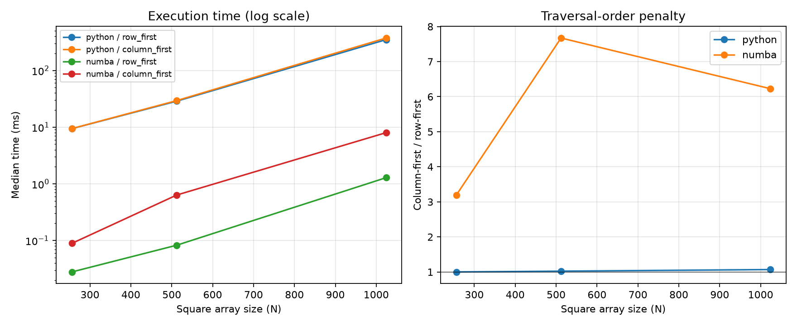

# Experiment 03 — Pure Python vs Numba

[English](#english) · [한국어](#한국어)



---

## English

### 1. Overview

This experiment measures how much Python loop overhead hides the performance effect of memory-access order. The same row-first and column-first traversal functions run as ordinary Python and as Numba `@njit`-compiled machine code over one C-order NumPy array.

### 2. Background

CPython executes each loop iteration, index operation, and addition through the interpreter. That fixed per-element work can dominate the cost of fetching array data. Numba compiles supported numerical Python into native code, removing most interpreter overhead. Once that overhead is reduced, the difference between contiguous row-first access and strided column-first access should be easier to observe.

This is a runtime comparison, not a compilation-latency comparison. The first call to each Numba function compiles it before timed warmups begin.

### 3. Research Question

How much does Python loop overhead hide the cache-locality difference between row-first and column-first traversal?

### 4. Hypothesis

Numba will substantially reduce execution time for both traversals. The column-first/row-first slowdown ratio will be much larger under Numba than under pure Python because interpreter overhead no longer dominates each array access.

### 5. Experimental Setup

- Reference environment: CPython 3.13.5, NumPy 2.4.6, Numba 0.66.0, 64-bit Windows 11
- C-order square `int64` arrays: 256, 512, and 1024
- Conditions: Python/Numba × row-first/column-first
- `time.perf_counter()` timer; 2 warmups and 11 timed repetitions
- First Numba compilation call excluded from timings
- Condition order randomized per repetition with seed `20260713`
- Garbage collection disabled only inside timed sections
- Identical array, traversal bodies, values, and verified checksums

```bash
uv run python experiments/exp03_python_vs_numba/benchmark.py
uv run python experiments/exp03_python_vs_numba/benchmark.py --quick
```

Independent variables are execution engine, traversal order, and array size. Elapsed time is the dependent variable. Array layout, shape, dtype, values, process, timer, warmups, and repetition count are controlled. CPU model, frequency, thermals, and background scheduling are not controlled by the script.

### 6. Benchmark Methodology and Implementation

`python_row_first()` and `python_column_first()` contain the two loop bodies. Numba dispatchers are created directly from those functions with `njit`, keeping the algorithm equivalent. `benchmark_size()` compiles and checks every condition, performs untimed warmups, randomizes each timed group, and verifies the checksum again.

All individual measurements are written to `results/raw.csv`. `results/summary.csv` contains mean, median, sample standard deviation, extrema, Numba speedup over Python, and the column-first/row-first slowdown. The median is the primary statistic. `results/metadata.json` records the runtime environment. The figure uses a log scale for execution time and separately plots the traversal penalty.

### 7. Results

Reference run on 2026-07-13; values are medians of 11 repetitions.

| Size | Python row | Python column | Numba row | Numba column | Numba speedup (row / column) |
| ---: | ---: | ---: | ---: | ---: | ---: |
| 256 | 9.399 ms | 9.414 ms | 0.028 ms | 0.089 ms | 336.89× / 105.65× |
| 512 | 28.680 ms | 29.343 ms | 0.083 ms | 0.633 ms | 347.64× / 46.35× |
| 1024 | 348.995 ms | 373.068 ms | 1.282 ms | 7.981 ms | 272.27× / 46.74× |

| Size | Python column / row | Numba column / row |
| ---: | ---: | ---: |
| 256 | 1.00× | 3.19× |
| 512 | 1.02× | 7.67× |
| 1024 | 1.07× | 6.23× |

### 8. Discussion

The reference result supports the hypothesis. Pure Python differed by at most 1.07× between traversal orders, while compiled traversal exposed a 3.19–7.67× column-first penalty. Removing interpreter work made contiguous memory access a much larger fraction of total runtime. Numba speedup was lower for column-first traversal because compilation cannot remove the cost of its unfavorable memory-access pattern.

The ratios should not be interpreted as cache-miss counts. Hardware prefetching, cache capacity, memory latency, CPU frequency, and compiler optimization also influence them. Numba and CPython also differ in integer execution semantics and generated instructions, so this experiment isolates interpreter removal operationally rather than proving one microarchitectural cause.

### 9. Conclusion

For this environment, Numba was 272–348× faster for row-first traversal and 47–106× faster for column-first traversal. The much larger traversal-order penalty after JIT compilation shows that Python loop overhead can substantially mask memory-locality effects.

### 10. Future Work

Repeat the same protocol on multiple CPUs and Python/Numba versions, record CPU frequency and thermal state, and collect hardware counters where available. Compilation latency could also be reported separately without mixing it into steady-state execution time.

Threats to validity include one operating system and CPU environment, only C-order square `int64` arrays, short Numba runtimes near timer-resolution and scheduling noise, and the absence of hardware performance counters.

Suggested commit message: `feat: add Experiment 03 Python vs Numba benchmark`

Suggested folder structure (implemented):

```text
experiments/exp03_python_vs_numba/
├── README.md
├── benchmark.py
├── figures/median_times.png
└── results/                 # generated CSV and metadata (gitignored)
```

---

## 한국어

### 1. 개요

이 실험은 Python 반복문 오버헤드가 메모리 접근 순서의 성능 차이를 얼마나 가리는지 측정한다. 하나의 C-order NumPy 배열에 대해 동일한 행 우선·열 우선 함수를 일반 Python과 Numba `@njit` 네이티브 코드로 실행한다.

### 2. 배경

CPython은 매 반복, 인덱싱, 덧셈을 인터프리터를 통해 처리한다. 이 원소별 고정 비용이 배열 데이터를 가져오는 비용보다 커지면 접근 순서의 영향이 잘 드러나지 않는다. Numba는 지원되는 수치 Python 코드를 기계어로 컴파일해 인터프리터 비용 대부분을 제거한다. 그러면 연속적인 행 우선 접근과 stride가 큰 열 우선 접근의 차이가 더 뚜렷해질 수 있다.

이 실험은 컴파일 지연이 아니라 정상 상태 실행 시간을 비교한다. 각 Numba 함수의 첫 호출은 측정 전 컴파일 단계로 제외한다.

### 3. 연구 질문

Python 반복문 오버헤드는 행 우선과 열 우선 순회 사이의 캐시 지역성 차이를 얼마나 가리는가?

### 4. 가설

Numba는 두 순회의 실행 시간을 크게 줄일 것이다. 인터프리터 비용이 더는 배열 접근을 지배하지 않으므로 열 우선/행 우선 slowdown ratio는 순수 Python보다 Numba에서 더 크게 나타날 것이다.

### 5. 실험 환경

- 기준 환경: CPython 3.13.5, NumPy 2.4.6, Numba 0.66.0, 64비트 Windows 11
- C-order 정사각형 `int64` 배열: 256, 512, 1024
- 조건: Python/Numba × 행 우선/열 우선
- `time.perf_counter()` 사용, 워밍업 2회, 측정 11회
- Numba 최초 컴파일 호출은 측정에서 제외
- seed `20260713`으로 매 반복의 조건 순서 무작위화
- 측정 구간에서만 가비지 컬렉션 비활성화
- 같은 배열·순회 본문·값을 사용하고 체크섬 검증

```bash
uv run python experiments/exp03_python_vs_numba/benchmark.py
uv run python experiments/exp03_python_vs_numba/benchmark.py --quick
```

독립 변수는 실행 엔진, 순회 순서, 배열 크기이며 종속 변수는 실행 시간이다. 배열 배치·형태·dtype·값·프로세스·타이머·워밍업과 반복 횟수는 통제한다. CPU 모델·주파수·발열과 백그라운드 스케줄링은 스크립트가 통제하지 않는다.

### 6. 벤치마크 방법과 구현

`python_row_first()`와 `python_column_first()`에 두 반복문을 구현하고 같은 함수를 `njit`에 전달해 알고리즘을 동일하게 유지한다. `benchmark_size()`는 모든 조건을 컴파일·검증하고, 워밍업한 뒤 각 측정 묶음의 실행 순서를 섞고 체크섬을 다시 검증한다.

개별 측정은 `results/raw.csv`에 기록한다. `results/summary.csv`에는 평균, 중앙값, 표본 표준편차, 최솟값·최댓값, Python 대비 Numba speedup, 열 우선/행 우선 slowdown을 저장한다. 중앙값을 주요 통계로 사용한다. `results/metadata.json`에는 실행 환경을 기록한다. 그림은 실행 시간을 로그 축으로, 순회 페널티를 별도 패널로 표현한다.

### 7. 결과

2026-07-13 기준 실행이며, 11회 측정의 중앙값이다.

| 크기 | Python 행 | Python 열 | Numba 행 | Numba 열 | Numba 향상 (행 / 열) |
| ---: | ---: | ---: | ---: | ---: | ---: |
| 256 | 9.399 ms | 9.414 ms | 0.028 ms | 0.089 ms | 336.89× / 105.65× |
| 512 | 28.680 ms | 29.343 ms | 0.083 ms | 0.633 ms | 347.64× / 46.35× |
| 1024 | 348.995 ms | 373.068 ms | 1.282 ms | 7.981 ms | 272.27× / 46.74× |

| 크기 | Python 열 / 행 | Numba 열 / 행 |
| ---: | ---: | ---: |
| 256 | 1.00× | 3.19× |
| 512 | 1.02× | 7.67× |
| 1024 | 1.07× | 6.23× |

### 8. 논의

기준 결과는 가설을 지지한다. 순수 Python의 순회 순서 차이는 최대 1.07배였지만 컴파일된 코드에서는 열 우선 페널티가 3.19~7.67배로 나타났다. 인터프리터 작업을 제거하자 연속 메모리 접근이 전체 실행 시간에서 차지하는 비중이 커졌다. 열 우선에서 Numba 향상 폭이 더 낮은 이유는 컴파일로 불리한 메모리 접근 비용까지 제거할 수는 없기 때문이다.

이 비율을 캐시 미스 횟수로 해석할 수는 없다. 하드웨어 프리페치, 캐시 용량, 메모리 지연, CPU 주파수와 컴파일러 최적화도 영향을 준다. Numba와 CPython의 정수 실행 의미 및 생성 명령도 다르므로 이 실험은 인터프리터 제거의 효과를 조작적으로 비교할 뿐 하나의 미시 구조 원인을 증명하지 않는다.

### 9. 결론

이 환경에서 Numba는 행 우선 순회를 272 ~ 348배, 열 우선 순회를 47 ~ 106배 빠르게 실행했다. JIT 컴파일 후 순회 순서 페널티가 훨씬 커졌다는 결과는 Python 반복문 오버헤드가 메모리 지역성 효과를 상당 부분 가릴 수 있음을 보여준다.

### 10. 향후 작업

여러 CPU와 Python/Numba 버전에서 같은 절차를 반복하고 CPU 주파수와 발열 상태를 기록할 수 있다. 가능한 환경에서는 하드웨어 카운터를 수집하고, 컴파일 지연을 정상 상태 실행 시간과 분리해 별도 보고할 수 있다.

한계는 단일 운영체제와 CPU 환경, C-order 정사각형 `int64` 배열만 사용한 점, 매우 짧은 Numba 실행이 타이머 해상도와 스케줄링 잡음에 민감한 점, 하드웨어 성능 카운터가 없다는 점이다.

추천 커밋 메시지: `feat: add Experiment 03 Python vs Numba benchmark`

제안 폴더 구조는 위에 표시한 형태로 구현했다.
