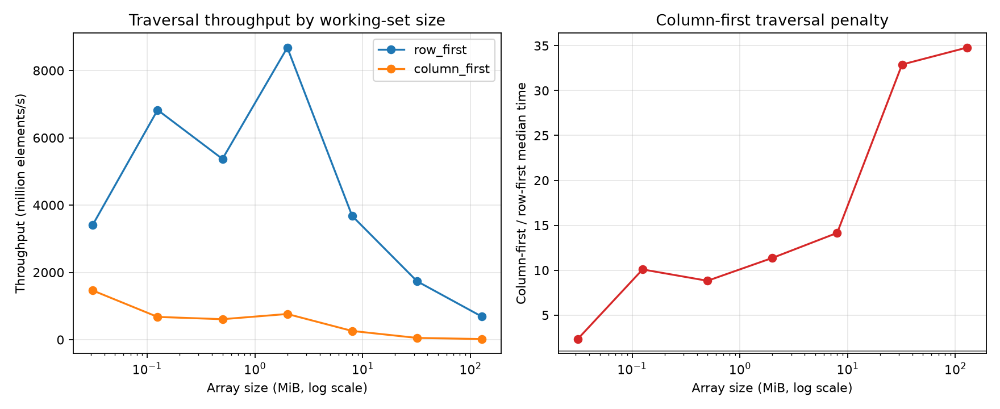

# Experiment 04 — Array Size Scaling

[English](#english) · [한국어](#한국어)



---

## English

### 1. Overview

This experiment measures whether the performance gap between contiguous row-first access and strided column-first access grows as a C-order NumPy array becomes larger. Numba-compiled loops reduce interpreter overhead so that the effect of access order can be observed across working sets from 0.03 MiB to 128 MiB.

### 2. Background

In a C-order two-dimensional array, adjacent columns within one row are contiguous in memory. Row-first traversal therefore reads consecutive `int64` values, while column-first traversal jumps by one full row on every access. Small working sets may remain in cache; larger ones create more cache and memory traffic. Array size alone does not identify a cache boundary, however, because cache associativity, prefetching, translation lookaside buffers, and other system effects also matter.

### 3. Research Question

Does the performance difference between row-first and column-first traversal increase as the array grows?

### 4. Hypothesis

Both traversal times will grow with the number of elements, but column-first throughput will deteriorate more sharply. Its median-time slowdown relative to row-first should generally increase once the working set no longer fits comfortably in the faster cache levels.

### 5. Experimental Setup

- Reference environment: CPython 3.13.5, NumPy 2.4.6, Numba 0.66.0, 64-bit Windows 11
- C-order square `int64` arrays with side lengths 64, 128, 256, 512, 1024, 2048, and 4096
- Working sets from 0.03 MiB to 128 MiB
- Conditions: Numba row-first and Numba column-first traversal
- `time.perf_counter()` timer; 2 warmups and 11 timed repetitions per condition
- First Numba compilation call excluded from timings
- Condition order randomized within each repetition using seed `20260714`
- Garbage collection disabled only inside timed sections
- Identical values and verified checksums for both traversal orders

```bash
uv run python experiments/exp04_array_size_scaling/benchmark.py
uv run python experiments/exp04_array_size_scaling/benchmark.py --quick
```

The independent variables are array size and traversal order. The dependent variables are elapsed time, throughput, and column-first/row-first slowdown. Dtype, C-order layout, square shape, values, compiled functions, process, timer, warmups, repetitions, and scheduling seed are controlled. CPU frequency, thermals, background scheduling, and cache state are not controlled by the script.

### 6. Benchmark Methodology and Implementation

`make_array()` creates one array per size. The `@njit`-compiled `row_first()` and `column_first()` functions visit every element and return an identical checksum. `benchmark_size()` compiles and validates both functions, performs untimed warmups, randomizes their order in each timed pair, and validates every result.

Individual observations are stored in `results/raw.csv`. `results/summary.csv` stores mean, median, sample standard deviation, extrema, throughput, and slowdown. `results/metadata.json` records the runtime environment. The median is the primary statistic because it is less sensitive than the mean to isolated scheduling delays.

Implementation order was: define equivalent traversal kernels, validate checksums, add randomized repeated timing, calculate summaries, persist metadata and CSV data, and generate the figure. The implemented files are shown in the folder structure below.

### 7. Measurements and Visualization

- Execution time in seconds for every run
- Median execution time per size and traversal
- Throughput in millions of elements per second
- Column-first median / row-first median slowdown
- Element count and working-set size in bytes

The left plot uses working-set MiB on a logarithmic x-axis and throughput on the y-axis. The right plot uses the same x-axis and the slowdown ratio on the y-axis. Together they show whether throughput and the access-order penalty change as the working set grows.

### 8. Results

Reference run on 2026-07-14 KST; values are medians of 11 repetitions.

| Side | Working set | Row-first | Column-first | Row throughput | Column throughput | Slowdown |
| ---: | ---: | ---: | ---: | ---: | ---: | ---: |
| 64 | 0.03 MiB | 0.001 ms | 0.003 ms | 3413.3 M elem/s | 1462.8 M elem/s | 2.33× |
| 128 | 0.12 MiB | 0.002 ms | 0.024 ms | 6826.6 M elem/s | 677.0 M elem/s | 10.08× |
| 256 | 0.50 MiB | 0.012 ms | 0.108 ms | 5371.7 M elem/s | 609.1 M elem/s | 8.82× |
| 512 | 2.00 MiB | 0.030 ms | 0.343 ms | 8680.3 M elem/s | 764.0 M elem/s | 11.36× |
| 1024 | 8.00 MiB | 0.285 ms | 4.036 ms | 3676.6 M elem/s | 259.8 M elem/s | 14.15× |
| 2048 | 32.00 MiB | 2.415 ms | 79.449 ms | 1736.8 M elem/s | 52.8 M elem/s | 32.90× |
| 4096 | 128.00 MiB | 24.466 ms | 851.055 ms | 685.7 M elem/s | 19.7 M elem/s | 34.78× |

### 9. Discussion

The reference result supports the hypothesis. The slowdown is not strictly monotonic at every small size—it falls from 10.08× at side 128 to 8.82× at side 256—but the overall penalty grows from 2.33× to 34.78×. The largest change occurs between the 8 MiB and 32 MiB working sets, where column-first throughput drops from 259.8 to 52.8 million elements/s.

This result demonstrates size-dependent traversal cost, not a specific cache capacity or cache-miss count. The unusually high throughputs at small sizes also reflect extremely short timings and should be interpreted comparatively rather than as sustained memory bandwidth.

### 10. Conclusion

On this reference system, increasing the array from 0.03 MiB to 128 MiB increased the column-first penalty from 2.33× to 34.78×. Contiguous row-first traversal retained substantially higher throughput as the working set grew.

### 11. Threats to Validity

The experiment uses one machine, one OS, square C-order `int64` arrays, and one Numba version. Very small cases approach timer and scheduling noise. CPU frequency, thermals, cache state, page faults, and background activity can vary. The tested sizes do not isolate cache levels, and no hardware counters are collected, so the timing changes cannot be attributed solely to cache misses.

### 12. Future Work

Repeat the protocol on multiple CPUs and with denser size steps around observed transitions. Hardware counter measurements, controlled CPU affinity/frequency, and randomized size order would help distinguish cache, TLB, prefetching, and thermal effects without changing this experiment's core comparison.

Suggested commit message: `feat: add Experiment 04 array-size scaling benchmark`

Suggested folder structure (implemented):

```text
experiments/exp04_array_size_scaling/
├── README.md
├── benchmark.py
├── figures/size_scaling.png
└── results/                 # generated CSV and metadata (gitignored)
```

---

## 한국어

### 1. 개요

이 실험은 C-order NumPy 배열이 커질수록 연속적인 행 우선 접근과 stride가 큰 열 우선 접근의 성능 차이가 증가하는지 측정한다. 인터프리터 오버헤드를 줄인 Numba 컴파일 반복문으로 0.03 MiB부터 128 MiB까지의 작업 집합을 비교한다.

### 2. 배경

C-order 2차원 배열에서는 한 행 안의 열 원소가 메모리에 연속으로 저장된다. 따라서 행 우선 순회는 연속된 `int64` 값을 읽지만, 열 우선 순회는 접근할 때마다 한 행만큼 건너뛴다. 작은 작업 집합은 캐시에 머물 수 있지만 큰 작업 집합은 캐시와 메모리 트래픽을 늘릴 수 있다. 다만 캐시 결합도, 프리페치, TLB와 다른 시스템 요인도 작용하므로 배열 크기만으로 특정 캐시 경계를 단정할 수는 없다.

### 3. 연구 질문

배열이 커질수록 행 우선과 열 우선 순회의 성능 차이가 증가하는가?

### 4. 가설

원소 수가 증가하면 두 순회의 실행 시간 모두 늘어나지만 열 우선 처리량이 더 급격히 낮아질 것이다. 작업 집합이 빠른 캐시 계층에 여유 있게 들어가지 못하는 구간부터 행 우선 대비 열 우선 중앙값 slowdown이 대체로 증가할 것으로 예상한다.

### 5. 실험 환경

- 기준 환경: CPython 3.13.5, NumPy 2.4.6, Numba 0.66.0, 64비트 Windows 11
- 한 변이 64, 128, 256, 512, 1024, 2048, 4096인 C-order 정사각형 `int64` 배열
- 작업 집합: 0.03 MiB ~ 128 MiB
- 조건: Numba 행 우선 순회와 Numba 열 우선 순회
- `time.perf_counter()` 사용, 워밍업 2회, 조건별 측정 11회
- Numba 최초 컴파일 호출은 측정에서 제외
- seed `20260714`로 각 반복 안의 조건 순서를 무작위화
- 측정 구간에서만 가비지 컬렉션 비활성화
- 동일한 값 사용 및 두 순회의 체크섬 검증

```bash
uv run python experiments/exp04_array_size_scaling/benchmark.py
uv run python experiments/exp04_array_size_scaling/benchmark.py --quick
```

독립 변수는 배열 크기와 순회 순서이고, 종속 변수는 실행 시간·처리량·열 우선/행 우선 slowdown이다. dtype, C-order 배치, 정사각형 형태, 값, 컴파일 함수, 프로세스, 타이머, 워밍업, 반복 횟수와 스케줄 seed를 통제한다. CPU 주파수·발열·백그라운드 스케줄링·캐시 상태는 스크립트가 통제하지 않는다.

### 6. 벤치마크 방법과 구현

`make_array()`는 크기마다 배열 하나를 만든다. `@njit`로 컴파일한 `row_first()`와 `column_first()`는 모든 원소를 방문하고 같은 체크섬을 반환한다. `benchmark_size()`는 두 함수를 컴파일·검증하고, 측정하지 않는 워밍업을 수행한 뒤 각 측정 쌍의 순서를 섞고 모든 결과를 다시 검증한다.

개별 관측값은 `results/raw.csv`에 저장한다. `results/summary.csv`에는 평균, 중앙값, 표본 표준편차, 최솟값·최댓값, 처리량과 slowdown을 기록한다. `results/metadata.json`에는 실행 환경을 기록한다. 고립된 스케줄링 지연의 영향을 평균보다 덜 받도록 중앙값을 주요 통계로 사용한다.

구현 순서는 동등한 순회 커널 정의, 체크섬 검증, 순서를 무작위화한 반복 측정, 요약 통계 계산, 메타데이터·CSV 저장, 그림 생성이다. 실제 파일은 아래 폴더 구조와 같다.

### 7. 측정값과 시각화

- 모든 실행의 초 단위 실행 시간
- 크기와 순회별 중앙값
- 초당 백만 원소 단위 처리량
- 열 우선 중앙값 / 행 우선 중앙값 slowdown
- 원소 수와 바이트 단위 작업 집합 크기

왼쪽 그래프는 로그 축의 작업 집합 MiB를 x축, 처리량을 y축으로 사용한다. 오른쪽 그래프는 같은 x축과 slowdown ratio를 사용한다. 두 그래프를 통해 작업 집합 증가에 따른 처리량과 접근 순서 페널티의 변화를 확인한다.

### 8. 결과

2026-07-14 KST 기준 실행이며, 조건별 11회 측정의 중앙값이다.

| 한 변 | 작업 집합 | 행 우선 | 열 우선 | 행 처리량 | 열 처리량 | Slowdown |
| ---: | ---: | ---: | ---: | ---: | ---: | ---: |
| 64 | 0.03 MiB | 0.001 ms | 0.003 ms | 3413.3 M elem/s | 1462.8 M elem/s | 2.33× |
| 128 | 0.12 MiB | 0.002 ms | 0.024 ms | 6826.6 M elem/s | 677.0 M elem/s | 10.08× |
| 256 | 0.50 MiB | 0.012 ms | 0.108 ms | 5371.7 M elem/s | 609.1 M elem/s | 8.82× |
| 512 | 2.00 MiB | 0.030 ms | 0.343 ms | 8680.3 M elem/s | 764.0 M elem/s | 11.36× |
| 1024 | 8.00 MiB | 0.285 ms | 4.036 ms | 3676.6 M elem/s | 259.8 M elem/s | 14.15× |
| 2048 | 32.00 MiB | 2.415 ms | 79.449 ms | 1736.8 M elem/s | 52.8 M elem/s | 32.90× |
| 4096 | 128.00 MiB | 24.466 ms | 851.055 ms | 685.7 M elem/s | 19.7 M elem/s | 34.78× |

### 9. 논의

기준 결과는 가설을 지지한다. slowdown이 모든 작은 크기에서 단조 증가한 것은 아니며, 한 변 128의 10.08배에서 256의 8.82배로 낮아졌다. 그러나 전체 페널티는 2.33배에서 34.78배로 증가했다. 가장 큰 변화는 8 MiB와 32 MiB 작업 집합 사이에서 나타났으며, 열 우선 처리량은 초당 259.8백만 원소에서 52.8백만 원소로 감소했다.

이 결과는 크기에 따른 순회 비용을 보여줄 뿐 특정 캐시 용량이나 캐시 미스 횟수를 측정한 것은 아니다. 작은 배열의 매우 높은 처리량도 극히 짧은 측정 시간의 영향을 받으므로 지속 가능한 메모리 대역폭이 아니라 조건 간 비교값으로 해석해야 한다.

### 10. 결론

이 기준 환경에서 배열이 0.03 MiB에서 128 MiB로 커질 때 열 우선 페널티는 2.33배에서 34.78배로 증가했다. 작업 집합이 커져도 연속적인 행 우선 순회가 훨씬 높은 처리량을 유지했다.

### 11. 타당성 위협

한 대의 컴퓨터, 하나의 OS, 정사각형 C-order `int64` 배열과 하나의 Numba 버전만 사용했다. 매우 작은 조건은 타이머와 스케줄링 잡음에 민감하다. CPU 주파수·발열·캐시 상태·페이지 폴트·백그라운드 작업이 달라질 수 있다. 테스트 크기가 캐시 계층을 분리하지 않고 하드웨어 카운터도 수집하지 않으므로 시간 변화의 원인을 캐시 미스로만 돌릴 수 없다.

### 12. 향후 작업

여러 CPU에서 같은 절차를 반복하고 변화가 관찰된 구간의 크기를 더 촘촘하게 측정할 수 있다. 하드웨어 카운터, CPU affinity·주파수 통제와 크기 실행 순서 무작위화를 추가하면 이 실험의 핵심 비교를 유지하면서 캐시·TLB·프리페치·발열 효과를 더 잘 구분할 수 있다.

추천 커밋 메시지: `feat: add Experiment 04 array-size scaling benchmark`

제안 폴더 구조는 위에 표시한 형태로 구현했다.
