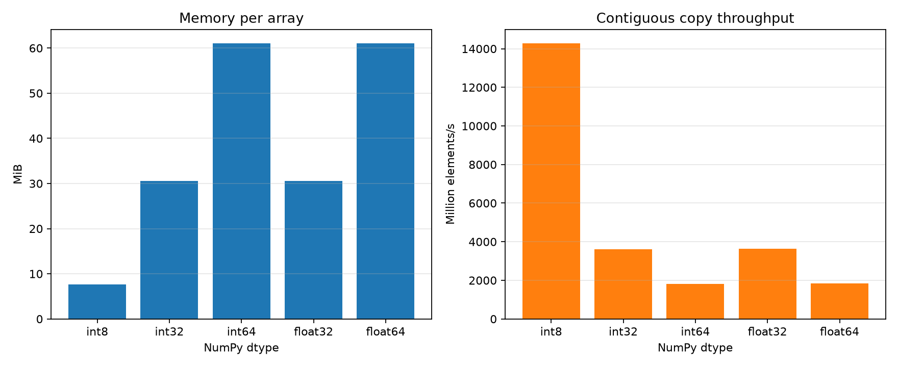

# Experiment 05 — Data Type and Element Size

[English](#english) · [한국어](#한국어)



---

## English

### 1. Experiment Overview

This experiment isolates NumPy element width by copying the same number of contiguous elements with `int8`, `int32`, `int64`, `float32`, and `float64`. It tests how dtype changes memory footprint, execution time, element throughput, and effective memory bandwidth without mixing in dtype-specific arithmetic.

### 2. Research Question

How does element size affect the memory use and contiguous-copy efficiency of a NumPy array?

### 3. Background

A NumPy array stores fixed-width elements in contiguous memory. For the same element count, a 64-bit dtype occupies eight times as many bytes as `int8`, so a sequential operation must move more data and touches more cache lines. `np.copyto` provides the same copy operation for every dtype; it reads one source array and writes one destination array.

### 4. Hypothesis

Smaller dtypes will use less memory and copy more elements per second. If the benchmark is limited mainly by memory bandwidth, dtypes of equal width should behave similarly and effective GiB/s should remain closer across dtypes than element throughput.

### 5. Experimental Setup and Variables

- Reference environment: CPython 3.13.5, NumPy 2.4.6, 64-bit Windows 11
- 8,000,000-element, one-dimensional C-contiguous arrays
- Dtypes: `int8`, `int32`, `int64`, `float32`, `float64`
- One preallocated source and destination per dtype; allocation excluded
- `np.copyto`, `time.perf_counter()`, 2 warmups, and 11 timed repetitions
- Condition order randomized within every repetition using seed `20260715`
- Garbage collection disabled only during timed sections

The independent variable is dtype/item size. Execution time, memory footprint, element throughput, and effective bandwidth are dependent variables. Element count, shape, layout, operation, values, timer, warmups, repetitions, process, and random seed are controlled. CPU frequency, thermals, background activity, and cache state are not controlled by the script. CPU identification is recorded in metadata through the platform string but is not required to run the experiment.

```bash
uv run python experiments/exp05_data_type_element_size/benchmark.py
uv run python experiments/exp05_data_type_element_size/benchmark.py --quick
```

### 6. Benchmark Methodology and Implementation Plan

`make_arrays()` allocates matching source and destination arrays. `benchmark_dtypes()` validates an untimed copy, performs warmups, randomizes dtype order in each repetition, and times only `np.copyto`. It verifies all destination arrays after measurement. `summarize()` reports mean, median, sample standard deviation, extrema, throughput, and effective bandwidth; the median is the primary timing statistic because it is less sensitive to isolated scheduling delays.

Implementation order: create equal-length arrays, validate equivalent copies, add randomized repeated timing, calculate summary statistics, persist CSV and environment metadata, generate the figure, and test dtype sizes and output metrics.

### 7. Measurements and Visualization

- Per-run execution time in `results/raw.csv`
- Array bytes and total source-plus-destination allocation
- Median throughput in millions of elements per second
- Effective bandwidth in GiB/s, counting bytes read plus bytes written
- Runtime configuration in `results/metadata.json`

The left chart uses dtype on the x-axis and memory per array in MiB on the y-axis. The right chart uses dtype and element throughput. Together they show the memory cost and the number of elements processed per unit time as element width changes.

### 8. Expected Results

Memory should scale exactly with item size. `int32` and `float32`, and likewise `int64` and `float64`, should have similar copy performance because each pair moves the same byte count. Deviations can arise from cache state, OS scheduling, CPU frequency, page placement, or dtype-specific copy-kernel implementation.

### 9. Results

Reference run on 2026-07-15 KST; values are medians of 11 repetitions.

| Dtype | Item size | Array memory | Median | Throughput | Effective bandwidth |
| --- | ---: | ---: | ---: | ---: | ---: |
| `int8` | 1 B | 7.63 MiB | 0.560 ms | 14,275.5 M elem/s | 26.59 GiB/s |
| `int32` | 4 B | 30.52 MiB | 2.211 ms | 3,618.6 M elem/s | 26.96 GiB/s |
| `int64` | 8 B | 61.04 MiB | 4.434 ms | 1,804.4 M elem/s | 26.89 GiB/s |
| `float32` | 4 B | 30.52 MiB | 2.206 ms | 3,625.8 M elem/s | 27.01 GiB/s |
| `float64` | 8 B | 61.04 MiB | 4.331 ms | 1,847.1 M elem/s | 27.52 GiB/s |

### 10. Discussion

The result supports the hypothesis. Memory grew exactly with element width, while throughput fell from 14,275.5 million elements/s for 1-byte elements to about 1,800 million elements/s for 8-byte elements. Equal-width integer and floating-point pairs were close. Effective bandwidth stayed in a narrow 26.59–27.52 GiB/s range, indicating that byte movement, rather than numeric type, dominated this copy workload.

This does not prove a particular cache hit or miss rate. The 7.63 MiB `int8` source and destination also form a smaller working set than the 61.04 MiB 64-bit arrays, but no hardware cache counters were collected.

### 11. Conclusion

For a fixed count of contiguous elements, smaller dtypes reduce memory use and increase element throughput almost in proportion to their width. On this system, all five dtypes reached similar effective copy bandwidth.

### 12. Threats to Validity and Future Work

The experiment uses one machine, one NumPy version, one array length, and a contiguous copy workload. `np.copyto` may use platform-specific optimized kernels, and effective bandwidth is a derived traffic estimate rather than a hardware-counter measurement. Cache state, CPU frequency, thermals, page faults, and background scheduling vary. The destination write policy and cache reuse may also affect traffic beyond the simple read-plus-write model.

Repeating several element counts and machines would show whether the pattern holds across cache and main-memory regimes. Hardware counters and controlled affinity could separate cache behavior from memory bandwidth, but those are outside this experiment's core comparison.

Suggested commit message: `feat: add Experiment 05 dtype element-size benchmark`

Suggested folder structure (implemented):

```text
experiments/exp05_data_type_element_size/
├── README.md
├── benchmark.py
├── figures/dtype_element_size.png
└── results/                 # generated CSV and metadata (gitignored)
```

---

## 한국어

### 1. 실험 개요

이 실험은 `int8`, `int32`, `int64`, `float32`, `float64`로 동일한 수의 연속 원소를 복사해 NumPy 원소 너비의 영향만 비교한다. dtype별 산술 차이를 섞지 않고 메모리 사용량, 실행 시간, 원소 처리량과 유효 메모리 대역폭을 검증한다.

### 2. 연구 질문

원소 크기는 NumPy 배열의 메모리 사용량과 연속 복사 효율에 어떤 영향을 미치는가?

### 3. 배경과 가설

NumPy 배열은 고정 너비 원소를 연속 메모리에 저장한다. 원소 수가 같으면 64비트 dtype은 `int8`보다 8배 많은 바이트를 차지하며, 순차 연산도 더 많은 캐시 라인을 사용한다. 따라서 작은 dtype이 메모리를 덜 사용하고 초당 더 많은 원소를 복사할 것으로 예상한다. 메모리 대역폭이 주된 제한이라면 같은 너비의 정수·실수 dtype은 비슷하고, GiB/s 차이는 원소 처리량 차이보다 작을 것이다.

### 4. 실험 환경과 변수

- 기준 환경: CPython 3.13.5, NumPy 2.4.6, 64비트 Windows 11
- 원소 8,000,000개인 1차원 C-contiguous 배열
- dtype: `int8`, `int32`, `int64`, `float32`, `float64`
- dtype별 source와 destination을 미리 할당하고 할당 시간 제외
- `np.copyto`, `time.perf_counter()`, 워밍업 2회, 조건별 측정 11회
- seed `20260715`로 매 반복의 조건 순서 무작위화
- 측정 구간에서만 가비지 컬렉션 비활성화

독립 변수는 dtype과 item size이며 종속 변수는 실행 시간, 메모리 사용량, 원소 처리량, 유효 대역폭이다. 원소 수, 형태, 메모리 배치, 연산, 값, 타이머, 워밍업, 반복 횟수, 프로세스와 seed를 통제한다.

### 5. 방법, 구현과 측정값

`make_arrays()`가 같은 dtype의 source와 destination을 만들고, `benchmark_dtypes()`가 측정하지 않는 정확성 검증과 워밍업 후 매 반복에서 dtype 순서를 섞어 `np.copyto`만 측정한다. 측정 후 모든 복사 결과를 다시 검증한다. 개별 시간은 `results/raw.csv`, 평균·중앙값·표본 표준편차·최솟값·최댓값·처리량·유효 대역폭은 `results/summary.csv`, 환경은 `results/metadata.json`에 저장한다.

그래프 왼쪽은 dtype별 배열 MiB, 오른쪽은 초당 백만 원소 처리량을 보여준다. 구현 순서는 배열 생성, 복사 정확성 검증, 무작위 반복 측정, 통계 계산, CSV·메타데이터 저장, 그래프 생성과 테스트 작성이다.

### 6. 결과

2026-07-15 KST 기준 실행이며 조건별 11회 측정의 중앙값이다.

| Dtype | 원소 크기 | 배열 메모리 | 중앙값 | 처리량 | 유효 대역폭 |
| --- | ---: | ---: | ---: | ---: | ---: |
| `int8` | 1 B | 7.63 MiB | 0.560 ms | 14,275.5 M elem/s | 26.59 GiB/s |
| `int32` | 4 B | 30.52 MiB | 2.211 ms | 3,618.6 M elem/s | 26.96 GiB/s |
| `int64` | 8 B | 61.04 MiB | 4.434 ms | 1,804.4 M elem/s | 26.89 GiB/s |
| `float32` | 4 B | 30.52 MiB | 2.206 ms | 3,625.8 M elem/s | 27.01 GiB/s |
| `float64` | 8 B | 61.04 MiB | 4.331 ms | 1,847.1 M elem/s | 27.52 GiB/s |

### 7. 논의와 결론

결과는 가설을 지지한다. 메모리는 원소 너비에 정확히 비례했고, 원소 처리량은 1바이트의 초당 14,275.5백만 개에서 8바이트의 약 1,800백만 개로 감소했다. 같은 너비의 정수·실수 쌍은 서로 가까웠으며 유효 대역폭도 26.59–27.52 GiB/s 범위에 머물렀다. 즉 이 연속 복사에서는 수치형 종류보다 이동한 바이트 수가 성능을 주로 좌우했다.

다만 이 결과는 특정 캐시 적중률이나 미스율을 증명하지 않는다. 작은 dtype은 작업 집합도 작지만 하드웨어 카운터를 측정하지 않았다.

### 8. 타당성 위협과 향후 작업

한 대의 컴퓨터, 하나의 NumPy 버전, 하나의 원소 수와 연속 복사만 사용했다. `np.copyto`는 플랫폼별 최적화 커널을 사용할 수 있고 유효 대역폭은 하드웨어 측정값이 아니라 읽기+쓰기 바이트로 계산한 값이다. 캐시 상태, CPU 주파수·발열, 페이지 폴트, 백그라운드 작업과 destination 쓰기 정책도 결과에 영향을 줄 수 있다.

여러 원소 수와 컴퓨터에서 반복하면 캐시와 주 메모리 구간에서도 같은 경향인지 확인할 수 있다. 하드웨어 카운터와 CPU affinity 통제는 캐시와 대역폭 효과를 더 잘 구분할 수 있다.

추천 커밋 메시지: `feat: add Experiment 05 dtype element-size benchmark`
