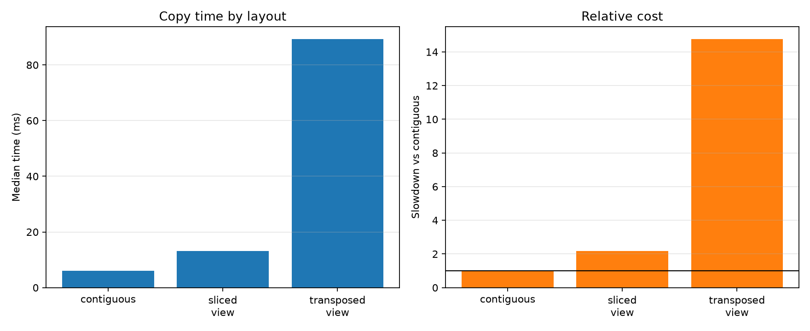

# Experiment 06 — Contiguous vs Non-Contiguous Arrays

[English](#english) · [한국어](#한국어)



---

## English

### 1. Experiment Overview

This experiment copies equal-shaped NumPy arrays into the same C-contiguous destination. It compares a C-contiguous array, a column-sliced view with gaps between elements, and a transposed (F-contiguous) view to test how strides and source/destination traversal order affect performance.

### 2. Research Question

Are sliced and transposed views slower to read into a C-contiguous destination than a C-contiguous source, and how do their strides and contiguity flags explain the difference?

### 3. Background

A NumPy view can change shape and strides without copying data. C-contiguous arrays place adjacent columns next to each other. The sliced view here skips every other stored element, while the transposed view has unit stride down rows and is F-contiguous. Copying either view into a C-contiguous destination requires a traversal that is less favorable than matching C-order source and destination layouts.

### 4. Hypothesis

The C-contiguous source should be fastest. The sliced view should be slower because it reads twice the address span and skips elements. The transposed view may be slowest because its source and destination have opposing contiguous axes, although NumPy's platform-specific copy implementation may change the size of the difference.

### 5. Experimental Setup and Variables

- Reference environment: CPython 3.13.5, NumPy 2.4.6, 64-bit Windows 11
- Shape: 2,000 × 4,000 (`float64`, 8,000,000 logical elements per condition)
- Sources: C-contiguous array, `padded[:, ::2]` sliced view, and transposed view
- One preallocated C-contiguous destination; allocation and view creation excluded
- Operation: `np.copyto(destination, source)`
- `time.perf_counter()`, 2 warmups, and 11 timed repetitions
- Condition order randomized within every repetition using seed `20260716`
- Garbage collection disabled only during timed sections

The independent variable is source memory layout. Execution time, throughput, and slowdown are dependent variables. Shape, dtype, values, destination layout, operation, timer, warmups, repetitions, process, and random seed are controlled. Strides and C/F contiguity flags describe each condition rather than serving as separately manipulated variables. CPU frequency, thermals, background activity, and cache state are not controlled; CPU identification is recorded but is not required.

```bash
uv run python experiments/exp06_contiguous_vs_non_contiguous/benchmark.py
uv run python experiments/exp06_contiguous_vs_non_contiguous/benchmark.py --quick
```

### 6. Benchmark Methodology and Implementation Plan

`make_arrays()` constructs all sources before timing and checks their logical shapes. `benchmark_layouts()` performs an untimed correctness check and warmups, randomizes condition order for every repetition, and times only `np.copyto`. `summarize()` uses the median as the primary statistic and also reports mean, sample standard deviation, extrema, throughput, and slowdown against the contiguous baseline.

Implementation order: construct and validate layouts, preallocate the destination, add warmups and randomized timing, record layout metadata, calculate statistics, persist CSV and environment metadata, render the figure, and test shapes, flags, strides, and output metrics. The files are `benchmark.py`, this README, `results/{raw.csv,summary.csv,metadata.json}`, `figures/layout_copy.png`, and a repository test.

### 7. Measurements and Visualization

- Per-run time, run order, strides, and contiguity flags in `results/raw.csv`
- Summary timing, throughput, and slowdown in `results/summary.csv`
- Runtime configuration in `results/metadata.json`

The left chart shows median copy time by layout. The right chart shows slowdown relative to the C-contiguous baseline. Both use layout condition on the x-axis, making the cost associated with each stride pattern visible.

### 8. Expected Results

The contiguous condition should have the lowest median. Both views may be slower, but the exact ordering and ratios depend on NumPy's iteration/copy kernels, CPU caches, memory subsystem, and array dimensions. A different result could also reflect cache state, scheduling noise, or optimized buffering for particular stride combinations.

### 9. Results

Reference run on 2026-07-16 KST; values are medians of 11 repetitions.

| Condition | Strides (bytes) | C contiguous | F contiguous | Median | Throughput | Slowdown |
| --- | ---: | :---: | :---: | ---: | ---: | ---: |
| Contiguous | `(32000, 8)` | Yes | No | 6.048 ms | 1,322.8 M elem/s | 1.00× |
| Sliced view | `(64000, 16)` | No | No | 13.196 ms | 606.2 M elem/s | 2.18× |
| Transposed view | `(8, 16000)` | No | Yes | 89.268 ms | 89.6 M elem/s | 14.76× |

### 10. Discussion

The result supports the hypothesis on this system. The sliced view took about 2.18 times as long as the C-contiguous source. It exposes the same logical elements but has a 16-byte inner stride, so useful reads are separated by unused elements. The transposed view was F-contiguous rather than non-contiguous in both senses, yet it was 14.76 times slower when copied into a C-contiguous destination: the source's unit-stride axis and destination's unit-stride axis do not match.

Therefore, a single “contiguous” label is insufficient. C/F order and the compatibility of source and destination traversal axes matter. These timings do not directly measure cache misses, so the stride-based explanation remains an interpretation rather than hardware-counter proof.

### 11. Conclusion

For this 2D copy, the C-contiguous source was fastest. A gapped slice substantially reduced throughput, and an F-contiguous transposed source was much slower when the destination was C-contiguous. Views are cheap to create, but later operations can pay for their stride pattern.

### 12. Threats to Validity and Future Work

The experiment covers one machine, NumPy version, dtype, shape, operation, and C-contiguous destination. The three source arrays have different backing allocations, and their physical placement and cache history cannot be identical. `np.copyto` may use platform-specific buffering or optimized kernels. OS scheduling, page faults, CPU frequency, thermals, and background load remain uncontrolled. Effective cache behavior is inferred from timing; no hardware counters are collected.

Repeating several shapes and dtypes, alternating destination order, and testing contiguous copies made with `np.ascontiguousarray` would clarify when paying an up-front copy is worthwhile. Hardware counters could test the cache explanation, but they are outside this experiment's core scope.

### 13. Suggested Commit Message

`feat: add Experiment 06 contiguous array benchmark`

### 14. Suggested Folder Structure

```text
experiments/exp06_contiguous_vs_non_contiguous/
├── README.md
├── benchmark.py
├── figures/layout_copy.png
└── results/
    ├── metadata.json
    ├── raw.csv
    └── summary.csv
```

---

## 한국어

### 1. 실험 개요

동일한 shape의 NumPy 배열을 같은 C-contiguous 목적지로 복사한다. C-contiguous 배열, 원소 사이에 간격이 있는 열 슬라이스 view, 전치된 F-contiguous view를 비교해 stride와 source/destination 순회 방향이 성능에 미치는 영향을 검증한다.

### 2. 연구 질문

슬라이스·전치 view를 C-contiguous 목적지로 읽을 때 C-contiguous source보다 느린가? 각 조건의 stride와 연속성 플래그는 차이를 어떻게 설명하는가?

### 3. 배경과 가설

NumPy view는 데이터를 복사하지 않고 shape와 stride를 바꿀 수 있다. C-contiguous 배열은 같은 행의 열이 인접하지만, 이 실험의 슬라이스 view는 저장된 원소를 하나씩 건너뛴다. 전치 view는 행 방향 stride가 8바이트인 F-contiguous 배열이다. C-order source와 destination이 일치하는 조건이 가장 빠르고, 슬라이스는 더 넓은 주소 범위를 읽어 느려질 것으로 예상한다. 전치 view는 source와 destination의 연속 축이 달라 가장 느릴 수 있다.

### 4. 실험 환경과 변수

- 기준 환경: CPython 3.13.5, NumPy 2.4.6, 64비트 Windows 11
- shape 2,000 × 4,000, `float64`, 조건별 논리 원소 8,000,000개
- source: C-contiguous, `padded[:, ::2]`, transposed view
- 미리 할당한 하나의 C-contiguous destination 사용; 할당·view 생성 시간 제외
- `np.copyto`, `time.perf_counter()`, 워밍업 2회, 조건별 측정 11회
- seed `20260716`으로 매 반복 조건 순서 무작위화
- 측정 구간에서만 가비지 컬렉션 비활성화

독립 변수는 source 메모리 배치이며 종속 변수는 실행 시간, 처리량과 slowdown이다. shape, dtype, 값, destination 배치, 연산, 타이머, 워밍업, 반복 횟수, 프로세스와 seed를 통제한다. stride와 C/F 플래그는 각 조건을 설명하는 측정값이다.

### 5. 방법, 구현과 측정값

`make_arrays()`가 모든 source를 측정 전에 생성하고 shape를 검사한다. `benchmark_layouts()`는 측정하지 않는 정확성 검증과 워밍업 후 매 반복에서 조건 순서를 섞고 `np.copyto`만 측정한다. 중앙값을 대표값으로 사용하며 평균, 표본 표준편차, 최솟값, 최댓값, 처리량과 contiguous 기준 slowdown도 계산한다.

개별 시간·실행 순서·stride·플래그는 `results/raw.csv`, 요약 통계는 `results/summary.csv`, 환경은 `results/metadata.json`에 저장한다. 왼쪽 그래프는 조건별 중앙 복사 시간, 오른쪽은 contiguous 기준 slowdown을 보여준다.

### 6. 결과

2026-07-16 KST 기준 실행이며 조건별 11회 측정의 중앙값이다.

| 조건 | Strides (bytes) | C 연속 | F 연속 | 중앙값 | 처리량 | Slowdown |
| --- | ---: | :---: | :---: | ---: | ---: | ---: |
| Contiguous | `(32000, 8)` | 예 | 아니요 | 6.048 ms | 1,322.8 M elem/s | 1.00× |
| Sliced view | `(64000, 16)` | 아니요 | 아니요 | 13.196 ms | 606.2 M elem/s | 2.18× |
| Transposed view | `(8, 16000)` | 아니요 | 예 | 89.268 ms | 89.6 M elem/s | 14.76× |

### 7. 논의와 결론

이 환경의 결과는 가설을 지지한다. 슬라이스 view는 C-contiguous source보다 약 2.18배 오래 걸렸다. 논리 원소 수는 같지만 안쪽 stride가 16바이트여서 사용하지 않는 원소 사이를 건너뛴다. 전치 view는 F-contiguous이지만 C-contiguous destination과 연속 축이 일치하지 않아 14.76배 오래 걸렸다. 따라서 단순한 연속/비연속 여부뿐 아니라 C/F 순서와 source/destination의 순회 축 호환성이 중요하다. 다만 cache miss를 직접 측정하지 않았으므로 stride에 따른 설명은 하드웨어 카운터로 입증된 결론은 아니다.

### 8. 타당성 위협과 향후 작업

한 대의 컴퓨터, 하나의 NumPy 버전·dtype·shape·연산과 C-contiguous destination만 사용했다. source별 backing allocation, 물리적 메모리 위치와 cache history가 다르며 `np.copyto`는 플랫폼별 최적화나 buffering을 사용할 수 있다. 스케줄링, page fault, CPU 주파수·발열과 background load도 통제하지 않았다.

여러 shape와 dtype, F-contiguous destination, `np.ascontiguousarray`의 선복사 비용을 비교하면 언제 view를 연속 복사하는 것이 유리한지 확인할 수 있다. 하드웨어 카운터 측정은 이 실험의 범위 밖이지만 cache 설명을 더 직접 검증할 수 있다.
