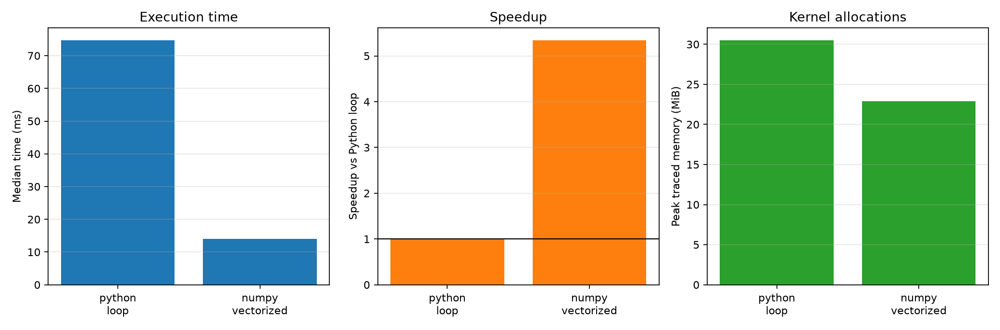

# Experiment 07 — Vectorization vs Python Loops

[English](#english) · [한국어](#한국어)



---

## English

### 1. Experiment Overview

This experiment evaluates the same element-wise expression, `y = x*x + 3*x`, using a pure Python loop and NumPy vectorization. It measures only the computation kernels, excluding input construction, to compare CPython's per-element iteration and object-operation overhead with NumPy's compiled array operations.

### 2. Research Question

When processing one million `float64` values, how much faster is NumPy vectorization than a Python loop, and how does the peak traced memory allocation differ between the two methods?

### 3. Background

A Python loop executes bytecode and performs Python object operations for every element before storing each result. NumPy vectorization processes contiguous, homogeneous data through compiled array loops, reducing this interpreter overhead. However, an expression such as `values * values + 3.0 * values` can create temporary arrays, so faster execution does not imply that memory allocation is eliminated.

### 4. Hypothesis

NumPy vectorization should be faster because it processes contiguous data in compiled internal loops, whereas Python performs dynamic object operations for every element. The Python method should also have a higher peak traced allocation because it creates a result list and individual `float` objects, although NumPy's temporary arrays may still consume substantial memory.

### 5. Experimental Setup and Variables

- Reference environment: CPython 3.13.5, NumPy 2.4.6, 64-bit Windows 11
- Input: 1,000,000 evenly spaced values from 0.0 to 1.0
- Python condition: `list[float]`
- NumPy condition: C-contiguous `float64` ndarray
- Expression: `y = x*x + 3*x`
- Timer: `time.perf_counter()`
- Two warmups and 11 timed repetitions per condition
- Condition order randomized within every repetition using seed `20260718`
- Input construction and correctness checks excluded from timing
- Garbage collection disabled only during timed sections

The independent variable is the computation method (`python_loop` or `numpy_vectorized`). Execution time, throughput, speedup relative to Python, and peak traced memory are dependent variables. Element count, logical input values, expression, `float64` precision, process, timer, warmups, repetitions, and random seed are controlled.

The input container representation is necessarily coupled to each implementation. The results therefore compare the practical combination of a Python object list and loop against a NumPy ndarray and vectorized expression, rather than isolating loop syntax alone.

```bash
uv run python experiments/exp07_vectorization_vs_python_loops/benchmark.py
uv run python experiments/exp07_vectorization_vs_python_loops/benchmark.py --quick
```

### 6. Benchmark Methodology and Implementation Plan

`make_inputs()` constructs equivalent list and ndarray inputs before measurement. `validate_results()` uses `np.allclose` to verify numerical equivalence outside the timed region. After warmup, `benchmark_methods()` randomizes method order in every repetition and times the complete function call. Output creation is part of the computation and remains included; input construction is excluded.

The median is the primary statistic. The benchmark also records the mean, sample standard deviation, minimum, maximum, and throughput. Speedup is calculated as `Python loop median / method median`. To prevent memory-profiling overhead from contaminating timing, `measure_peak_memory()` runs separately once per method and records the increase in `tracemalloc` peak from the start of each kernel.

Implementation order: create equivalent inputs and kernels, validate numerical results, add warmups and randomized timing, measure memory separately, calculate statistics, write CSV and metadata files, render the figure, and test correctness and summary calculations.

### 7. Measurements and Visualization

- Per-run method, execution order, and elapsed time in `results/raw.csv`
- Summary statistics, throughput, speedup, and peak traced bytes in `results/summary.csv`
- Python, NumPy, OS, and benchmark configuration in `results/metadata.json`
- Median time, speedup, and peak traced memory in `figures/vectorization.png`

All charts use computation method on the x-axis. The first chart shows median execution time in milliseconds, the second shows speedup relative to the Python loop, and the third shows peak traced memory in MiB.

### 8. Expected Results

NumPy vectorization should have a lower median execution time and higher throughput. A small difference or reversal could indicate that the input is too small and function-call or array-allocation costs dominate, or that system load, CPU frequency, and memory state affected the run. Other expressions may produce different speedups and allocation patterns depending on their number of temporary arrays and internal kernels.

### 9. Results

Reference run on 2026-07-18 KST; times are medians of 11 repetitions.

| Method | Median time | Throughput | Speedup | Peak traced memory |
| --- | ---: | ---: | ---: | ---: |
| Python loop | 74.760 ms | 13.38 M elem/s | 1.00× | 30.52 MiB |
| NumPy vectorized | 13.986 ms | 71.50 M elem/s | 5.35× | 22.89 MiB |

### 10. Discussion

In this environment, NumPy vectorization was 5.35 times faster than the Python loop and achieved approximately 5.35 times the throughput. This supports the hypothesis that vectorization reduces per-element interpreter and object-operation overhead.

The Python loop's peak traced allocation was about 7.63 MiB greater than NumPy's. NumPy still allocated 22.89 MiB—more than the approximately 7.63 MiB final output array—because the expression creates temporary arrays.

The standard deviations were 10.23 ms for Python and 4.14 ms for NumPy. Their observed ranges were 59.65–95.81 ms and 7.03–18.83 ms, respectively. These variations make the median more informative than a single run, and the 5.35× ratio should be interpreted as specific to this reference environment and expression.

### 11. Conclusion

For this one-million-element calculation, NumPy vectorization was faster and used less peak traced allocation than the Python loop. The benefit of vectorization comes from processing large amounts of homogeneous data in compiled array loops, not merely from more concise syntax.

### 12. Threats to Validity and Future Work

The benchmark covers one machine, input size, dtype, and expression. Python and NumPy use different containers and internal numeric representations, so this is not a microbenchmark that isolates only the iteration mechanism. OS scheduling, CPU frequency, thermals, background load, and cache state are not fully controlled.

`tracemalloc` reports the peak traceable allocation exposed by the Python allocator and NumPy during each kernel. It is not the process's total resident set size and may not include every native allocation. Memory is measured only once per method, so it does not provide a distribution comparable to the timing data.

Future work could measure several input sizes to locate the crossover point, compare more complex expressions, and test in-place NumPy implementations. Those extensions would help separate the effects of array allocation and computation intensity.

### 13. Suggested Commit Message

`feat: add Experiment 07 vectorization benchmark`

### 14. Suggested Folder Structure

```text
experiments/exp07_vectorization_vs_python_loops/
├── README.md
├── benchmark.py
├── figures/vectorization.png
└── results/
    ├── metadata.json
    ├── raw.csv
    └── summary.csv
```

---

## 한국어

### 1. 실험 개요

동일한 원소별 수식 `y = x*x + 3*x`를 순수 Python 반복문과 NumPy 벡터화로 계산한다. 입력 생성 시간을 제외하고 계산 커널만 측정해 CPython의 원소별 반복·객체 연산 비용과 NumPy의 컴파일된 배열 연산을 비교한다.

### 2. 연구 질문

100만 개의 `float64` 값을 처리할 때 NumPy 벡터화는 Python 반복문보다 얼마나 빠르며, 각 방식의 계산 중 추적 가능한 peak 메모리 할당량은 어떻게 다른가?

### 3. 배경과 가설

Python 반복문은 원소마다 바이트코드와 Python 객체 연산을 실행하고 결과를 저장한다. NumPy 벡터화는 연속된 동질 자료를 컴파일된 배열 루프에서 처리해 인터프리터 오버헤드를 줄인다. 따라서 NumPy가 더 빠르고, 결과 리스트와 개별 `float` 객체를 만드는 Python 방식보다 peak traced allocation도 작을 것으로 예상한다. 다만 NumPy 표현식도 중간 배열을 만들 수 있다.

### 4. 실험 환경과 변수

- 기준 환경: CPython 3.13.5, NumPy 2.4.6, 64비트 Windows 11
- 입력: 0.0부터 1.0까지 균등한 값 1,000,000개
- Python 조건: `list[float]`
- NumPy 조건: C-contiguous `float64` ndarray
- 계산식: `y = x*x + 3*x`
- `time.perf_counter()`, 워밍업 2회, 조건별 측정 11회
- seed `20260718`로 매 반복의 조건 순서 무작위화
- 입력 생성과 정확성 검사는 측정 구간에서 제외
- 시간 측정 중에만 garbage collection 비활성화

독립 변수는 계산 방법이며 종속 변수는 실행 시간, 처리량, Python 기준 speedup과 peak traced memory다. 원소 수, 논리적 입력값, 수식, 정밀도, 프로세스, 타이머, 워밍업·반복 횟수와 seed를 통제한다. 컨테이너 표현은 구현 방식과 결합되어 있으므로, 이 결과는 Python 객체 리스트와 반복문의 조합을 NumPy ndarray와 벡터화 표현식의 조합과 비교한다.

### 5. 방법, 구현과 측정값

`make_inputs()`가 동등한 리스트와 ndarray를 미리 만들고 `validate_results()`가 측정 전에 `np.allclose`로 결과를 검증한다. `benchmark_methods()`는 워밍업 후 매 반복에서 조건 순서를 섞고 함수 호출 전체를 측정한다. 출력 생성은 계산 비용에 포함하지만 입력 생성은 제외한다.

중앙값을 대표값으로 사용하며 평균, 표본 표준편차, 최솟값, 최댓값, 처리량과 speedup도 계산한다. 메모리는 시간 측정과 분리해 `measure_peak_memory()`로 조건별 한 번씩 측정한다. 개별 결과는 `results/raw.csv`, 요약 통계는 `results/summary.csv`, 실행 환경은 `results/metadata.json`에 저장한다. 그래프는 중앙 실행 시간, Python 기준 speedup과 peak traced memory를 보여준다.

### 6. 결과

2026-07-18 KST 기준 실행이며 시간은 조건별 11회 측정의 중앙값이다.

| 방법 | 중앙 실행 시간 | 처리량 | Speedup | Peak traced memory |
| --- | ---: | ---: | ---: | ---: |
| Python loop | 74.760 ms | 13.38 M elem/s | 1.00× | 30.52 MiB |
| NumPy vectorized | 13.986 ms | 71.50 M elem/s | 5.35× | 22.89 MiB |

### 7. 논의와 결론

이 환경에서 NumPy 벡터화는 Python 반복문보다 5.35배 빨랐고 처리량도 약 5.35배 높았다. 이는 벡터화가 원소별 인터프리터·객체 연산 비용을 줄인다는 가설과 일치한다.

Python loop의 peak traced allocation은 NumPy보다 약 7.63 MiB 컸다. 다만 NumPy도 중간 배열 때문에 최종 결과 ndarray 크기인 약 7.63 MiB보다 큰 22.89 MiB를 할당했다. 표준편차는 Python 10.23 ms, NumPy 4.14 ms였고 측정 범위는 각각 59.65–95.81 ms와 7.03–18.83 ms였다. 따라서 단일 실행값보다 중앙값이 중요하며, 5.35배라는 비율은 이 기준 환경과 수식에 한정된다.

100만 원소의 이 계산에서는 NumPy 벡터화가 더 빠르고 추적된 peak allocation도 더 작았다. 이 장점은 단순히 문법이 간결해서가 아니라 대량의 동질 데이터를 컴파일된 배열 루프에서 처리하기 때문에 발생한다.

### 8. 타당성 위협과 향후 작업

한 대의 컴퓨터, 하나의 크기·dtype·수식만 측정했다. Python과 NumPy의 컨테이너와 내부 숫자 표현이 다르므로 반복 메커니즘만 격리한 실험은 아니다. OS scheduling, CPU frequency, 발열, background load와 cache state도 완전히 통제하지 못했다.

`tracemalloc` 값은 커널 실행 중 추적 가능한 peak allocation이며 프로세스 전체 RSS나 모든 native allocation을 뜻하지 않는다. 메모리 측정은 조건별 1회라 시간 결과와 같은 분포를 제공하지 않는다. 여러 원소 수의 crossover 지점, 더 복잡한 수식과 in-place NumPy 구현을 비교하면 배열 할당 비용과 계산량이 speedup에 미치는 영향을 더 명확히 구분할 수 있다.
