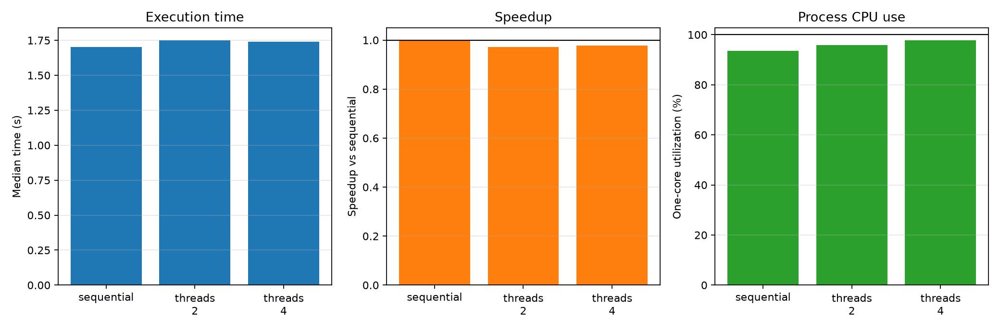

# Experiment 09 — Sequential vs Threading

[English](#english) · [한국어](#한국어)


---

## English

### Overview

This experiment compares sequential execution with two- and four-worker
`ThreadPoolExecutor` execution for the same CPU-bound pure-Python workload. It
tests whether adding threads reduces wall-clock time when CPython's Global
Interpreter Lock (GIL) constrains Python bytecode execution.

### Background

In a standard GIL-enabled CPython build, only one thread at a time normally
executes Python bytecode within a process. Threads can overlap waiting
operations, and native extensions may release the GIL, but threads do not
automatically execute a pure-Python CPU loop in parallel. Scheduling and
executor management can instead add overhead.

### Research Question

For an equivalent CPU-bound pure-Python workload, do two or four worker threads
run faster than sequential execution, and does process CPU use grow beyond one
core?

### Hypothesis

Threading will not produce a speedup. All conditions should remain near 100%
one-core-equivalent CPU utilization, while threaded conditions may be slightly
slower because of scheduling and executor overhead.

### Experimental Setup

- Runtime: CPython 3.13.5 on Windows 11
- Tools: `concurrent.futures` and psutil 7.2.2
- Machine: 16 physical and 22 logical CPUs reported by psutil
- Workload: eight independent deterministic integer-mixing tasks
- Task size: 1,000,000 Python-loop iterations per task
- Conditions: sequential, two threads, and four threads
- Protocol: one warmup and seven measured repetitions per condition
- Order: randomized within every repetition using seed `20260719`
- Primary statistic: median wall time

The independent variable is the execution method. Dependent variables are wall
time, speedup, process CPU time, and CPU utilization. Task count and size,
algorithm, inputs, runtime, machine, warmups, repetitions, and random seed are
controlled.

CPU utilization is `(process user + system CPU time) / wall time × 100`; 100%
therefore represents approximately one fully occupied logical CPU.

### Benchmark Methodology

`cpu_bound_task` performs deterministic Python integer operations. Sequential
execution calls all tasks in order; threaded execution submits the same tasks
to `ThreadPoolExecutor`. Results are validated before timing and after every
run. Garbage collection is disabled during measurement. Executor creation is
included because it is part of using the threaded method.

```bash
uv run python experiments/exp09_sequential_vs_threading/benchmark.py
uv run python experiments/exp09_sequential_vs_threading/benchmark.py --quick
```

The benchmark writes `results/raw.csv`, `results/summary.csv`, and
`results/metadata.json`, and creates `figures/threading.png`.

### Results

| Method             | Workers | Median time | Speedup | Median CPU use |
| ------------------ | ------: | ----------: | ------: | -------------: |
| Sequential         |       1 |     1.701 s |   1.00× |          93.6% |
| ThreadPoolExecutor |       2 |     1.751 s |   0.97× |          95.9% |
| ThreadPoolExecutor |       4 |     1.739 s |   0.98× |          97.8% |

Two threads were about 2.9% slower and four threads about 2.2% slower than
sequential execution. CPU use stayed near one core rather than growing toward
200% or 400%.

### Discussion

The result is consistent with the GIL explanation for this workload:
additional threads did not execute the Python loop simultaneously across
cores. Executor creation, synchronization, and scheduling can explain the
small slowdowns. This is a result for a GIL-enabled CPython build and a
pure-Python kernel; it does not mean that threads are universally ineffective.

### Conclusion

For this CPU-bound pure-Python workload, two or four threads neither improved
execution time nor used multiple CPU cores. Threads were not a substitute for
CPU-parallel execution in this case.

### Threats to Validity and Future Work

Windows scheduling, CPU frequency, background load, timer resolution, and task
size affect the exact ratios. CPU use is inferred from process CPU time rather
than sampled per-core counters. Executor construction is included. Free-threaded
CPython and native extensions that release the GIL may behave differently.
Future experiments may compare processes, I/O-bound tasks, worker scaling, and
GIL-releasing NumPy kernels.

---

## 한국어

### 개요

동일한 CPU-bound 순수 Python 작업을 순차 실행, 2-worker
`ThreadPoolExecutor`, 4-worker `ThreadPoolExecutor`로 비교한다. CPython의
Global Interpreter Lock(GIL)이 Python bytecode 실행을 제한할 때 스레드를
추가하면 실행 시간이 줄어드는지 검증한다.

### 배경

일반적인 GIL 활성화 CPython에서는 한 프로세스 안에서 한 번에 한
스레드만 Python bytecode를 실행한다. 대기 작업은 스레드가 겹쳐 처리할
수 있고 일부 native extension은 GIL을 해제하지만, 순수 Python CPU
반복문은 스레드를 추가한다고 자동으로 병렬 실행되지 않는다. 오히려
thread scheduling과 executor 관리 비용이 추가될 수 있다.

### 연구 질문

동일한 CPU-bound 순수 Python 작업에서 2개 또는 4개 worker thread는 순차
실행보다 빠른가? 프로세스 CPU 사용량은 한 코어 이상으로 증가하는가?

### 가설

스레딩은 speedup을 만들지 못할 것이다. 모든 조건의 CPU 사용률은 한
코어에 해당하는 약 100%에 머물고, 스레드 조건은 scheduling과 executor
overhead 때문에 조금 느릴 수 있다.

### 실험 환경

- Runtime: Windows 11의 CPython 3.13.5
- 도구: `concurrent.futures`, psutil 7.2.2
- CPU: psutil 기준 physical 16개, logical 22개
- 작업: 독립적인 결정적 정수 혼합 작업 8개
- 작업 크기: task당 Python loop 1,000,000회
- 조건: sequential, 2 threads, 4 threads
- 측정: 조건별 warmup 1회, 본 측정 7회
- 실행 순서: seed `20260719`로 매 반복에서 무작위화
- 대표 통계: wall time 중앙값

독립 변수는 실행 방식이다. 종속 변수는 wall time, speedup, process CPU
time과 CPU utilization이다. task 수와 크기, 알고리즘, 입력, runtime,
machine, warmup, 반복 수와 random seed를 통제한다.

CPU 사용률은 `(프로세스 user + system CPU time) / wall time × 100`으로
계산하며, 100%는 논리 CPU 약 한 개를 완전히 사용하는 상태이다.

### 벤치마크 방법

`cpu_bound_task`는 결정적인 순수 Python 정수 연산을 수행한다. 순차
조건은 모든 task를 차례로 호출하고, 스레드 조건은 같은 task를
`ThreadPoolExecutor`에 제출한다. 측정 전과 모든 실행 후 결과를 검증하며
측정 중 garbage collection은 끈다. Executor 생성은 실제 스레딩 비용이므로
측정에 포함한다.

```bash
uv run python experiments/exp09_sequential_vs_threading/benchmark.py
uv run python experiments/exp09_sequential_vs_threading/benchmark.py --quick
```

결과는 `results/raw.csv`, `results/summary.csv`, `results/metadata.json`에
저장하고 `figures/threading.png`를 생성한다.

### 결과

| 방법               | Worker | 중앙 실행 시간 | Speedup | 중앙 CPU 사용률 |
| ------------------ | -----: | -------------: | ------: | --------------: |
| Sequential         |      1 |        1.701초 |   1.00× |           93.6% |
| ThreadPoolExecutor |      2 |        1.751초 |   0.97× |           95.9% |
| ThreadPoolExecutor |      4 |        1.739초 |   0.98× |           97.8% |

2-thread 조건은 순차 실행보다 약 2.9%, 4-thread 조건은 약 2.2% 느렸다.
CPU 사용률도 200%나 400%로 증가하지 않고 한 코어 수준에 머물렀다.

### 논의

관찰 결과는 이 작업에서 GIL이 영향을 준다는 설명과 일치한다. 추가
스레드가 Python loop를 여러 코어에서 동시에 실행하지 못했고, executor
생성, 동기화와 scheduling 비용이 작은 slowdown에 기여했을 수 있다.
이는 GIL이 활성화된 CPython과 이 순수 Python kernel의 결과이며, 스레드가
모든 상황에서 효과 없다는 뜻은 아니다.

### 결론

측정한 CPU-bound 순수 Python 작업에서는 worker를 2개 또는 4개로 늘려도
실행 시간이 줄거나 여러 CPU 코어가 활용되지 않았다. 이 경우 thread는
CPU 병렬 실행을 위한 대안이 아니다.

### 타당성 위협과 향후 작업

Windows scheduling, CPU frequency, background load, timer resolution과 task
크기가 정확한 비율에 영향을 준다. CPU 사용률은 per-core counter가 아니라
process CPU time으로 계산했다. Executor 생성 비용도 포함한다. Free-threaded
CPython이나 GIL을 해제하는 native extension은 다르게 동작할 수 있다.
향후 별도 실험에서 multiprocessing, I/O-bound task, worker scaling과
GIL을 해제하는 NumPy 연산을 비교할 수 있다.
