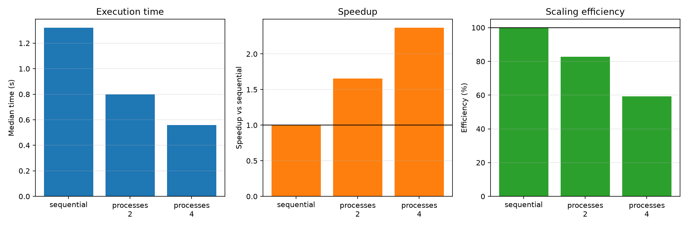

# Experiment 10 — Sequential vs Multiprocessing

[English](#english) · [한국어](#한국어)



---

## English

### Overview

This experiment compares sequential execution with two- and four-worker
`ProcessPoolExecutor` execution for the same CPU-bound pure-Python workload. It
tests when separate Python processes overcome process startup, scheduling, and
result-transfer costs.

### Background

Each CPython process has its own interpreter and Global Interpreter Lock (GIL).
Independent processes can therefore execute Python bytecode on multiple CPU
cores at once. This parallelism is not free: workers must be created, tasks
must be serialized and dispatched, and results must return to the parent.

### Research Question

For a sufficiently large CPU-bound pure-Python workload, do two or four worker
processes outperform sequential execution, and how efficiently does performance
scale with worker count?

### Hypothesis

Both process conditions will beat sequential execution because eight large,
independent tasks offer useful parallel work. Speedup will remain sublinear
because executor lifecycle, serialization, scheduling, and hardware contention
add costs.

### Experimental Setup

- Runtime: CPython 3.13.5 on Windows 11
- Tools: `concurrent.futures`, psutil 7.2.2, and Matplotlib
- Machine: 16 physical and 22 logical CPUs reported by psutil
- Workload: eight independent deterministic integer-mixing tasks
- Task size: 1,000,000 Python-loop iterations per task
- Conditions: sequential, two processes, and four processes
- Protocol: one warmup and seven measured repetitions per condition
- Order: randomized within every repetition using seed `20260720`
- Primary statistic: median wall time

The independent variable is the execution method and worker count. Dependent
variables are wall time, speedup, scaling efficiency, aggregate task CPU time,
and one-core-equivalent CPU utilization. Workload, inputs, repetitions, runtime,
machine, and random seed are controlled.

### Benchmark Methodology

`cpu_bound_task` performs deterministic integer operations without native
extension kernels. The sequential condition calls each task in the parent;
process conditions submit identical inputs to `ProcessPoolExecutor`. Checksums
are validated before timing and after every run. Garbage collection is disabled
during measurements. Executor creation and teardown are included to represent
the cost of using the method.

Scaling efficiency is `speedup / workers`. Aggregate CPU utilization is the sum
of each task's `time.process_time()` divided by wall time; 100% approximates one
fully occupied logical CPU. It excludes process startup CPU work, so it is a
supporting rather than primary metric.

```bash
uv run python experiments/exp10_sequential_vs_multiprocessing/benchmark.py
uv run python experiments/exp10_sequential_vs_multiprocessing/benchmark.py --quick
```

The benchmark writes `results/raw.csv`, `results/summary.csv`, and
`results/metadata.json`, and creates `figures/multiprocessing.png`.

### Results

| Method                | Workers | Median time | Speedup | Scaling efficiency |
| --------------------- | ------: | ----------: | ------: | -----------------: |
| Sequential            |       1 |     1.322 s |   1.00× |             100.0% |
| `ProcessPoolExecutor` |       2 |     0.798 s |   1.66× |              82.8% |
| `ProcessPoolExecutor` |       4 |     0.558 s |   2.37× |              59.2% |

Four processes completed this CPU-bound workload 2.37× faster than sequential
execution. Scaling efficiency fell from 82.8% with two workers to 59.2% with
four workers.

### Discussion

The result supports the hypothesis: separate interpreters allowed this
pure-Python loop to execute concurrently. Two processes reduced the median by
39.6%, and four reduced it by 57.8%. The four-worker condition delivered the
best absolute time, but not proportional 4× scaling. Its 59.2% efficiency is
consistent with fixed executor costs, OS scheduling, background load, and
competition for shared hardware resources.

### Conclusion

Multiprocessing was advantageous for these eight coarse CPU tasks. More workers
improved latency, while diminishing efficiency showed that worker count alone
does not guarantee linear speedup.

### Threats to Validity and Future Work

The measurements come from one Windows machine. Spawn behavior, CPU frequency,
thermal state, background load, task granularity, core topology, and executor
reuse can change the crossover point. Executor startup was deliberately
included, and CPU utilization omits startup CPU time. A later experiment can
vary task size to locate the overhead break-even point.

---

## 한국어

### 개요

동일한 CPU-bound 순수 Python 작업을 순차 실행, 2-worker 및 4-worker
`ProcessPoolExecutor`로 비교한다. 별도 Python 프로세스의 병렬성이 프로세스
시작, scheduling, 결과 전달 비용을 언제 상쇄하는지 검증한다.

### 배경

각 CPython 프로세스는 독립된 interpreter와 Global Interpreter Lock(GIL)을
가진다. 따라서 서로 독립된 프로세스는 여러 CPU core에서 Python bytecode를
동시에 실행할 수 있다. 다만 worker 생성, task 직렬화와 전달, 결과 반환에
추가 비용이 발생한다.

### 연구 질문

충분히 큰 CPU-bound 순수 Python 작업에서 2개 또는 4개 worker process는
순차 실행보다 빠른가? Worker 수가 증가할 때 성능은 얼마나 효율적으로
확장되는가?

### 가설

크고 독립적인 task 8개가 병렬 작업량을 제공하므로 두 process 조건 모두
순차 실행보다 빠를 것이다. 그러나 executor lifecycle, serialization,
scheduling과 hardware contention 때문에 speedup은 worker 수에 비례하지
않을 것이다.

### 실험 환경

- Runtime: Windows 11의 CPython 3.13.5
- 도구: `concurrent.futures`, psutil 7.2.2, Matplotlib
- CPU: psutil 기준 physical 16개, logical 22개
- 작업: 독립적인 결정적 정수 혼합 작업 8개
- 작업 크기: task당 Python loop 1,000,000회
- 조건: sequential, 2 processes, 4 processes
- 측정: 조건별 warmup 1회, 본 측정 7회
- 실행 순서: seed `20260720`으로 매 반복에서 무작위화
- 대표 통계: wall time 중앙값

독립 변수는 실행 방식과 worker 수이다. 종속 변수는 wall time, speedup,
scaling efficiency, task CPU time 합계와 단일 core 환산 CPU 사용률이다.
작업량, 입력, 반복 수, runtime, machine과 random seed를 통제한다.

### 벤치마크 방법

`cpu_bound_task`는 native extension kernel 없이 결정적인 정수 연산을
수행한다. 순차 조건은 parent에서 task를 호출하고, process 조건은 같은
입력을 `ProcessPoolExecutor`에 제출한다. 측정 전과 매 실행 후 checksum을
검증한다. 측정 중 garbage collection을 끄며, 실제 사용 비용을 반영하기
위해 executor 생성과 종료를 측정에 포함한다.

Scaling efficiency는 `speedup / workers`로 계산한다. CPU 사용률은 각
task의 `time.process_time()` 합계를 wall time으로 나눈 값으로, 100%가
논리 CPU 약 한 개를 완전히 사용한 상태이다. 프로세스 시작 CPU 시간은
포함하지 않으므로 보조 지표로 해석한다.

```bash
uv run python experiments/exp10_sequential_vs_multiprocessing/benchmark.py
uv run python experiments/exp10_sequential_vs_multiprocessing/benchmark.py --quick
```

벤치마크는 `results/raw.csv`, `results/summary.csv`,
`results/metadata.json`과 `figures/multiprocessing.png`를 생성한다.

### 결과

| 방법                  | Worker | 중앙 실행 시간 | Speedup | Scaling efficiency |
| --------------------- | -----: | -------------: | ------: | -----------------: |
| Sequential            |      1 |        1.322초 |   1.00× |             100.0% |
| `ProcessPoolExecutor` |      2 |        0.798초 |   1.66× |              82.8% |
| `ProcessPoolExecutor` |      4 |        0.558초 |   2.37× |              59.2% |

4개 프로세스는 이 CPU-bound 작업을 순차 실행보다 2.37배 빠르게 완료했다.
Scaling efficiency는 2-worker의 82.8%에서 4-worker의 59.2%로 낮아졌다.

### 논의

관찰 결과는 가설과 일치했다. 별도 interpreter를 사용해 순수 Python loop가
동시에 실행되었다. 2-process는 중앙 실행 시간을 39.6%, 4-process는
57.8% 줄였다. 4-worker의 절대 시간은 가장 짧았지만 4배에 비례하는
속도 향상은 없었다. 59.2%의 효율은 고정 executor 비용, OS scheduling,
background load와 공유 hardware resource 경쟁의 영향을 받을 수 있다.

### 결론

측정한 8개의 큰 CPU task에서는 multiprocessing이 유리했다. Worker를
추가하면 latency는 줄었지만 효율은 감소했으므로 worker 수 증가만으로
선형 speedup이 보장되지는 않는다.

### 타당성 위협과 향후 작업

결과는 Windows 장비 한 대에서 측정했다. Spawn 방식, CPU frequency,
thermal state, background load, task granularity, core topology와 executor
재사용 여부가 손익분기점을 바꿀 수 있다. Executor 시작 비용은 의도적으로
포함했고 CPU 사용률에는 시작 CPU 시간이 빠져 있다. 이후 실험에서는 task
크기를 바꾸어 process overhead의 손익분기점을 측정할 수 있다.
