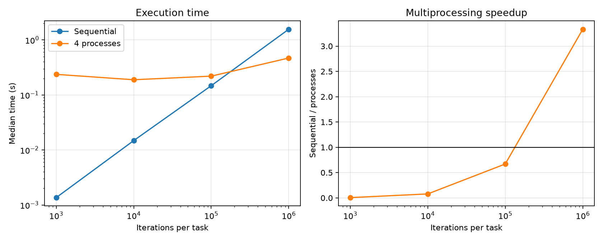

# Experiment 11 — Task Size and Process Overhead

[English](#english) · [한국어](#한국어)



---

## English

### Overview

This experiment varies CPU-bound task size while holding the task count and
worker count constant. It measures when useful parallel work becomes large
enough to offset process startup, serialization, scheduling, and result-transfer
costs.

### Background

Separate CPython processes can run Python bytecode on multiple cores because
each owns an interpreter and GIL. However, `ProcessPoolExecutor` has fixed and
per-task costs. These costs dominate short tasks but become a smaller fraction
of runtime as computation grows.

### Research Question

How does CPU task size change the relative performance of sequential and
four-process execution, and where is the break-even point among the measured
sizes?

### Hypothesis

Multiprocessing will be slower for small tasks because process overhead exceeds
the saved compute time. It will become faster once each task contains enough
pure-Python work to amortize that overhead.

### Experimental Setup

- Runtime: CPython 3.13.5 on Windows 11
- Tools: `concurrent.futures`, psutil 7.2.2, and Matplotlib
- Machine: 16 physical and 22 logical CPUs reported by psutil
- Workload: eight deterministic integer-mixing tasks
- Task sizes: 1K, 10K, 100K, and 1M loop iterations per task
- Conditions: sequential and four-process execution
- Protocol: one warmup and seven measured repetitions per condition and size
- Order: randomized within each size and repetition using seed `20260721`
- Primary statistic: median wall time

The independent variable is iterations per task. Dependent variables are median
wall time, process-minus-sequential time, speedup, and the measured-set
break-even size. Task count, worker count, inputs, runtime, machine, repetition
count, and random seed are controlled. CPU metadata is recorded because core
topology and platform process behavior can affect the result.

### Benchmark Methodology

`cpu_bound_task` performs deterministic pure-Python integer work. Checksums are
validated before measurement and after every run. Garbage collection is
disabled while timing. Every process observation creates and closes a new
executor, intentionally including the full executor lifecycle. Condition order
is randomized to reduce systematic ordering bias.

For each size, process overhead or saving is reported as `process median -
sequential median`; positive values are a penalty and negative values are a
saving. Speedup is `sequential median / process median`. The break-even result
is the smallest tested size with speedup at least 1, not an estimate of the
exact crossover between sampled sizes.

```bash
uv run python experiments/exp11_task_size_process_overhead/benchmark.py
uv run python experiments/exp11_task_size_process_overhead/benchmark.py --quick
```

The benchmark writes `results/raw.csv`, `results/summary.csv`, and
`results/metadata.json`, and creates `figures/task_size_overhead.png`.

### Results

| Iterations/task | Sequential median | Process median | Process − sequential | Speedup |
| --------------: | ----------------: | -------------: | -------------------: | ------: |
|           1,000 |          0.0014 s |       0.2368 s |            +0.2355 s |   0.01× |
|          10,000 |          0.0148 s |       0.1889 s |            +0.1741 s |   0.08× |
|         100,000 |          0.1472 s |       0.2197 s |            +0.0725 s |   0.67× |
|       1,000,000 |          1.5634 s |       0.4690 s |            −1.0944 s |   3.33× |

The first break-even point in the measured set was 1,000,000 iterations per
task. The exact crossover lies somewhere above 100,000 and at or below
1,000,000 iterations under this configuration.

### Discussion

The observations support the hypothesis. At 1K iterations, full process
execution took about 174 times the sequential time. The fixed lifecycle cost
remained visible at 100K, where processes were still 1.49 times slower. At 1M,
parallel computation outweighed overhead and reduced median wall time by 1.0944
seconds, yielding 3.33× speedup.

### Conclusion

Multiprocessing is not automatically beneficial for CPU-bound work. Task
granularity must be large enough to amortize process management; in this run,
only the largest sampled task size crossed that threshold.

### Future Work

Sample more sizes between 100K and 1M, compare a reused executor with lifecycle
cost included, vary task and worker counts, and repeat on a fork-based platform.

### Threats to Validity

The result comes from one Windows machine and uses the spawn process model.
Scheduling, antivirus activity, CPU frequency, thermal state, Python version,
core topology, argument size, and executor reuse can shift the crossover. The
coarse geometric size grid identifies only a measured-set break-even point.
Process-minus-sequential time combines all overheads and parallel savings; it
does not isolate startup, serialization, IPC, and scheduling individually.

### Implementation and Files

`benchmark.py` contains the deterministic kernel, correctness checks,
randomized benchmark, summary calculation, break-even detection, CSV/JSON
output, and plotting. Generated measurements live in `results/` and the plot in
`figures/`.

---

## 한국어

### 개요

Task 수와 worker 수를 고정하고 CPU-bound task 크기만 바꾼다. 유용한 병렬
작업이 process 시작, serialization, scheduling, 결과 전달 비용을 언제
상쇄하는지 측정한다.

### 배경

각 CPython process는 독립된 interpreter와 GIL을 가지므로 여러 core에서
Python bytecode를 동시에 실행할 수 있다. 그러나 `ProcessPoolExecutor`에는
고정 비용과 task별 비용이 있다. 짧은 task에서는 이 비용이 지배적이지만
계산량이 늘면 전체 실행 시간에서 차지하는 비율이 감소한다.

### 연구 질문

CPU task 크기가 순차 실행과 4-process 실행의 상대 성능을 어떻게 바꾸며,
측정한 크기 중 손익분기점은 어디인가?

### 가설

작은 task에서는 절약한 계산 시간보다 process overhead가 커서
multiprocessing이 느릴 것이다. Task당 순수 Python 계산량이 충분히 커지면
overhead를 상쇄하여 더 빨라질 것이다.

### 실험 환경

- Runtime: Windows 11의 CPython 3.13.5
- 도구: `concurrent.futures`, psutil 7.2.2, Matplotlib
- CPU: psutil 기준 physical 16개, logical 22개
- 작업: 결정적 정수 혼합 task 8개
- Task 크기: task당 loop 1K, 10K, 100K, 1M회
- 조건: sequential과 4-process 실행
- 측정: 조건·크기별 warmup 1회, 본 측정 7회
- 실행 순서: seed `20260721`로 각 크기와 반복 안에서 무작위화
- 대표 통계: wall time 중앙값

독립 변수는 task당 반복 횟수이다. 종속 변수는 중앙 wall time,
process-minus-sequential 시간, speedup과 측정 후보 내 손익분기 크기이다.
Task 수, worker 수, 입력, runtime, 장비, 반복 수와 random seed를 통제한다.
Core 구조와 platform의 process 동작이 결과에 영향을 주므로 CPU 정보도
기록한다.

### 벤치마크 방법

`cpu_bound_task`는 결정적인 순수 Python 정수 연산을 수행한다. 측정 전과 매
실행 후 checksum을 검증하고 측정 중 garbage collection을 끈다. 각 process
측정마다 executor를 새로 생성하고 종료하여 전체 lifecycle 비용을 의도적으로
포함한다. 체계적인 순서 편향을 줄이기 위해 조건 순서를 무작위화한다.

각 크기의 process overhead 또는 절감 시간은 `process 중앙값 - sequential
중앙값`이다. 양수는 penalty, 음수는 절감이다. Speedup은 `sequential 중앙값
/ process 중앙값`이다. 손익분기 결과는 speedup이 1 이상인 가장 작은 측정
크기이며, 측정점 사이의 정확한 교차점 추정치는 아니다.

```bash
uv run python experiments/exp11_task_size_process_overhead/benchmark.py
uv run python experiments/exp11_task_size_process_overhead/benchmark.py --quick
```

벤치마크는 `results/raw.csv`, `results/summary.csv`,
`results/metadata.json`과 `figures/task_size_overhead.png`를 생성한다.

### 결과

| Task당 반복 | Sequential 중앙값 | Process 중앙값 | Process − sequential | Speedup |
| ----------: | ----------------: | -------------: | -------------------: | ------: |
|       1,000 |          0.0014초 |       0.2368초 |            +0.2355초 |   0.01× |
|      10,000 |          0.0148초 |       0.1889초 |            +0.1741초 |   0.08× |
|     100,000 |          0.1472초 |       0.2197초 |            +0.0725초 |   0.67× |
|   1,000,000 |          1.5634초 |       0.4690초 |            −1.0944초 |   3.33× |

측정한 후보 중 최초 손익분기점은 task당 1,000,000회였다. 이 설정에서 실제
교차점은 100,000회보다 크고 1,000,000회 이하인 범위에 있다.

### 논의

결과는 가설을 지지한다. 1K에서는 전체 process 실행이 sequential보다 약
174배 오래 걸렸다. 100K에서도 고정 lifecycle 비용이 남아 process 실행이
1.49배 느렸다. 1M에서는 병렬 계산의 이득이 overhead보다 커져 중앙 실행
시간을 1.0944초 줄였고 3.33배 speedup을 보였다.

### 결론

CPU-bound 작업이라고 multiprocessing이 항상 유리한 것은 아니다. Process
관리 비용을 분산할 만큼 task granularity가 커야 하며, 이번 실행에서는 가장
큰 측정 크기만 그 임계점을 넘었다.

### 향후 작업

100K와 1M 사이를 더 촘촘히 측정하고, executor 재사용과 lifecycle 포함
방식을 비교하며, task·worker 수를 바꾸고 fork 기반 platform에서 반복한다.

### 타당성 위협

Windows 장비 한 대에서 spawn process model로 측정했다. Scheduling,
antivirus, CPU frequency, thermal state, Python version, core topology, 인자
크기와 executor 재사용 여부가 교차점을 바꿀 수 있다. 성긴 등비 크기 목록은
측정 후보 내 손익분기점만 식별한다. Process-minus-sequential 시간은 모든
overhead와 병렬 절감을 합친 값이므로 startup, serialization, IPC와
scheduling을 개별적으로 분리하지 않는다.

### 구현과 파일 구조

`benchmark.py`에 결정적 kernel, 정확성 검사, 무작위 benchmark, 요약 계산,
손익분기 탐색, CSV/JSON 출력과 plotting이 있다. 생성 측정값은 `results/`,
그래프는 `figures/`에 저장된다.
