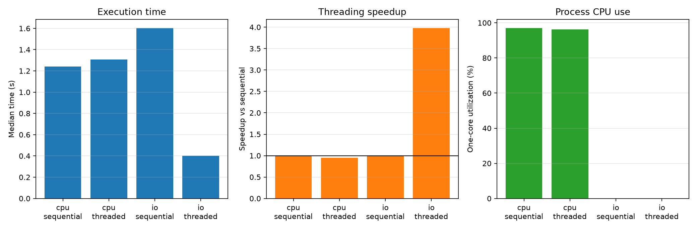

# Experiment 12 — CPU-bound vs I/O-bound

[English](#english) · [한국어](#한국어)



---

## English

### Overview

This experiment compares sequential and four-thread execution for a pure-Python CPU workload and a waiting workload. It tests whether threading helps according to what each task spends its time doing.

### Background

The standard CPython GIL normally permits only one thread at a time to execute Python bytecode. A blocking operation such as `time.sleep`, however, releases the GIL while waiting, allowing other threads to make progress.

### Research Question

Does four-thread execution improve an I/O-like waiting workload while leaving a pure-Python CPU-bound workload unimproved?

### Hypothesis

Threads will provide little or no speedup for CPU work because of the GIL and will add scheduling overhead. They will approach fourfold speedup for eight independent waits because four workers can overlap them in two waves.

### Experimental Setup

- Runtime: CPython 3.13.5 on Windows 11
- Tools: `concurrent.futures`, psutil 7.2.2, and Matplotlib
- Machine: 16 physical and 22 logical CPUs reported by psutil
- Conditions: sequential and four-thread execution
- Workload: eight deterministic tasks
- CPU task: 1,000,000 pure-Python integer-mixing iterations
- I/O surrogate: 0.2-second `time.sleep` per task
- Protocol: one warmup and seven measured repetitions per condition
- Order: all four conditions randomized per repetition with seed `20260722`
- Primary statistic: median wall time

Workload type and execution method are independent variables. Wall time, speedup, and process CPU utilization are dependent variables. Task count, worker count, inputs, repetitions, runtime, machine, and random seed are controlled.

### Benchmark Methodology

Sequential and threaded results are checked before and during measurement. Garbage collection is disabled while timing. Each threaded observation includes executor creation and shutdown. Speedup is the median sequential time divided by the median threaded time for the same workload. CPU utilization is process CPU time divided by wall time, where 100% represents approximately one fully occupied logical CPU.

```bash
uv run python experiments/exp12_cpu_vs_io_bound/benchmark.py
uv run python experiments/exp12_cpu_vs_io_bound/benchmark.py --quick
```

The benchmark writes `results/raw.csv`, `results/summary.csv`, and `results/metadata.json`, and creates `figures/cpu_vs_io_bound.png`.

### Results

| Workload            | Sequential median | Four-thread median | Threading speedup | Threaded CPU use |
| ------------------- | ----------------: | -----------------: | ----------------: | ---------------: |
| CPU-bound           |          1.2403 s |           1.3078 s |             0.95× |            96.2% |
| I/O-bound surrogate |          1.6039 s |           0.4029 s |             3.98× |           0.0%\* |

\* Process CPU time has coarse resolution on this platform; the waiting workload consumed too little CPU to register.

### Discussion

The results support the hypothesis. Four threads made the pure-Python CPU workload about 5% slower and process utilization stayed near one core, consistent with serialized bytecode plus thread overhead. The same worker count reduced the waiting workload to about one quarter of sequential time because independent waits overlapped.

### Conclusion

Thread usefulness depends on the bottleneck. Threads did not accelerate CPU-bound Python bytecode here, but they were effective when tasks mostly waited and released the GIL.

### Future Work

Repeat with socket and file I/O, vary delay and worker count, record context switches, and compare threading with `asyncio`.

### Threats to Validity

`time.sleep` is a controlled waiting surrogate, not real I/O: it excludes device, network, protocol, buffering, and service variability. CPU utilization is process-wide and timer resolution makes very small CPU costs appear as zero. Results come from one Windows machine and one GIL-enabled CPython build. Task granularity, worker count, scheduler load, frequency scaling, and Python version can change the ratios.

---

## 한국어

### 개요

순수 Python CPU 작업과 대기 작업을 각각 순차 및 4-thread로 실행한다. Task가 시간을 어디에 쓰는지에 따라 threading 효과가 달라지는지 검증한다.

### 배경

일반적인 CPython의 GIL은 한 번에 한 thread만 Python bytecode를 실행하도록 제한한다. 반면 `time.sleep` 같은 blocking 연산은 대기 중 GIL을 해제하여 다른 thread가 진행할 수 있게 한다.

### 연구 질문

4-thread 실행은 I/O형 대기 작업을 개선하지만 순수 Python CPU-bound 작업에는 이득을 주지 못하는가?

### 가설

CPU 작업에서는 GIL과 scheduling overhead 때문에 speedup이 없거나 느려질 것이다. 독립적인 대기 8개는 worker 4개가 두 묶음으로 겹쳐 처리하므로 약 4배 빨라질 것이다.

### 실험 환경

- Runtime: Windows 11의 CPython 3.13.5
- 도구: `concurrent.futures`, psutil 7.2.2, Matplotlib
- CPU: psutil 기준 physical 16개, logical 22개
- 조건: sequential과 4-thread 실행
- 작업 수: 결정적 task 8개
- CPU task: 순수 Python 정수 혼합 1,000,000회
- I/O 대체 모델: task당 `time.sleep` 0.2초
- 측정: 조건별 warmup 1회, 본 측정 7회
- 실행 순서: seed `20260722`로 매 반복에서 네 조건 무작위화
- 대표 통계: wall time 중앙값

독립 변수는 workload 종류와 실행 방식이다. 종속 변수는 wall time, speedup, process CPU utilization이다. Task 수, worker 수, 입력, 반복 수, runtime, 장비와 random seed를 통제한다.

### 벤치마크 방법

측정 전과 측정 중 sequential/threaded 결과가 같은지 검사한다. 측정 중 garbage collection을 끄고 각 threaded 관측에 executor 생성과 종료를 포함한다. Speedup은 같은 workload의 sequential 중앙값을 threaded 중앙값으로 나눈 값이다. CPU 사용률은 process CPU time을 wall time으로 나누며 100%는 logical CPU 약 1개를 완전히 사용하는 수준이다.

```bash
uv run python experiments/exp12_cpu_vs_io_bound/benchmark.py
uv run python experiments/exp12_cpu_vs_io_bound/benchmark.py --quick
```

벤치마크는 `results/raw.csv`, `results/summary.csv`, `results/metadata.json`과 `figures/cpu_vs_io_bound.png`를 생성한다.

### 결과

| 작업                | Sequential 중앙값 | 4-thread 중앙값 | Threading speedup | Threaded CPU 사용률 |
| ------------------- | ----------------: | --------------: | ----------------: | ------------------: |
| CPU-bound           |          1.2403초 |        1.3078초 |             0.95× |               96.2% |
| I/O-bound 대체 모델 |          1.6039초 |        0.4029초 |             3.98× |              0.0%\* |

\* 이 platform의 process CPU time 해상도가 성기므로 짧은 대기 작업의 매우 작은 CPU 소비가 0으로 기록되었다.

### 논의

결과는 가설을 지지한다. 4개 thread는 순수 Python CPU 작업을 약 5% 느리게 했고 process 사용률은 CPU 한 개 수준에 머물렀다. 같은 worker 수는 독립적인 대기를 겹쳐 순차 실행 시간의 약 1/4로 줄였다.

### 결론

Thread의 유용성은 병목에 달려 있다. 이번 실험에서 thread는 CPU-bound Python bytecode를 가속하지 못했지만 대부분의 시간을 기다리며 GIL을 해제하는 task에는 효과적이었다.

### 향후 작업

Socket 및 file I/O로 반복하고 delay와 worker 수를 바꾸며 OS thread context switch를 기록하고 같은 작업을 `asyncio`와 비교한다.

### 타당성 위협

`time.sleep`은 통제된 대기 대체 모델이며 실제 I/O가 아니다. Device, network, protocol, buffering과 service 변동을 포함하지 않는다. CPU 사용률은 process 전체 값이고 timer 해상도 때문에 매우 작은 CPU 비용이 0으로 보일 수 있다. 한 Windows 장비와 GIL이 활성화된 CPython build에서만 측정했다.

### 구현과 파일 구조

`benchmark.py`에 두 workload, 정확성 검사, 무작위 benchmark, 통계 요약, CSV/JSON 저장과 plotting이 있다. 생성 측정값은 `results/`, 그래프는 `figures/`에 저장된다.
