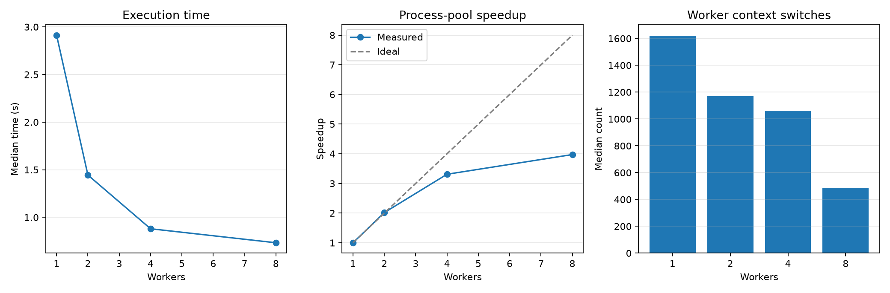

# Experiment 13 — Worker Count Scaling

[English](#english) · [한국어](#한국어)



---

## English

### Overview

This experiment runs one fixed pure-Python CPU workload with 1, 2, 4, and 8 process-pool workers. It measures how added parallelism changes execution time, speedup, scaling efficiency, CPU use, and context switching.

### Background

Separate processes can execute Python bytecode on multiple CPU cores because each process has its own interpreter and GIL. Scaling is not unlimited: process startup and dispatch, scheduling, CPU availability, memory traffic, and other shared resources make additional workers progressively less effective.

### Research Question

How do speedup, scaling efficiency, and worker context switches change as the process-pool worker count increases from 1 to 8?

### Hypothesis

Execution time will fall as workers increase, but speedup will be sublinear and efficiency will decline at higher counts. Context-switch behavior may change as more runnable processes compete for CPU time.

### Experimental Setup

- Runtime: CPython 3.13.5 on Windows 11
- Tools: `concurrent.futures`, psutil 7.2.2, and Matplotlib
- Machine: 16 physical and 22 logical CPUs reported by psutil
- Worker counts: 1, 2, 4, and 8 processes
- Workload: 16 deterministic tasks, each running 1,000,000 pure-Python integer-mixing iterations
- Protocol: one warmup and seven measured repetitions per worker count
- Order: worker-count conditions randomized per repetition with seed `20260723`
- Primary statistic: median wall time

Worker count is the independent variable. Wall time, speedup, efficiency, worker CPU utilization, and context switches are dependent variables. Task count, task inputs, work per task, runtime, machine, repetitions, and random seed are controlled.

### Benchmark Methodology

All conditions, including the one-worker baseline, use `ProcessPoolExecutor`; executor startup and shutdown are included in every observation. Task checksums are validated across worker counts. Garbage collection is disabled in the parent while timing. Speedup is one-worker median time divided by each condition's median. Scaling efficiency is speedup divided by worker count. Each task records CPU time and voluntary/involuntary context-switch deltas inside its worker, which are summed per observation.

```bash
uv run python experiments/exp13_worker_count_scaling/benchmark.py
uv run python experiments/exp13_worker_count_scaling/benchmark.py --quick
```

The benchmark writes `results/raw.csv`, `results/summary.csv`, and `results/metadata.json`, and creates `figures/worker_count_scaling.png`.

### Results

| Workers | Median time | Speedup | Scaling efficiency | Median context switches |
| ------: | ----------: | ------: | -----------------: | ----------------------: |
|       1 |    2.9136 s |   1.00× |             100.0% |                   1,621 |
|       2 |    1.4443 s |   2.02× |             100.9% |                   1,169 |
|       4 |    0.8803 s |   3.31× |              82.7% |                   1,062 |
|       8 |    0.7333 s |   3.97× |              49.7% |                     486 |

### Discussion

Performance improved through eight workers, but the incremental gain shrank sharply. Four workers achieved 3.31× speedup, while doubling to eight raised speedup only to 3.97× and reduced efficiency to 49.7%. The 2-worker value slightly above ideal is benchmark noise, not superlinear scaling evidence.

The measured context-switch total decreased rather than increased. This metric sums switches occurring only inside each timed task body. Parallel tasks finish sooner and therefore have a shorter interval in which switches can accumulate; pool startup, shutdown, idle time, and parent-process switches are excluded. It should be interpreted as task-scoped scheduler activity, not a system-wide context-switch count.

### Conclusion

More process workers accelerated this fixed CPU-bound workload, but returns diminished. On this run, moving from four to eight workers added only 20% throughput, demonstrating why worker count should be measured rather than assumed to scale linearly.

### Future Work

Repeat under controlled CPU affinity, sample system-wide context switches, reuse a persistent pool to isolate lifecycle cost, and test workloads with different task sizes.

### Threats to Validity

Results come from one machine and reflect its scheduler, background load, power state, and logical/physical CPU topology. Executor lifecycle is included, so the results apply to batch execution rather than a long-lived pool. psutil CPU-time resolution and task-scoped context-switch measurement limit precision. The task is synthetic and does not represent workloads constrained by memory bandwidth, IPC, serialization, or external I/O.

---

## 한국어

### 개요

고정된 순수 Python CPU workload를 process-pool worker 1, 2, 4, 8개로 실행한다. 병렬성이 늘어날 때 실행 시간, speedup, scaling efficiency, CPU 사용량과 context switch가 어떻게 변하는지 측정한다.

### 배경

각 process는 독립된 interpreter와 GIL을 가지므로 여러 process가 Python bytecode를 여러 CPU core에서 실행할 수 있다. 그러나 process 시작과 task 전달, scheduling, 사용 가능한 CPU, memory traffic과 공유 자원 때문에 worker 증가 효과는 점차 줄 수 있다.

### 연구 질문

Process-pool worker를 1개에서 8개까지 늘릴 때 speedup, scaling efficiency와 worker context switch는 어떻게 변하는가?

### 가설

Worker가 늘면 실행 시간은 줄지만 speedup은 선형보다 작고 높은 worker 수에서 efficiency가 낮아질 것이다. 실행 가능한 process가 많아지면 context-switch 양상도 달라질 수 있다.

### 실험 환경

- Runtime: Windows 11의 CPython 3.13.5
- 도구: `concurrent.futures`, psutil 7.2.2, Matplotlib
- CPU: psutil 기준 physical 16개, logical 22개
- Worker 수: process 1, 2, 4, 8개
- Workload: 결정적 task 16개, task마다 순수 Python 정수 혼합 1,000,000회
- 측정: worker 조건별 warmup 1회, 본 측정 7회
- 실행 순서: seed `20260723`으로 각 반복에서 조건 무작위화
- 대표 통계: wall time 중앙값

독립 변수는 worker 수다. 종속 변수는 wall time, speedup, efficiency, worker CPU utilization과 context switch다. Task 수와 입력, task당 연산량, runtime, 장비, 반복 수와 random seed를 통제한다.

### 벤치마크 방법

1-worker baseline을 포함한 모든 조건에서 `ProcessPoolExecutor`를 사용하며 매 관측에 executor 시작과 종료를 포함한다. Worker 수가 달라도 task checksum이 같은지 검증한다. 측정 중 parent의 garbage collection을 끈다. Speedup은 1-worker 중앙값을 각 조건 중앙값으로 나누고, scaling efficiency는 speedup을 worker 수로 나눈 값이다. 각 task가 worker 내부에서 CPU time 및 voluntary/involuntary context-switch 증분을 기록하며 관측별로 합산한다.

```bash
uv run python experiments/exp13_worker_count_scaling/benchmark.py
uv run python experiments/exp13_worker_count_scaling/benchmark.py --quick
```

벤치마크는 `results/raw.csv`, `results/summary.csv`, `results/metadata.json`과 `figures/worker_count_scaling.png`를 생성한다.

### 결과

| Workers | 실행 시간 중앙값 | Speedup | Scaling efficiency | Context switch 중앙값 |
| ------: | ---------------: | ------: | -----------------: | --------------------: |
|       1 |         2.9136초 |   1.00× |             100.0% |                 1,621 |
|       2 |         1.4443초 |   2.02× |             100.9% |                 1,169 |
|       4 |         0.8803초 |   3.31× |              82.7% |                 1,062 |
|       8 |         0.7333초 |   3.97× |              49.7% |                   486 |

### 논의

8-worker까지 성능은 개선됐지만 추가 이득은 크게 줄었다. 4-worker는 3.31배 speedup을 냈고, 8-worker로 두 배 늘려도 speedup은 3.97배에 그쳐 efficiency가 49.7%로 낮아졌다. 2-worker의 100% 초과 값은 benchmark 변동이며 초선형 scaling의 증거로 해석하지 않는다.

측정된 context-switch 합계는 증가하지 않고 감소했다. 이 값은 각 task 본문 실행 중 발생한 switch만 합산한다. 병렬 task는 더 빨리 끝나 switch가 누적될 시간도 짧으며 pool 시작·종료, idle 구간과 parent process의 switch는 제외된다. 따라서 system 전체 횟수가 아니라 task 범위의 scheduler activity로 해석해야 한다.

### 결론

Process worker 증가는 이 고정 CPU-bound workload를 가속했지만 수익은 체감했다. 이번 실행에서 4개에서 8개로 늘렸을 때 throughput 증가는 약 20%에 그쳤으므로 worker 수는 선형 scaling을 가정하지 말고 측정하여 정해야 한다.

### 향후 작업

CPU affinity를 통제해 반복하고, system 전체 context switch를 sampling하며, persistent pool로 lifecycle 비용을 분리하고, task 크기가 다른 workload를 비교한다.

### 타당성 위협

한 장비의 scheduler, background load, power state와 logical/physical CPU topology가 결과에 영향을 준다. Executor lifecycle을 포함하므로 장기 유지 pool보다 batch 실행에 해당한다. psutil CPU time 해상도와 task 범위 context-switch 측정은 정밀도를 제한한다. 합성 task이므로 memory bandwidth, IPC, serialization 또는 외부 I/O가 병목인 workload를 대표하지 않는다.

### 구현과 파일 구조

`benchmark.py`에 CPU task, worker별 process-pool 실행, 정확성 검사, 무작위 benchmark, 통계 요약, CSV/JSON 저장과 plotting이 있다. 생성 측정값은 `results/`, 그래프는 `figures/`에 저장된다.
