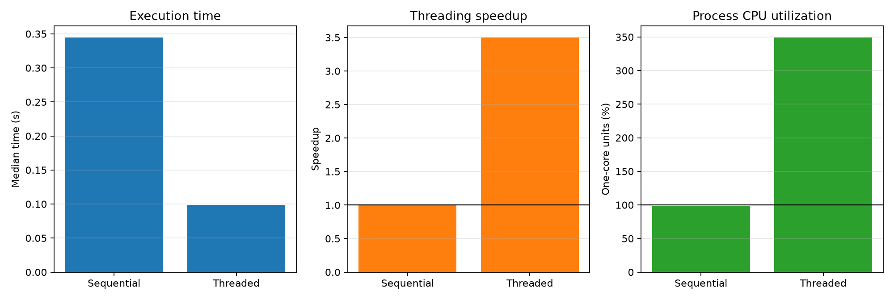

# Experiment 14 — NumPy and the GIL

[English](#english) · [한국어](#한국어)



---

## English

### Overview

This experiment compares sequential execution with four Python threads for eight independent NumPy `sin` tasks. It tests whether native NumPy work can overlap across threads even when CPython's GIL is enabled.

### Background

The GIL normally permits only one thread at a time to execute Python bytecode. NumPy ufuncs perform their element-wise loops in native code and can release the GIL while operating on supported numeric arrays. Independent ufunc calls may therefore execute on multiple cores, although memory bandwidth, kernel duration, scheduling, and thread overhead still limit scaling. This experiment deliberately avoids matrix multiplication so that BLAS library threading is not part of the comparison.

### Research Question

Can independent NumPy ufunc tasks execute concurrently in Python threads, reducing wall time and raising process CPU utilization above one core?

### Hypothesis

Four threads will complete the fixed set of NumPy tasks faster than sequential execution and report more than 100% process CPU utilization. Speedup will remain below 4× because executor lifecycle, Python dispatch, scheduling, and shared hardware resources add overhead.

### Experimental Setup

- Runtime: CPython 3.13.5 with the GIL enabled on Windows 11
- Library: NumPy 2.4.6
- Machine: 22 logical CPUs reported by the OS
- Workload: eight independent `float64` arrays of 1,000,000 elements
- Kernel: `numpy.sin(source, out=destination)`, repeated eight times per task
- Conditions: sequential execution and `ThreadPoolExecutor` with four workers
- Protocol: one warmup and seven measured repetitions per condition
- Order: conditions randomized per repetition with seed `20260724`
- Primary statistic: median wall time

The execution method is the independent variable. Wall time, speedup, process CPU time, and CPU utilization are dependent variables. Task count, array size and dtype, data, kernel, iteration count, output-buffer reuse, machine, runtime, repetitions, and seed are controlled.

### Benchmark Methodology

Inputs and one output buffer per task are created before timing. Both conditions operate on the same buffers, perform identical work, and validate results against sequential checksums. The threaded condition includes executor creation and shutdown. Garbage collection is disabled during measurement. Wall time uses `time.perf_counter()`; aggregate process CPU time uses `time.process_time()`. CPU utilization is process CPU time divided by wall time, so 100% represents approximately one fully occupied core. Speedup is the sequential median divided by the threaded median.

```bash
uv run python experiments/exp14_numpy_and_gil/benchmark.py
uv run python experiments/exp14_numpy_and_gil/benchmark.py --quick
```

The benchmark writes `results/raw.csv`, `results/summary.csv`, and `results/metadata.json`, and creates `figures/numpy_and_gil.png`.

### Results

| Method     | Workers | Median time | Speedup | Median CPU utilization |
| ---------- | ------: | ----------: | ------: | ---------------------: |
| Sequential |       1 |    0.3444 s |   1.00× |                  99.0% |
| Threaded   |       4 |    0.0985 s |   3.50× |                 349.0% |

Across seven runs, the standard deviations were 0.0272 s sequentially and 0.0167 s with threads.

### Discussion

Four Python threads reduced median wall time by about 71% and consumed about 3.5 one-core units of CPU time. This is direct evidence that these independent NumPy ufunc calls overlapped while the interpreter's GIL remained enabled. It does not mean that the GIL disappeared: Python-level scheduling and result handling still require it, while the long native `sin` loops release it.

The 3.50× result is workload- and machine-specific. Shorter kernels may not recover thread-pool overhead, and memory-bound ufuncs can saturate bandwidth before four cores are useful. Object-dtype arrays and Python callbacks may also retain or reacquire the GIL.

### Conclusion

For this numeric `float64` ufunc workload, NumPy released the GIL long enough for four Python threads to run native work concurrently. The evidence is the combination of 3.50× wall-time speedup and 349.0% aggregate process CPU utilization, not timing alone.

### Future Work

Compare ufuncs with different compute-to-memory ratios, vary Python worker count, reuse a persistent executor, and test object-dtype operations that do not offer the same GIL-release behavior.

### Threats to Validity

Results come from one NumPy build, CPython version, operating system, and machine. CPU frequency, background load, scheduling, and thermal state can change the measurements. `process_time()` aggregates the whole process and cannot attribute CPU time to individual threads. Reusing output buffers avoids allocation cost but represents only one usage pattern. The experiment establishes concurrency for this ufunc and dtype; it does not imply that every NumPy operation releases the GIL or scales with threads.

---

## 한국어

### 개요

독립적인 NumPy `sin` task 8개를 순차 실행과 Python thread 4개로 실행해 비교한다. CPython의 GIL이 활성화된 상태에서도 native NumPy 작업이 thread 사이에서 겹쳐 실행될 수 있는지 검증한다.

### 배경

GIL은 보통 한 번에 한 thread만 Python bytecode를 실행하도록 제한한다. NumPy ufunc는 지원되는 numeric array의 원소별 loop를 native code에서 수행하며 그동안 GIL을 해제할 수 있다. 따라서 독립적인 ufunc 호출은 여러 core에서 실행될 수 있지만 memory bandwidth, kernel 실행 시간, scheduling과 thread overhead가 scaling을 제한한다. BLAS 자체 threading이 비교에 섞이지 않도록 행렬곱은 사용하지 않는다.

### 연구 질문

독립적인 NumPy ufunc task를 Python thread에서 동시에 실행해 wall time을 줄이고 process CPU utilization을 한 core 이상으로 높일 수 있는가?

### 가설

Thread 4개는 고정된 NumPy task를 순차 실행보다 빠르게 완료하고 100%를 넘는 process CPU utilization을 보일 것이다. Executor lifecycle, Python dispatch, scheduling과 공유 hardware 자원 때문에 speedup은 4배보다 작을 것이다.

### 실험 환경

- Runtime: GIL이 활성화된 Windows 11의 CPython 3.13.5
- Library: NumPy 2.4.6
- CPU: OS 기준 logical CPU 22개
- Workload: 원소 1,000,000개인 독립 `float64` array 8개
- Kernel: task마다 `numpy.sin(source, out=destination)` 8회
- 조건: 순차 실행과 4-worker `ThreadPoolExecutor`
- 측정: 조건별 warmup 1회, 본 측정 7회
- 실행 순서: seed `20260724`로 반복마다 조건 무작위화
- 대표 통계: wall time 중앙값

독립 변수는 실행 방법이다. 종속 변수는 wall time, speedup, process CPU time과 CPU utilization이다. Task 수, array 크기와 dtype, 입력 데이터, kernel, 반복 횟수, output buffer 재사용, 장비, runtime, 측정 횟수와 seed를 통제한다.

### 벤치마크 방법

입력과 task별 output buffer는 측정 전에 만든다. 두 조건은 같은 buffer로 동일한 연산을 수행하며 순차 checksum과 결과가 같은지 검사한다. Thread 조건에는 executor 생성과 종료 시간이 포함된다. 측정 중 garbage collection을 끈다. Wall time은 `time.perf_counter()`, process 전체 CPU time은 `time.process_time()`으로 측정한다. CPU utilization은 process CPU time을 wall time으로 나눈 값이므로 100%는 완전히 사용된 core 약 1개를 뜻한다. Speedup은 순차 중앙값을 thread 중앙값으로 나눈다.

```bash
uv run python experiments/exp14_numpy_and_gil/benchmark.py
uv run python experiments/exp14_numpy_and_gil/benchmark.py --quick
```

벤치마크는 `results/raw.csv`, `results/summary.csv`, `results/metadata.json`과 `figures/numpy_and_gil.png`를 생성한다.

### 결과

| 방법       | Workers | 실행 시간 중앙값 | Speedup | CPU utilization 중앙값 |
| ---------- | ------: | ---------------: | ------: | ---------------------: |
| Sequential |       1 |         0.3444초 |   1.00× |                  99.0% |
| Threaded   |       4 |         0.0985초 |   3.50× |                 349.0% |

7회 측정의 표준편차는 순차 0.0272초, thread 0.0167초였다.

### 논의

Python thread 4개는 중앙 wall time을 약 70% 줄였고 core 약 3.6개에 해당하는 CPU time을 사용했다. Interpreter의 GIL이 활성화된 상태에서 독립적인 NumPy ufunc 호출이 겹쳐 실행됐다는 증거다. GIL이 사라졌다는 뜻은 아니다. Python 수준의 scheduling과 결과 처리는 여전히 GIL이 필요하지만 긴 native `sin` loop는 GIL을 해제한다.

3.50배라는 수치는 이 workload와 장비에 한정된다. 더 짧은 kernel은 thread-pool overhead를 회수하지 못할 수 있고, memory-bound ufunc는 core 4개를 쓰기 전에 bandwidth가 포화될 수 있다. Object-dtype array와 Python callback은 GIL을 유지하거나 다시 획득할 수도 있다.

### 결론

이 numeric `float64` ufunc workload에서는 NumPy가 GIL을 충분히 오래 해제해 Python thread 4개의 native 작업이 동시에 실행됐다. 근거는 timing 하나가 아니라 3.50배 wall-time speedup과 349.0% process CPU utilization의 조합이다.

### 향후 작업

연산량 대비 memory 접근량이 다른 ufunc를 비교하고, Python worker 수를 바꾸며, persistent executor를 재사용하고, 같은 GIL 해제 특성을 기대할 수 없는 object-dtype 연산을 시험한다.

### 타당성 위협

결과는 한 NumPy build, CPython version, OS와 장비에서 측정했다. CPU frequency, background load, scheduling과 thermal state가 값에 영향을 줄 수 있다. `process_time()`은 process 전체를 합산하므로 개별 thread의 CPU time을 구분하지 못한다. Output buffer 재사용은 allocation 비용을 피하지만 모든 사용 양상을 대표하지 않는다. 이 실험은 해당 ufunc와 dtype의 동시 실행을 입증할 뿐, 모든 NumPy 연산이 GIL을 해제하거나 thread로 scaling한다는 뜻은 아니다.

### 구현과 파일 구조

`benchmark.py`에 buffer 생성, NumPy kernel, 순차/thread 실행, 정확성 검사, 무작위 benchmark, 통계 요약, CSV/JSON 저장과 plotting이 있다. 생성 측정값은 `results/`, 그래프는 `figures/`에 저장된다.
