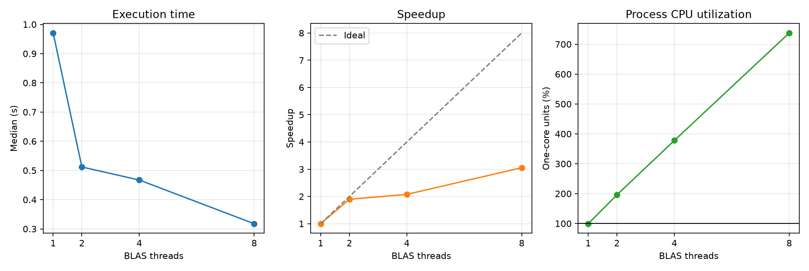

# Experiment 15 — BLAS Threading

[English](#english) · [한국어](#한국어)



---

## English

### Overview

This experiment measures one fixed NumPy matrix-multiplication workload with the
underlying BLAS pool limited to 1, 2, 4, and 8 threads. Its purpose is to isolate
the performance and CPU-utilization effect of native BLAS threading.

### Background

NumPy delegates `matmul` on dense numeric arrays to an optimized BLAS library.
That native library can split the operation among its own worker threads,
independently of Python-level threading. More BLAS threads can reduce wall time
for sufficiently large matrices, but synchronization, scheduling, memory
traffic, and shared CPU resources make scaling sublinear.

### Research Question

How do BLAS thread counts of 1, 2, 4, and 8 affect execution time and process
CPU utilization for the same NumPy matrix multiplication?

### Hypothesis

Increasing the BLAS thread limit will reduce median wall time and raise process
CPU utilization above one core. Speedup will be less than the thread count
because parallel overhead and shared hardware resources limit scaling.

### Experimental Setup

- Runtime: CPython 3.13.5 on Windows 11
- NumPy: 2.4.6
- BLAS: OpenBLAS 0.3.31.188.0, pthreads layer
- Machine: 22 logical CPUs reported by the OS
- Data: two 2048 × 2048 C-contiguous `float64` matrices
- Kernel: `numpy.matmul(left, right, out=destination)`, three calls per run
- Conditions: 1, 2, 4, and 8 BLAS threads via `threadpoolctl`
- Protocol: one warmup and seven measured runs per condition
- Order: conditions randomized within each repeat using seed `20260725`
- Primary statistic: median wall time

The BLAS thread limit is the independent variable. Wall time, speedup, process
CPU time, and CPU utilization are dependent variables. Matrix values, shape,
dtype, memory layout, kernel count, output reuse, runtime, machine, repeats, and
random seed are controlled.

### Benchmark Methodology

Inputs and the output buffer are allocated before timing. Every condition uses
the same matrices, performs identical work, and checks its checksum against the
one-thread result. `threadpool_limits(..., user_api="blas")` applies the requested
limit around the timed kernel. Garbage collection is disabled during measured
runs. Wall time uses `time.perf_counter()` and aggregate process CPU time uses
`time.process_time()`. CPU utilization is CPU time divided by wall time, so 100%
corresponds to approximately one fully occupied core. Speedup is the one-thread
median divided by each condition's median.

```bash
uv run python experiments/exp15_blas_threading/benchmark.py
uv run python experiments/exp15_blas_threading/benchmark.py --quick
```

The benchmark writes `results/raw.csv`, `results/summary.csv`, and
`results/metadata.json`, and creates `figures/blas_threading.png`.

### Results

| BLAS threads | Median time | Speedup | Median CPU utilization | Time stdev |
| -----------: | ----------: | ------: | ---------------------: | ---------: |
|            1 |    0.9706 s |   1.00× |                  99.5% |   0.5484 s |
|            2 |    0.5119 s |   1.90× |                 196.0% |   0.1869 s |
|            4 |    0.4672 s |   2.08× |                 377.9% |   0.2250 s |
|            8 |    0.3177 s |   3.06× |                 737.7% |   0.0974 s |

### Discussion

The workload became faster as the BLAS limit increased: eight threads reduced
the median time by about 67% relative to one thread. CPU utilization rose from
about one core to 7.4 one-core units, confirming that OpenBLAS performed the
matrix multiplication in parallel.

Scaling was not linear. Four threads delivered only 2.08× speedup, and eight
threads delivered 3.06× rather than 8×. Thread coordination, OS scheduling,
shared caches, memory traffic, frequency behavior, and background activity can
all contribute. The relatively large run-to-run standard deviations, especially
at one thread, mean the exact ratios should not be treated as universal.

### Conclusion

For these 2048 × 2048 matrix multiplications, increasing the OpenBLAS pool from
one to eight threads improved median execution time and raised CPU utilization
substantially. Native BLAS threading provided real parallelism, but with
diminishing speedup per additional thread.

### Future Work

Repeat the experiment across matrix sizes, collect more samples under a quieter
system state, and compare different BLAS implementations and physical-core
counts.

### Threats to Validity

Measurements come from one machine, OS, NumPy build, and OpenBLAS version.
Frequency scaling, thermal state, background load, core topology, and OpenBLAS
scheduling affect results. `process_time()` measures the aggregate process and
does not attribute work to individual BLAS threads. Checksums allow small
floating-point differences and do not prove bitwise-identical reduction order.
The result applies to large dense matrix multiplication, not every NumPy or BLAS
operation.

### Implementation and Measurements

`benchmark.py` contains matrix creation, the controlled BLAS kernel, correctness
checks, randomized measurement, median/mean/standard-deviation summaries,
CSV/JSON output, and plotting. Raw rows store thread count, repeat, run order,
wall time, process CPU time, CPU utilization, and checksum.

```text
experiments/exp15_blas_threading/
├── README.md
├── benchmark.py
├── figures/blas_threading.png
└── results/
    ├── metadata.json
    ├── raw.csv
    └── summary.csv
```

---

## 한국어

### 개요

동일한 NumPy 행렬곱 workload에서 내부 BLAS pool을 1, 2, 4, 8 thread로
제한해 측정한다. Native BLAS threading이 성능과 CPU utilization에 미치는
영향만 분리해 확인하는 것이 목적이다.

### 배경

NumPy는 조밀한 numeric array의 `matmul`을 최적화된 BLAS library에 위임한다.
이 native library는 Python 수준 threading과 별개로 자체 worker thread에
연산을 분배할 수 있다. 충분히 큰 행렬에서는 thread 증가로 wall time이
줄어들 수 있지만 동기화, scheduling, memory traffic과 공유 CPU 자원 때문에
선형 scaling은 보장되지 않는다.

### 연구 질문

동일한 NumPy 행렬곱에서 BLAS thread 수 1, 2, 4, 8은 실행 시간과 process
CPU utilization에 어떤 영향을 미치는가?

### 가설

BLAS thread limit을 늘리면 wall time 중앙값은 줄고 process CPU utilization은
한 core 이상으로 증가할 것이다. 병렬화 overhead와 공유 hardware 자원 때문에
speedup은 thread 수보다 작을 것이다.

### 실험 환경

- Runtime: Windows 11의 CPython 3.13.5
- NumPy: 2.4.6
- BLAS: OpenBLAS 0.3.31.188.0, pthreads layer
- CPU: OS 기준 logical CPU 22개
- Data: 2048 × 2048 C-contiguous `float64` 행렬 2개
- Kernel: run마다 `numpy.matmul(left, right, out=destination)` 3회
- 조건: `threadpoolctl`로 제한한 BLAS thread 1, 2, 4, 8개
- 측정: 조건별 warmup 1회와 본 측정 7회
- 실행 순서: seed `20260725`로 각 repeat 안에서 조건 무작위화
- 대표 통계: wall time 중앙값

독립 변수는 BLAS thread limit이다. 종속 변수는 wall time, speedup, process
CPU time과 CPU utilization이다. 행렬 값, shape, dtype, memory layout, kernel
횟수, output 재사용, runtime, 장비, 측정 횟수와 random seed를 통제한다.

### 벤치마크 방법

입력과 output buffer는 측정 전에 할당한다. 모든 조건은 같은 행렬로 동일한
작업을 수행하며 one-thread 결과와 checksum을 비교한다.
`threadpool_limits(..., user_api="blas")`로 timed kernel 주변에 요청한 제한을
적용한다. 측정 중 garbage collection을 끈다. Wall time은
`time.perf_counter()`, process 전체 CPU time은 `time.process_time()`으로
측정한다. CPU utilization은 CPU time을 wall time으로 나눈 값이므로 100%는
완전히 사용된 core 약 1개를 뜻한다. Speedup은 one-thread 중앙값을 각 조건의
중앙값으로 나눈다.

```bash
uv run python experiments/exp15_blas_threading/benchmark.py
uv run python experiments/exp15_blas_threading/benchmark.py --quick
```

벤치마크는 `results/raw.csv`, `results/summary.csv`,
`results/metadata.json`과 `figures/blas_threading.png`를 생성한다.

### 결과

| BLAS threads | 실행 시간 중앙값 | Speedup | CPU utilization 중앙값 | 시간 표준편차 |
| -----------: | ---------------: | ------: | ---------------------: | ------------: |
|            1 |         0.9706초 |   1.00× |                  99.5% |      0.5484초 |
|            2 |         0.5119초 |   1.90× |                 196.0% |      0.1869초 |
|            4 |         0.4672초 |   2.08× |                 377.9% |      0.2250초 |
|            8 |         0.3177초 |   3.06× |                 737.7% |      0.0974초 |

### 논의

BLAS limit을 늘릴수록 workload가 빨라졌다. Thread 8개는 thread 1개보다
중앙 실행 시간을 약 67% 줄였다. CPU utilization은 core 약 1개에서 7.4개
수준으로 증가해 OpenBLAS가 행렬곱을 병렬 실행했음을 보여 준다.

Scaling은 선형이 아니었다. Thread 4개는 2.08배, 8개는 8배가 아닌 3.06배
speedup을 보였다. Thread coordination, OS scheduling, 공유 cache, memory
traffic, frequency 변화와 background activity가 영향을 줄 수 있다. 특히
one-thread 조건의 측정 간 표준편차가 크므로 정확한 비율을 보편적인 값으로
해석하면 안 된다.

### 결론

이 2048 × 2048 행렬곱에서는 OpenBLAS pool을 1개에서 8개 thread로 늘리자
실행 시간 중앙값이 개선되고 CPU utilization이 크게 증가했다. Native BLAS
threading은 실제 병렬성을 제공했지만 thread를 추가할수록 증가분은 감소했다.

### 향후 작업

행렬 크기별로 반복하고, 더 안정된 system 상태에서 sample을 늘리며, 다른
BLAS 구현과 physical core 수를 기준으로 비교한다.

### 타당성 위협

한 장비, OS, NumPy build와 OpenBLAS version에서 측정한 결과다. Frequency
scaling, thermal state, background load, core topology와 OpenBLAS scheduling이
값에 영향을 준다. `process_time()`은 process 전체를 합산해 개별 BLAS thread의
작업을 구분하지 못한다. Checksum 비교는 작은 부동소수점 차이를 허용하며
reduction 순서가 bitwise-identical임을 보장하지 않는다. 결과는 큰 조밀 행렬곱에
해당하며 모든 NumPy 또는 BLAS 연산을 대표하지 않는다.

### 구현과 측정값

`benchmark.py`에 행렬 생성, BLAS 제한 kernel, 정확성 검사, 무작위 측정,
중앙값·평균·표준편차 요약, CSV/JSON 저장과 plotting이 있다. Raw row에는
thread 수, repeat, 실행 순서, wall time, process CPU time, CPU utilization과
checksum을 저장한다.
