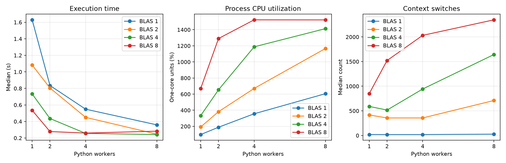

# Experiment 16 — Oversubscription

[English](#english) · [한국어](#한국어)



---

## English

### Overview

This experiment combines Python `ThreadPoolExecutor` workers with the native
BLAS threads used by NumPy matrix multiplication. It tests whether multiplying
both forms of parallelism eventually creates more runnable threads than the
machine can use efficiently.

### Background

Each Python worker starts one independent `numpy.matmul` task, and each task may
ask BLAS for its own native worker team. The approximate native thread budget is
therefore `Python workers × BLAS threads`. Once that budget exceeds useful CPU
capacity, scheduling, synchronization, cache contention, and context switching
can outweigh the benefit of additional parallelism.

### Research Question

Why can increasing Python workers and BLAS threads together make a fixed NumPy
workload slower?

### Hypothesis

Performance will improve while the combined thread budget uses otherwise idle
cores. Beyond that point, wall time will flatten or increase while CPU
utilization stops growing and context switches rise.

### Experimental Setup

- Runtime: CPython 3.13.5 on Windows 11
- NumPy: 2.4.6; psutil: 7.2.2
- BLAS: OpenBLAS 0.3.31.188.0 with pthreads
- Machine: 22 logical CPUs reported by the OS
- Data: eight independent pairs of 1024 × 1024 C-contiguous `float64` matrices
- Kernel: two `numpy.matmul(..., out=destination)` calls per task
- Conditions: Python workers 1, 2, 4, 8 × BLAS threads 1, 2, 4, 8
- Protocol: one warmup and seven measurements per condition
- Order: randomized within each repeat with seed `20260726`
- Primary statistic: median wall time

Python-worker and BLAS-thread counts are the independent variables. Wall time,
speedup, CPU utilization, and process context switches are dependent variables.
The matrices, task count, dtype, kernel count, output reuse, runtime, machine,
repeats, and random seed are controlled.

### Benchmark Methodology

All arrays are allocated before measurement. The eight tasks and their inputs
remain fixed across conditions. `threadpool_limits` constrains BLAS while a
`ThreadPoolExecutor` runs the requested number of Python workers. Every result
is checked against the 1-worker × 1-BLAS-thread result.

Wall time uses `perf_counter`; aggregate process CPU time uses `process_time`.
CPU utilization is CPU time divided by wall time, where 100% is approximately
one fully occupied core. `psutil.Process().num_ctx_switches()` is sampled before
and after each run. This is a process-level scheduling indicator, not a count of
every internal BLAS-thread switch.

```bash
uv run python experiments/exp16_oversubscription/benchmark.py
uv run python experiments/exp16_oversubscription/benchmark.py --quick
```

The benchmark writes raw and summarized CSV data, environment metadata, and the
figure shown above.

### Results

| Python workers | BLAS threads | Thread budget |  Median time |   Speedup | CPU utilization | Context switches |
| -------------: | -----------: | ------------: | -----------: | --------: | --------------: | ---------------: |
|              1 |            1 |             1 |     1.6296 s |     1.00× |           97.9% |               20 |
|              1 |            2 |             2 |     1.0829 s |     1.50× |          192.1% |              417 |
|              1 |            4 |             4 |     0.7330 s |     2.22× |          333.6% |              590 |
|              1 |            8 |             8 |     0.5351 s |     3.05× |          670.0% |              850 |
|              2 |            1 |             2 |     0.8350 s |     1.95× |          188.9% |               19 |
|              2 |            2 |             4 |     0.8047 s |     2.03× |          381.8% |              356 |
|              2 |            4 |             8 |     0.4358 s |     3.74× |          653.5% |              516 |
|              2 |            8 |            16 |     0.2781 s |     5.86× |         1290.4% |            1,521 |
|              4 |            1 |             4 |     0.5488 s |     2.97× |          355.9% |               19 |
|              4 |            2 |             8 |     0.4500 s |     3.62× |          670.7% |              356 |
|              4 |            4 |            16 |     0.2559 s |     6.37× |         1187.4% |              943 |
|              4 |            8 |            32 |     0.2597 s |     6.27× |         1522.6% |            2,032 |
|              8 |            1 |             8 |     0.3590 s |     4.54× |          605.4% |               27 |
|              8 |            2 |            16 |     0.2465 s |     6.61× |         1166.3% |              710 |
|              8 |            4 |            32 | **0.2417 s** | **6.74×** |         1412.9% |            1,643 |
|              8 |            8 |            64 |     0.2827 s |     5.76× |         1521.6% |            2,347 |

### Discussion

The fastest condition used 8 Python workers and 4 BLAS threads. Doubling the
BLAS limit to 8 raised the nominal thread budget from 32 to 64, but made the
median 17.0% slower and reduced speedup from 6.74× to 5.76×. Median context
switches rose from 1,643 to 2,347 while CPU utilization changed only from about
14.1 to 15.2 one-core units. The additional threads therefore added scheduling
activity without adding proportional useful CPU work.

The same boundary appeared at four Python workers: 4×4 finished in 0.2559 s,
whereas 4×8 was slightly slower at 0.2597 s and had more than twice as many
context switches. Conversely, thread growth below the saturation region often
helped, so the result is not that nested parallelism is always harmful. The
useful setting depends on workload granularity, BLAS behavior, and hardware.

### Conclusion

For this fixed workload, combining Python and BLAS parallelism helped up to a
point. The 8×8 condition created a nominal 64-thread budget on a 22-logical-CPU
machine and was slower than 8×4, despite slightly higher CPU utilization. More
parallelism can therefore reduce performance once scheduling and resource
contention dominate.

### Future Work

Repeat with physical-core affinity, different matrix sizes and BLAS libraries,
and OS-wide or per-thread scheduler counters. A follow-up could compare manual
BLAS limiting against library defaults in a real application.

### Threats to Validity

Results come from one Windows machine and one OpenBLAS build. Logical CPU count
does not equal physical-core capacity, and frequency scaling, thermals, cache
topology, background load, and OpenBLAS scheduling affect the crossover point.
The nominal thread budget is an upper-level model, not a direct observation of
simultaneously runnable threads. psutil exposes process-level context switches
on this platform and may omit switches within native BLAS workers. Executor
creation is included in every run. The findings apply to independent dense
matrix multiplications, not all NumPy workloads.

### Implementation and Measurements

`benchmark.py` implements matrix generation, the Cartesian condition grid,
correctness checks, warmups, randomized repeats, CSV/JSON persistence, and
plotting. Raw rows record both thread counts, nominal budget, run order, wall and
CPU times, CPU utilization, voluntary/involuntary context switches, and checksum.

```text
experiments/exp16_oversubscription/
├── README.md
├── benchmark.py
├── figures/oversubscription.png
└── results/
    ├── metadata.json
    ├── raw.csv
    └── summary.csv
```

---

## 한국어

### 개요

Python `ThreadPoolExecutor` worker와 NumPy 행렬곱이 사용하는 native BLAS
thread를 함께 늘려 측정한다. 두 병렬화 계층을 곱했을 때 장비가 효율적으로
처리할 수 있는 수보다 runnable thread가 많아지는지 확인하는 실험이다.

### 배경

각 Python worker는 독립적인 `numpy.matmul` task 하나를 실행하고, 각 task의
BLAS는 다시 자체 native worker team을 사용할 수 있다. 따라서 대략적인 native
thread budget은 `Python workers × BLAS threads`다. 이 값이 유효 CPU 용량을
넘으면 scheduling, synchronization, cache contention과 context switching의
비용이 추가 병렬화 이득보다 커질 수 있다.

### 연구 질문

Python worker와 BLAS thread를 동시에 늘릴 때 고정된 NumPy workload가 왜
오히려 느려질 수 있는가?

### 가설

남는 core를 활용하는 구간에서는 성능이 좋아지지만, 결합 thread budget이
유효 CPU 용량을 넘으면 wall time은 정체되거나 증가하고 context switch는
늘어날 것이다.

### 실험 환경

- Runtime: Windows 11의 CPython 3.13.5
- NumPy 2.4.6, psutil 7.2.2
- BLAS: pthreads 기반 OpenBLAS 0.3.31.188.0
- CPU: OS 기준 logical CPU 22개
- Data: 독립적인 1024 × 1024 C-contiguous `float64` 행렬 쌍 8개
- Kernel: task마다 `numpy.matmul(..., out=destination)` 2회
- 조건: Python worker 1, 2, 4, 8 × BLAS thread 1, 2, 4, 8
- 측정: 조건별 warmup 1회, 본 측정 7회
- 실행 순서: seed `20260726`으로 repeat마다 무작위화
- 대표 통계: wall time 중앙값

독립 변수는 Python worker와 BLAS thread 수다. 종속 변수는 wall time,
speedup, CPU utilization과 process context switch다. 행렬, task 수, dtype,
kernel 횟수, output 재사용, runtime, 장비, 반복 횟수와 seed를 통제한다.

### 벤치마크 방법

모든 array는 측정 전에 할당하고, 조건마다 동일한 8개 task와 입력을 사용한다.
`threadpool_limits`로 BLAS를 제한한 상태에서 `ThreadPoolExecutor`가 요청한
수의 Python worker를 실행한다. 모든 결과는 1×1 조건 결과와 비교한다.

Wall time은 `perf_counter`, process 전체 CPU time은 `process_time`으로 잰다.
CPU utilization 100%는 완전히 사용한 core 약 1개에 해당한다. 각 run 전후의
`psutil.Process().num_ctx_switches()` 차이도 기록한다. 이 값은 process 수준의
scheduling 지표이며 모든 내부 BLAS thread switch를 세는 값은 아니다.

```bash
uv run python experiments/exp16_oversubscription/benchmark.py
uv run python experiments/exp16_oversubscription/benchmark.py --quick
```

### 결과

| Python workers | BLAS threads | Thread budget | 실행 시간 중앙값 |   Speedup | CPU utilization | Context switches |
| -------------: | -----------: | ------------: | ---------------: | --------: | --------------: | ---------------: |
|              1 |            1 |             1 |         1.6296초 |     1.00× |           97.9% |               20 |
|              1 |            2 |             2 |         1.0829초 |     1.50× |          192.1% |              417 |
|              1 |            4 |             4 |         0.7330초 |     2.22× |          333.6% |              590 |
|              1 |            8 |             8 |         0.5351초 |     3.05× |          670.0% |              850 |
|              2 |            1 |             2 |         0.8350초 |     1.95× |          188.9% |               19 |
|              2 |            2 |             4 |         0.8047초 |     2.03× |          381.8% |              356 |
|              2 |            4 |             8 |         0.4358초 |     3.74× |          653.5% |              516 |
|              2 |            8 |            16 |         0.2781초 |     5.86× |         1290.4% |            1,521 |
|              4 |            1 |             4 |         0.5488초 |     2.97× |          355.9% |               19 |
|              4 |            2 |             8 |         0.4500초 |     3.62× |          670.7% |              356 |
|              4 |            4 |            16 |         0.2559초 |     6.37× |         1187.4% |              943 |
|              4 |            8 |            32 |         0.2597초 |     6.27× |         1522.6% |            2,032 |
|              8 |            1 |             8 |         0.3590초 |     4.54× |          605.4% |               27 |
|              8 |            2 |            16 |         0.2465초 |     6.61× |         1166.3% |              710 |
|              8 |            4 |            32 |     **0.2417초** | **6.74×** |         1412.9% |            1,643 |
|              8 |            8 |            64 |         0.2827초 |     5.76× |         1521.6% |            2,347 |

### 논의

가장 빠른 조건은 Python worker 8개와 BLAS thread 4개였다. BLAS limit을
8개로 늘려 nominal budget을 32에서 64로 두 배로 만들자 중앙값은 17.0%
느려졌고 speedup은 6.74배에서 5.76배로 감소했다. Context switch 중앙값은
1,643에서 2,347로 늘었지만 CPU utilization은 core 약 14.1개에서 15.2개
수준으로만 변했다. 추가 thread가 그에 비례한 유효 작업 대신 scheduling
활동을 늘린 결과와 일치한다.

Python worker 4개에서도 같은 경계가 나타났다. 4×4는 0.2559초였지만 4×8은
0.2597초로 조금 느렸고 context switch는 두 배 이상이었다. 반대로 포화 전에는
thread 증가가 대체로 유리했다. 따라서 nested parallelism이 항상 나쁜 것은
아니며 적절한 설정은 workload 크기, BLAS 동작과 hardware에 따라 달라진다.

### 결론

이 고정 workload에서는 Python과 BLAS 병렬화를 함께 늘리는 것이 일정
구간까지 도움이 됐다. 그러나 logical CPU 22개인 장비에서 nominal budget
64인 8×8 조건은 CPU utilization이 조금 더 높았음에도 8×4보다 느렸다.
Scheduling과 자원 경합이 지배하면 더 많은 병렬성이 성능을 낮출 수 있다.

### 향후 작업

Physical core affinity, 다른 행렬 크기와 BLAS library로 반복하고 OS 전체
또는 thread별 scheduler counter를 수집한다. 실제 application에서 BLAS
수동 제한과 library 기본값을 비교하는 후속 실험도 가능하다.

### 타당성 위협

한 Windows 장비와 OpenBLAS build의 결과다. Logical CPU 수는 physical core
용량과 같지 않으며 frequency scaling, thermal state, cache topology,
background load와 OpenBLAS scheduling이 경계점에 영향을 준다. Nominal
thread budget은 동시에 실행된 thread의 직접 관측값이 아니다. 이 platform의
psutil 값은 process 수준이며 native BLAS worker 내부 switch를 누락할 수 있다.
매 run의 executor 생성 시간도 측정에 포함된다. 결과는 독립적인 dense
matrix multiplication에 해당하며 모든 NumPy workload를 대표하지 않는다.

### 구현과 측정값

`benchmark.py`에 행렬 생성, Cartesian 조건 조합, 정확성 검사, warmup,
무작위 반복 측정, CSV/JSON 저장과 plotting을 구현했다. Raw row에는 두 thread
수, nominal budget, 실행 순서, wall/CPU time, CPU utilization,
voluntary/involuntary context switch와 checksum을 기록한다.
