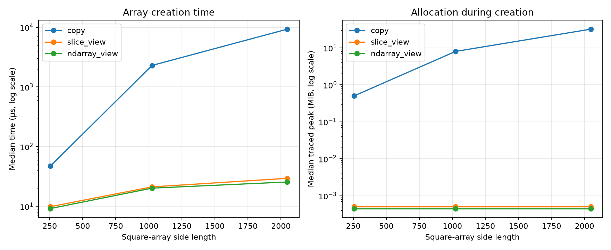

# Experiment 17 — Memory Copy vs View

[English](#english) · [한국어](#한국어)



---

## English

### Overview

This experiment measures the cost of creating an independent NumPy array with
`.copy()` against creating metadata-only aliases with full slicing (`[:, :]`)
and `.view()`. It separates an array's logical size from the memory allocated
while the result is created.

### Background

A copy allocates a new data buffer and copies every element. A view normally
creates only a small array header containing shape, dtype, strides, and a
reference to existing storage. Consequently, copy cost should grow with the
number of bytes, while view creation should remain approximately constant.
Views are not independent: writes through either alias can affect the other.

### Research Question

How do creation time and additional memory allocation differ between a NumPy
copy and an equivalent slicing or ndarray view as array size grows?

### Hypothesis

Copy time and peak allocation will scale with array size. Both view operations
will allocate only metadata and take roughly constant time, but will share
memory with the source.

### Experimental Setup

- Runtime: CPython 3.13.5 on Windows 11
- NumPy: 2.4.6
- Data: C-contiguous square `float64` arrays with sides 256, 1024, and 2048
- Source sizes: 0.5 MiB, 8 MiB, and 32 MiB
- Conditions: `source.copy()`, `source[:, :]`, and `source.view()`
- Protocol: two warmups and 11 measured runs per size and condition
- Order: randomized within each repeat with seed `20260727`
- Timer: `perf_counter_ns`; memory: `tracemalloc` peak during creation
- Primary statistics: median creation time and median traced peak allocation

Array side length and operation are independent variables. Creation time, peak
allocation, ownership, and memory sharing are dependent variables. Dtype,
shape within a size, source layout, runtime, repeats, warmups, and seed are
controlled.

### Benchmark Methodology

The source is allocated before timing. Each operation returns an equal-valued,
equal-shaped array, retained until peak allocation is sampled. `np.shares_memory`
and `flags.owndata` verify semantics. Warmups precede randomized measurements;
median values reduce sensitivity to individual interruptions.

```bash
uv run python experiments/exp17_memory_copy_vs_view/benchmark.py
uv run python experiments/exp17_memory_copy_vs_view/benchmark.py --quick
```

### Results

| Shape | Operation    | Median time | Traced peak | Owns data | Shares source | Speedup vs copy |
| ----: | ------------ | ----------: | ----------: | :-------: | :-----------: | --------------: |
|  256² | copy         |     47.6 µs |  0.5005 MiB |    Yes    |      No       |            1.0× |
|  256² | slice view   |      9.9 µs |       528 B |    No     |      Yes      |            4.8× |
|  256² | ndarray view |      9.2 µs |       472 B |    No     |      Yes      |            5.2× |
| 1024² | copy         |   2.2925 ms |  8.0005 MiB |    Yes    |      No       |            1.0× |
| 1024² | slice view   |     21.2 µs |       528 B |    No     |      Yes      |          108.1× |
| 1024² | ndarray view |     20.2 µs |       472 B |    No     |      Yes      |          113.5× |
| 2048² | copy         |   9.2974 ms | 32.0005 MiB |    Yes    |      No       |            1.0× |
| 2048² | slice view   |     29.5 µs |       528 B |    No     |      Yes      |          315.2× |
| 2048² | ndarray view |     25.6 µs |       472 B |    No     |      Yes      |          363.2× |

### Discussion

At 2048², copying allocated approximately the full 32 MiB payload and took
9.30 ms. The two views allocated less than 0.6 KiB according to `tracemalloc`
and took 25–30 µs. Copy cost increased sharply with the payload, whereas view
metadata allocation remained effectively fixed. The observed speedup reached
315× for slicing and 363× for `.view()` at the largest size.

The result's `nbytes` is 32 MiB in all three conditions, but that value describes
the logical elements visible through the array, not newly owned storage.
Ownership and `shares_memory` checks are therefore essential to interpreting
memory use.

### Conclusion

For these full-array operations, views were nearly constant-cost metadata
objects, while `.copy()` paid time and memory proportional to the source
payload. A view is appropriate when shared storage is safe; a copy is required
when mutation or lifetime isolation matters.

### Future Work

Measure resident-set changes with a process-isolated runner, compare partial and
strided slices, and benchmark later computations where a compact copy may repay
its creation cost through better locality.

### Threats to Validity

The measurements come from one Windows machine and NumPy build. Sub-microsecond
metadata work is sensitive to timer and tracing overhead; `tracemalloc` reports
allocations visible through Python's allocator hooks and is not a complete
process RSS measurement. Page faults, allocator reuse, cache state, background
load, and memory bandwidth affect copy timing. Full slices are representative
of view creation but not of the performance of every downstream view operation.

### Implementation and Measurements

`benchmark.py` creates sources, validates values and sharing semantics,
randomizes condition order, records raw data, summarizes medians, saves
environment metadata, and generates the figure.

```text
experiments/exp17_memory_copy_vs_view/
├── README.md
├── benchmark.py
├── figures/copy_vs_view.png
└── results/
    ├── metadata.json
    ├── raw.csv
    └── summary.csv
```

---

## 한국어

### 개요

NumPy `.copy()`로 독립 배열을 만드는 비용과 전체 slicing(`[:, :]`) 및
`.view()`로 metadata-only alias를 만드는 비용을 측정한다. 배열의 논리적
크기와 결과 생성 중 실제로 추가 할당된 메모리를 구분한다.

### 배경

복사는 새 data buffer를 할당하고 모든 원소를 옮긴다. View는 일반적으로
shape, dtype, strides와 기존 저장소 참조를 담은 작은 array header만 만든다.
따라서 복사 비용은 byte 수에 따라 증가하고 view 생성 비용은 거의 일정할
것으로 예상된다. 다만 view는 독립적이지 않아 한 alias의 수정이 다른 쪽에
반영될 수 있다.

### 연구 질문

배열 크기가 커질 때 NumPy 복사와 동일 모양의 slicing/view는 생성 시간과
추가 메모리 할당에서 얼마나 차이가 나는가?

### 가설

복사 시간과 peak allocation은 배열 크기에 비례해 증가할 것이다. 두 view는
metadata만 할당해 거의 일정한 시간이 걸리지만 원본과 메모리를 공유할 것이다.

### 실험 환경

- Runtime: Windows 11의 CPython 3.13.5
- NumPy 2.4.6
- Data: 변 길이 256, 1024, 2048인 C-contiguous 정사각 `float64` 배열
- 원본 크기: 0.5 MiB, 8 MiB, 32 MiB
- 조건: `source.copy()`, `source[:, :]`, `source.view()`
- 측정: 조건별 warmup 2회, 본 측정 11회
- 순서: seed `20260727`로 repeat마다 무작위화
- 측정 도구: `perf_counter_ns`, 생성 구간의 `tracemalloc` peak
- 대표 통계: 생성 시간과 traced peak allocation의 중앙값

독립 변수는 배열 변 길이와 생성 연산이다. 종속 변수는 생성 시간, peak
allocation, data 소유권과 원본 메모리 공유 여부다. dtype, 각 크기에서의
shape, source layout, runtime, 반복 수, warmup과 seed를 통제한다.

### 벤치마크 방법

원본은 측정 전에 할당한다. 각 연산은 값과 shape가 같은 배열을 반환하며 peak
allocation을 읽을 때까지 유지한다. `np.shares_memory`와 `flags.owndata`로
의미를 검증한다. Warmup 후 조건 순서를 무작위화하고 중앙값을 사용한다.

```bash
uv run python experiments/exp17_memory_copy_vs_view/benchmark.py
uv run python experiments/exp17_memory_copy_vs_view/benchmark.py --quick
```

### 결과

| Shape | 연산         | 시간 중앙값 | Traced peak | Data 소유 | 원본 공유 | Copy 대비 속도 |
| ----: | ------------ | ----------: | ----------: | :-------: | :-------: | -------------: |
|  256² | copy         |     47.6 µs |  0.5005 MiB |    예     |  아니요   |           1.0× |
|  256² | slice view   |      9.9 µs |       528 B |  아니요   |    예     |           4.8× |
|  256² | ndarray view |      9.2 µs |       472 B |  아니요   |    예     |           5.2× |
| 1024² | copy         |   2.2925 ms |  8.0005 MiB |    예     |  아니요   |           1.0× |
| 1024² | slice view   |     21.2 µs |       528 B |  아니요   |    예     |         108.1× |
| 1024² | ndarray view |     20.2 µs |       472 B |  아니요   |    예     |         113.5× |
| 2048² | copy         |   9.2974 ms | 32.0005 MiB |    예     |  아니요   |           1.0× |
| 2048² | slice view   |     29.5 µs |       528 B |  아니요   |    예     |         315.2× |
| 2048² | ndarray view |     25.6 µs |       472 B |  아니요   |    예     |         363.2× |

### 논의

2048² 배열 복사는 payload 전체에 가까운 32 MiB를 할당하고 9.30 ms가
걸렸다. 두 view는 `tracemalloc` 기준 0.6 KiB 미만을 할당하고 25–30 µs가
걸렸다. 복사 비용은 payload와 함께 크게 증가했지만 view metadata allocation은
사실상 일정했다. 가장 큰 배열에서 slicing은 315배, `.view()`는 363배의
속도 차이를 보였다.

세 조건 모두 결과의 `nbytes`는 32 MiB지만 이는 배열을 통해 보이는 논리적
원소 크기이지 새로 소유한 저장 공간을 뜻하지 않는다. 따라서 data 소유권과
`shares_memory` 확인이 메모리 사용량 해석에 필요하다.

### 결론

이 전체 배열 연산에서 view는 거의 고정 비용인 metadata 객체였고 `.copy()`는
원본 payload에 비례한 시간과 메모리를 사용했다. 저장 공간 공유가 안전하면
view가 적합하고, mutation 또는 lifetime을 분리해야 하면 copy가 필요하다.

### 향후 작업

격리 process에서 resident set 변화를 측정하고, 부분/strided slice를 비교하며,
연속 copy의 생성 비용을 이후 연산의 locality 개선으로 회수하는 시점도 측정할
수 있다.

### 타당성 위협

한 Windows 장비와 NumPy build의 결과다. 매우 짧은 metadata 연산은 timer와
tracing overhead에 민감하다. `tracemalloc`은 Python allocator hook에 보이는
할당을 측정하며 process RSS 전체를 나타내지 않는다. Page fault, allocator
재사용, cache 상태, background load와 memory bandwidth가 복사 시간에 영향을
준다. 전체 slice 생성 결과가 모든 후속 view 연산의 성능을 대표하지는 않는다.

### 구현과 측정값

`benchmark.py`는 source 생성, 값과 공유 의미 검증, 조건 순서 무작위화, raw
data 기록, 중앙값 요약, 환경 metadata 저장과 figure 생성을 구현한다.

```text
experiments/exp17_memory_copy_vs_view/
├── README.md
├── benchmark.py
├── figures/copy_vs_view.png
└── results/
    ├── metadata.json
    ├── raw.csv
    └── summary.csv
```
