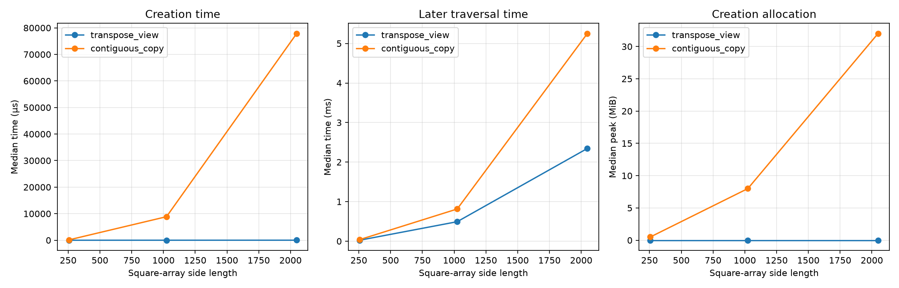

# Experiment 18 — Transpose Cost

[English](#english) · [한국어](#한국어)



---

## English

### Overview

This experiment separates the cost of creating `source.T` from the cost of
later reading the transposed array. It compares the metadata-only transpose
view with `np.ascontiguousarray(source.T)`, which materializes the same logical
values in a new C-contiguous buffer.

### Background

NumPy transpose normally changes shape and strides without moving payload
bytes. That makes creation cheap but leaves a view whose logical rows are not
contiguous in C order. A contiguous copy pays an up-front allocation and copy
cost, and may improve some later kernels. Whether that investment is recovered
depends on the kernel, NumPy implementation, array size, and number of reuses.

### Research Question

How do transpose creation time, later traversal time, and additional allocation
differ between a `.T` view and a C-contiguous copy?

### Hypothesis

The transpose view should take approximately constant creation time and share
the source buffer. The copy should scale with payload size. A logical row
reduction may favor the contiguous copy, but one traversal may not recover its
creation cost.

### Experimental Setup

- Runtime: CPython 3.13.5 on Windows 11; NumPy 2.4.6
- Data: C-contiguous square `float64` arrays, sides 256, 1024, and 2048
- Conditions: `source.T` and `np.ascontiguousarray(source.T)`
- Traversal: `np.sum(array, axis=1).sum()`
- Protocol: two warmups and 11 measured runs per condition and size
- Order: randomized per repeat with seed `20260728`
- Timer: `perf_counter_ns`; creation allocation: `tracemalloc` peak
- Statistics: medians for creation, traversal, and allocation

Array size and representation are independent variables. Creation time,
traversal time, allocation, contiguity, ownership, and sharing are dependent
variables. Values, dtype, shape, source layout, reduction, runtime, warmups,
repeats, and random seed are controlled. CPU information is useful for
cross-machine interpretation but is not required to execute the benchmark.

### Benchmark Methodology

Sources and expected checksums are created before measurement. Creation and
traversal use separate timers. Results are checked for value equality through a
checksum, and flags plus `np.shares_memory` verify storage semantics. Condition
order is randomized to reduce systematic order bias.

```bash
uv run python experiments/exp18_transpose_cost/benchmark.py
uv run python experiments/exp18_transpose_cost/benchmark.py --quick
```

### Results

| Shape | Representation  |   Creation | Traversal | Creation peak | C-contiguous | Shares source |
| ----: | --------------- | ---------: | --------: | ------------: | :----------: | :-----------: |
|  256² | transpose view  |     2.0 µs | 0.0238 ms |         188 B |      No      |      Yes      |
|  256² | contiguous copy |   137.9 µs | 0.0387 ms |    0.5002 MiB |     Yes      |      No       |
| 1024² | transpose view  |     7.5 µs | 0.4922 ms |         188 B |      No      |      Yes      |
| 1024² | contiguous copy |  8.8685 ms | 0.8136 ms |    8.0002 MiB |     Yes      |      No       |
| 2048² | transpose view  |    15.0 µs | 2.3437 ms |         188 B |      No      |      Yes      |
| 2048² | contiguous copy | 77.8425 ms | 5.2498 ms |   32.0002 MiB |     Yes      |      No       |

### Discussion

The two costs were clearly distinct. At 2048², the view took 15 µs and 188
traced bytes to create, while materialization took 77.84 ms and approximately
the full 32 MiB payload. The view was F-contiguous and shared storage; the copy
was C-contiguous and independently owned.

Contrary to the locality hypothesis, the contiguous copy did not improve this
specific reduction. Its traversal median was 2.24× the view median at 2048².
This does not show that strided access is generally faster. It shows that
high-level NumPy reductions can select efficient native iteration strategies,
so contiguity benefits cannot be inferred from strides alone. Creation cost
also cannot be justified without measuring the actual downstream kernel.

### Conclusion

`.T` itself was a small metadata operation; making the transpose contiguous
was the expensive operation. For the measured one-pass axis reduction, the
copy neither reduced traversal time nor recovered its up-front cost.

### Future Work

Repeat the comparison for matrix multiplication, element-wise kernels, and
multiple reuses; isolate cold-cache effects; record process RSS; and compare
NumPy builds and CPU architectures.

### Threats to Validity

Results come from one Windows machine and NumPy build. `tracemalloc` does not
measure all process RSS changes. `np.sum` is an optimized native kernel and is
not representative of every row-wise consumer. Cache state, allocator reuse,
page faults, CPU frequency, background load, and randomized order affect
timings. The benchmark measures square `float64` arrays only.

### Implementation and Measurements

`benchmark.py` records raw creation and traversal timing, creation peak memory,
layout flags, ownership, sharing, checksum, run order, summary statistics, and
environment metadata. The figure plots creation time, later traversal time,
and creation allocation against array size.

---

## 한국어

### 개요

`source.T`를 만드는 비용과 전치 배열을 나중에 읽는 비용을 분리한다.
Metadata만 변경하는 transpose view와 같은 논리 값을 새 C-contiguous buffer에
구체화하는 `np.ascontiguousarray(source.T)`를 비교한다.

### 배경

NumPy 전치는 보통 payload를 이동하지 않고 shape와 strides만 바꾼다. 생성은
저렴하지만 논리적 행이 C order에서 연속적이지 않은 view가 된다. 연속 복사는
먼저 할당과 복사 비용을 지불하며 일부 후속 kernel을 빠르게 할 수 있다. 이
비용을 회수하는지는 kernel, NumPy 구현, 배열 크기와 재사용 횟수에 달려 있다.

### 연구 질문

`.T` view와 C-contiguous copy는 전치 생성 시간, 후속 순회 시간, 추가 메모리
할당에서 어떻게 다른가?

### 가설

Transpose view 생성 시간은 거의 일정하고 원본 buffer를 공유할 것이다. Copy
비용은 payload 크기에 따라 증가할 것이다. 논리적 행 reduction은 contiguous
copy에 유리할 수 있지만 한 번의 순회로 생성 비용까지 회수하지는 못할 것이다.

### 실험 환경

- Windows 11, CPython 3.13.5, NumPy 2.4.6
- C-contiguous 정사각 `float64` 배열: 256, 1024, 2048
- 조건: `source.T`, `np.ascontiguousarray(source.T)`
- 순회: `np.sum(array, axis=1).sum()`
- 조건·크기별 warmup 2회, 본 측정 11회
- Seed `20260728`로 repeat마다 조건 순서 무작위화
- `perf_counter_ns`, 생성 구간 `tracemalloc` peak
- 생성·순회·할당 중앙값 보고

독립 변수는 배열 크기와 표현 방식이다. 종속 변수는 생성 시간, 순회 시간,
할당량, 연속성, 소유권과 공유 여부다. 값, dtype, shape, 원본 layout,
reduction, runtime, warmup, 반복 수와 seed를 통제한다. CPU 정보는 다른
장비의 결과를 해석할 때 유용하지만 실행에 필수적이지 않다.

### 벤치마크 방법

원본과 예상 checksum은 측정 전에 만든다. 생성과 순회를 별도 timer로
측정하고 checksum으로 값을 검증한다. Array flags와 `np.shares_memory`로
저장 방식도 확인한다. 순서 편향을 줄이기 위해 조건 순서를 무작위화한다.

```bash
uv run python experiments/exp18_transpose_cost/benchmark.py
uv run python experiments/exp18_transpose_cost/benchmark.py --quick
```

### 결과

| Shape | 표현            |       생성 |      순회 |   생성 peak | C-contiguous | 원본 공유 |
| ----: | --------------- | ---------: | --------: | ----------: | :----------: | :-------: |
|  256² | transpose view  |     2.0 µs | 0.0238 ms |       188 B |    아니요    |    예     |
|  256² | contiguous copy |   137.9 µs | 0.0387 ms |  0.5002 MiB |      예      |  아니요   |
| 1024² | transpose view  |     7.5 µs | 0.4922 ms |       188 B |    아니요    |    예     |
| 1024² | contiguous copy |  8.8685 ms | 0.8136 ms |  8.0002 MiB |      예      |  아니요   |
| 2048² | transpose view  |    15.0 µs | 2.3437 ms |       188 B |    아니요    |    예     |
| 2048² | contiguous copy | 77.8425 ms | 5.2498 ms | 32.0002 MiB |      예      |  아니요   |

### 논의

두 비용은 명확히 분리됐다. 2048²에서 view 생성은 15 µs와 traced 188 B가
필요했지만 구체화에는 77.84 ms와 payload 전체에 가까운 32 MiB가 필요했다.
View는 F-contiguous이며 저장소를 공유했고, copy는 C-contiguous이며 독립
저장소를 소유했다.

Locality 가설과 달리 이 reduction에서는 연속 복사가 순회를 개선하지 않았다.
2048² copy의 순회 중앙값은 view의 2.24배였다. 이는 strided access가 일반적으로
더 빠르다는 뜻이 아니다. 고수준 NumPy reduction이 효율적인 native iteration
전략을 사용할 수 있으므로 strides만으로 이득을 단정할 수 없다는 결과다.

### 결론

`.T` 자체는 작은 metadata 연산이고, 전치 결과를 연속 배열로 만드는 단계가
비싼 연산이었다. 측정한 1회 axis reduction에서 copy는 순회 시간도 줄이지
못했고 선행 비용도 회수하지 못했다.

### 향후 작업

행렬 곱, 원소별 kernel, 반복 재사용을 비교하고 cold-cache 효과를 분리한다.
Process RSS를 기록하고 다른 NumPy build와 CPU에서도 반복한다.

### 타당성 위협

한 Windows 장비와 NumPy build의 결과다. `tracemalloc`은 전체 process RSS를
측정하지 않는다. 최적화된 `np.sum`은 모든 행 순회 작업을 대표하지 않는다.
Cache 상태, allocator 재사용, page fault, CPU 주파수, background load와
실행 순서가 결과에 영향을 준다. 정사각 `float64` 배열만 측정했다.

### 구현 및 측정값

`benchmark.py`는 생성·순회 시간, 생성 peak memory, layout flags, 소유권,
공유 여부, checksum, 실행 순서, 요약 통계와 환경 metadata를 저장한다. 그래프는
배열 크기에 따른 생성 시간, 후속 순회 시간과 생성 할당량을 보여 준다.
