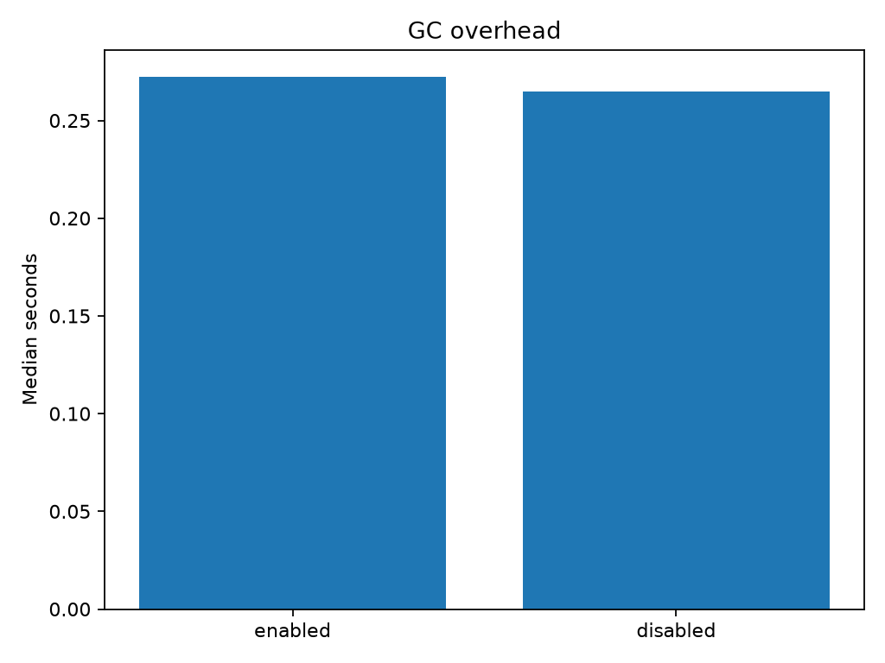

# Experiment 19 — Garbage Collection Overhead

[English](#english) · [한국어](#한국어)



---

## English

### Overview

This experiment measures the runtime and memory trade-off caused by CPython's
cyclic garbage collector during an object-heavy workload. It compares the same
workload with cyclic GC enabled and disabled.

The goal is not to show that garbage collection should generally be disabled.
It is to determine how much collection work occurs inside the measured region
and what happens to memory when that work is deferred.

### Background

CPython primarily uses reference counting. Most objects are reclaimed as soon
as their reference count reaches zero, but reference counting alone cannot
reclaim cycles.

The workload deliberately creates self-referential lists:

```python
node = [i]
node.append(node)
```

When such a list becomes unreachable, its reference count does not fall to
zero because it still refers to itself. With GC enabled, CPython's cyclic
collector periodically detects and reclaims these unreachable cycles. With GC
disabled, they remain allocated until an explicit collection is performed.

### Research Question

For a workload that creates many short-lived cyclic objects:

- How much does cyclic GC affect execution time?
- How many collections occur during the workload?
- How much traced peak memory is required when collection is deferred?

### Hypothesis

Disabling cyclic GC should make the timed workload slightly faster because no
generational collections occur inside the measured region. However, unreachable
cycles should accumulate, causing substantially higher peak memory.

The expected result is therefore a throughput-versus-memory trade-off, not a
free performance improvement.

### Experimental Setup

- Platform: Windows 11
- Runtime: CPython
- Workload: 200,000 self-referential lists per run
- Retention rule: every 64th list remains reachable until the workload returns
- Conditions: cyclic GC enabled and cyclic GC disabled
- Warm-up: one reduced 2,000-object run per condition
- Measured repetitions: nine per condition
- Timer: `time.perf_counter_ns`
- Collection counter: sum of `gc.get_stats()` collection counts
- Memory measurement: `tracemalloc` peak during the workload
- Correctness check: deterministic checksum of retained objects

The benchmark calls `gc.collect()` before every measurement so each condition
starts after an explicit cleanup. It restores the caller's GC state and
performs another explicit collection after the timed region.

#### Variables

| Type        | Variables                                                                                                         |
| ----------- | ----------------------------------------------------------------------------------------------------------------- |
| Independent | GC enabled or disabled                                                                                            |
| Dependent   | Execution time, traced peak memory, collection count                                                              |
| Controlled  | Object count, object structure, retention rule, checksum, timer, warm-up count, repetition count, condition order |

CPU model information is useful when comparing absolute timings across
machines, but the experiment does not require hardware performance counters.

### Benchmark Methodology

Each measured repeat runs the enabled condition followed by the disabled
condition. The workload, object count, and checksum logic are identical.

Only object creation and checksum calculation are timed. Cleanup after the run
is intentionally outside the timer. This distinction is essential: the
disabled condition defers reclamation work rather than eliminating it.

Nine samples per condition are summarized using the median. A speedup is
calculated as:

```text
enabled median time / disabled median time
```

Run the full experiment:

```bash
uv run python experiments/exp19_garbage_collection_overhead/benchmark.py
```

Run a small smoke-test configuration:

```bash
uv run python experiments/exp19_garbage_collection_overhead/benchmark.py --quick
```

Custom parameters are also supported:

```bash
uv run python experiments/exp19_garbage_collection_overhead/benchmark.py \
  --objects 500000 --repeats 15 --warmups 2
```

### Results

| Condition   | Median time | Speedup | Median collections | Median traced peak |
| ----------- | ----------: | ------: | -----------------: | -----------------: |
| GC enabled  |    0.2724 s |   1.00× |                 96 |           0.78 MiB |
| GC disabled |    0.2650 s |   1.03× |                  0 |          29.01 MiB |

With GC disabled, the measured workload was about 2.8% faster. At the same
time, traced peak memory increased from approximately 0.78 MiB to 29.01 MiB,
or roughly 37×.

The enabled condition performed a median of 96 collections during a run. The
disabled condition performed none inside the workload, as intended.

Generated artifacts:

- `results/raw.csv`: every measured run
- `results/summary.csv`: medians and speedup
- `results/metadata.json`: platform and benchmark parameters
- `figures/gc_overhead.png`: median runtime comparison

### Discussion

The timing result supports the first part of the hypothesis, but the gain was
small: only 1.03×. Collection work was measurable, yet it was not the dominant
cost of this workload.

The memory result is more pronounced. Disabling GC allowed unreachable cycles
to accumulate throughout the timed region. The later `gc.collect()` still had
to reclaim them, but that cleanup occurred after timing and therefore does not
appear in the disabled runtime.

This means the two timing numbers answer a narrow question:

> How quickly can this allocation phase finish when cyclic reclamation is
> performed during the phase versus deferred until afterward?

They do not compare the complete long-running cost of both policies. A program
that repeatedly disables GC without arranging safe collection points could
experience growing memory use, long cleanup pauses, or eventual memory
pressure.

### Conclusion

For this cyclic-object workload, disabling GC reduced measured execution time
by about 2.8%, but increased traced peak memory by roughly 37×. The experiment
therefore shows a trade-off between in-phase collection overhead and deferred
memory reclamation.

Disabling GC may be useful inside a carefully bounded region when the program
knows that it creates no problematic cycles or provides an explicit cleanup
point. These results do not justify disabling GC globally.

### Future Work

- Include post-run `gc.collect()` time in an end-to-end cost comparison.
- Vary cycle density independently from total allocation count.
- Compare different generation thresholds with `gc.set_threshold()`.
- Separate short-lived, long-lived, acyclic, and cyclic object populations.
- Record process RSS alongside `tracemalloc`.
- Randomize or counterbalance condition order.
- Report distributions and confidence intervals instead of medians alone.
- Repeat on other CPython versions and operating systems.

### Threats to Validity

- The enabled condition always runs before the disabled condition within a
  repeat, so temporal drift could create an order effect.
- Cleanup for the disabled condition is outside the measured interval.
- `tracemalloc` tracks Python allocations but is not equivalent to process RSS.
- The synthetic self-cycle workload does not represent every application.
- Allocator reuse, cache state, CPU frequency, thermal state, and background
  activity may affect timing.
- Results come from one operating system, interpreter build, and object count.
- Medians describe the observed samples but do not establish statistical
  significance.

### Implementation and Measurements

`benchmark.py` contains the workload, state restoration, timing, collection
counting, memory tracing, CSV serialization, metadata capture, and plotting.
The checksum verifies that both conditions perform the same retained-object
work. The test suite also checks that both conditions produce identical
checksums.

---

## 한국어

### 개요

이 실험은 Python 객체를 많이 생성할 때 CPython의 순환 garbage collector가
실행 시간과 메모리에 미치는 영향을 측정한다. 동일한 workload를 순환 GC가
활성화된 상태와 비활성화된 상태에서 각각 실행한다.

목적은 GC를 일반적으로 꺼야 한다는 결론을 내리는 것이 아니다. 측정 구간
안에서 실제로 어느 정도의 수집 작업이 발생하는지, 그리고 그 작업을 뒤로
미루면 메모리에 어떤 비용이 생기는지 확인하는 것이 목적이다.

### 배경

CPython은 주로 참조 계수를 사용한다. 대부분의 객체는 참조 계수가 0이 되는
즉시 회수되지만, 참조 계수만으로는 순환 참조를 회수할 수 없다.

이 실험은 의도적으로 자기 자신을 참조하는 list를 만든다.

```python
node = [i]
node.append(node)
```

이 list가 도달 불가능한 상태가 되어도 자기 자신을 참조하므로 참조 계수는
0이 되지 않는다. GC가 활성화되어 있으면 CPython의 순환 collector가 이런
객체를 주기적으로 찾아 회수한다. GC가 비활성화되어 있으면 명시적으로
수집하기 전까지 메모리에 남는다.

### 연구 질문

수명이 짧은 순환 객체를 대량으로 생성할 때 다음 질문을 검증한다.

- 순환 GC가 실행 시간에 얼마나 영향을 주는가?
- Workload 실행 중 collection은 몇 번 발생하는가?
- 수집을 뒤로 미루면 traced peak memory는 얼마나 증가하는가?

### 가설

순환 GC를 비활성화하면 측정 구간 안에서 세대별 collection이 발생하지 않기
때문에 workload가 조금 더 빠르게 끝날 것이다. 하지만 도달 불가능한 cycle이
누적되어 peak memory는 크게 증가할 것이다.

따라서 예상되는 결과는 공짜 성능 향상이 아니라 처리량과 메모리 사이의
trade-off다.

### 실험 환경

- 운영체제: Windows 11
- Runtime: CPython
- Workload: run마다 자기 참조 list 200,000개 생성
- 보존 규칙: 64개마다 하나의 list를 workload 종료 시점까지 유지
- 비교 조건: 순환 GC 활성화, 순환 GC 비활성화
- Warm-up: 조건별 2,000개 객체를 사용하는 축소 실행 1회
- 본 측정: 조건별 9회
- Timer: `time.perf_counter_ns`
- Collection 측정: `gc.get_stats()`의 세대별 collection 수 합계
- Memory 측정: workload 구간의 `tracemalloc` peak
- 정확성 검증: 보존된 객체로 계산한 deterministic checksum

각 측정 전에 `gc.collect()`를 호출해 명시적 정리가 끝난 상태에서 시작한다.
측정 후에는 호출 이전의 GC 활성 상태를 복원하고 다시 명시적 collection을
수행한다.

#### 변수

| 구분      | 변수                                                                           |
| --------- | ------------------------------------------------------------------------------ |
| 독립 변수 | GC 활성화 또는 비활성화                                                        |
| 종속 변수 | 실행 시간, traced peak memory, collection 수                                   |
| 통제 변수 | 객체 수, 객체 구조, 보존 규칙, checksum, timer, warm-up 수, 반복 수, 조건 순서 |

CPU 모델은 다른 장비의 절대 시간을 비교할 때 유용하지만, 이 실험을 실행하기
위해 hardware performance counter가 필요하지는 않다.

### 벤치마크 방법

각 repeat에서 활성 조건을 먼저 실행하고 비활성 조건을 실행한다. 두 조건의
workload, 객체 수와 checksum 계산은 동일하다.

측정 구간에는 객체 생성과 checksum 계산만 포함한다. Run 이후의 정리 작업은
의도적으로 timer 밖에 있다. 이 구분이 중요하다. 비활성 조건은 회수 비용을
없애는 것이 아니라 뒤로 미룬다.

조건별 9개 sample의 중앙값을 보고하며 speedup은 다음과 같이 계산한다.

```text
GC 활성 조건 중앙값 / GC 비활성 조건 중앙값
```

전체 실험:

```bash
uv run python experiments/exp19_garbage_collection_overhead/benchmark.py
```

빠른 smoke test:

```bash
uv run python experiments/exp19_garbage_collection_overhead/benchmark.py --quick
```

실험 parameter도 직접 지정할 수 있다.

```bash
uv run python experiments/exp19_garbage_collection_overhead/benchmark.py \
  --objects 500000 --repeats 15 --warmups 2
```

### 결과

| 조건        | 실행 시간 중앙값 | Speedup | Collection 중앙값 | Traced peak 중앙값 |
| ----------- | ---------------: | ------: | ----------------: | -----------------: |
| GC 활성화   |         0.2724초 |   1.00× |              96회 |           0.78 MiB |
| GC 비활성화 |         0.2650초 |   1.03× |               0회 |          29.01 MiB |

GC 비활성 조건의 workload는 기준 측정에서 약 2.8% 빨랐다. 반면 traced peak
memory는 약 0.78 MiB에서 29.01 MiB로 약 37배 증가했다.

활성 조건에서는 run당 collection 중앙값이 96회였으며, 비활성 조건에서는
의도한 대로 workload 안에서 collection이 발생하지 않았다.

생성되는 결과물:

- `results/raw.csv`: 모든 개별 측정값
- `results/summary.csv`: 중앙값과 speedup
- `results/metadata.json`: 환경과 benchmark parameter
- `figures/gc_overhead.png`: 실행 시간 중앙값 비교

### 논의

시간 결과는 가설의 첫 부분과 일치하지만 성능 향상은 1.03배로 작았다. 순환
수집 작업의 비용은 측정됐지만 이 workload의 지배적인 비용은 아니었다.

메모리 차이는 훨씬 컸다. GC를 비활성화하면 도달 불가능한 cycle이 측정 구간
동안 계속 누적된다. 이후의 `gc.collect()`가 결국 이를 회수하지만, 그 작업은
timer가 끝난 뒤 수행되므로 비활성 조건의 실행 시간에는 포함되지 않는다.

따라서 두 실행 시간은 다음과 같은 제한된 질문에 답한다.

> 객체 생성 단계에서 순환 객체를 즉시 수집하는 경우와 수집을 단계 이후로
> 미루는 경우, 해당 생성 단계가 얼마나 빨리 끝나는가?

두 정책의 장시간 end-to-end 비용 전체를 비교한 것은 아니다. 안전한 수집
시점을 마련하지 않고 GC를 계속 비활성화하면 메모리 증가, 긴 후속 정지 시간,
또는 memory pressure가 발생할 수 있다.

### 결론

이 순환 객체 workload에서 GC 비활성화는 측정 시간을 약 2.8% 줄였지만 traced
peak memory를 약 37배 증가시켰다. 즉, 측정 구간 안의 collection overhead와
회수가 미뤄진 객체의 memory cost 사이에 명확한 trade-off가 있었다.

프로그램이 순환 객체를 만들지 않는다는 사실을 알고 있거나 안전한 명시적
수집 지점을 제공할 수 있다면 제한된 구간에서 GC 비활성화를 검토할 수 있다.
하지만 이 결과는 GC를 전역으로 비활성화할 근거가 아니다.

### 향후 작업

- Run 이후 `gc.collect()` 시간까지 포함한 end-to-end 비용 비교
- 전체 할당 수와 cycle 밀도를 독립적으로 변화
- `gc.set_threshold()`를 이용한 세대별 threshold 비교
- 단기·장기, 비순환·순환 객체 population 분리
- `tracemalloc`과 process RSS 동시 기록
- 조건 순서 무작위화 또는 counterbalancing
- 중앙값뿐 아니라 분포와 신뢰구간 보고
- 다른 CPython version과 운영체제에서 반복

### 타당성 위협

- Repeat마다 활성 조건이 먼저 실행되므로 시간 drift에 의한 순서 효과가 생길
  수 있다.
- 비활성 조건의 정리 비용은 측정 구간 밖에 있다.
- `tracemalloc`은 Python allocation을 추적하지만 process RSS와 같지 않다.
- 합성 자기 참조 workload가 모든 실제 application을 대표하지 않는다.
- Allocator 재사용, cache 상태, CPU 주파수, 온도와 background load가 timing에
  영향을 줄 수 있다.
- 하나의 운영체제, interpreter build와 객체 수에서 얻은 결과다.
- 중앙값은 관측 sample을 요약하지만 통계적 유의성을 입증하지 않는다.

### 구현 및 측정값

`benchmark.py`는 workload, GC 상태 복원, timing, collection counting, memory
tracing, CSV 저장, metadata 기록과 plotting을 담당한다. Checksum으로 두 조건이
동일한 보존 객체 작업을 수행했는지 확인하며, test suite에서도 두 조건의
checksum이 같은지 검증한다.
