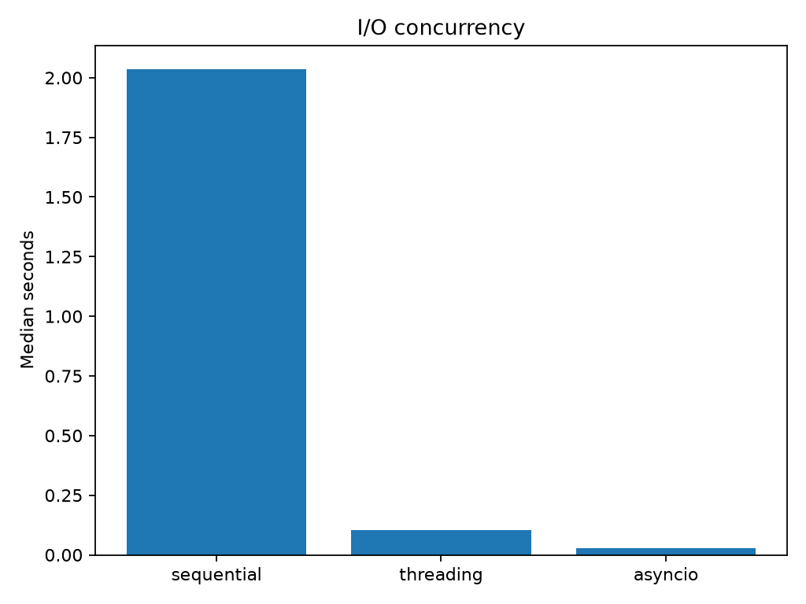

# Experiment 22 — Async I/O vs Threading

[English](#english) · [한국어](#한국어)

> **Key finding:** both concurrency models overlapped synthetic I/O waits, but
> the checked-in run is **not a concurrency-matched comparison**. The thread
> pool was capped at 20 workers while `asyncio` scheduled all 100 coroutines at
> once. Its 72.96× result therefore must not be read as evidence that asyncio is
> intrinsically 3.8× faster than threads.



---

## English

### Overview

This experiment measures how three execution models handle 100 independent,
20 ms simulated I/O waits:

- **sequential:** performs one blocking `time.sleep()` after another;
- **threading:** submits blocking sleeps to a `ThreadPoolExecutor`; and
- **asyncio:** schedules non-blocking `asyncio.sleep()` coroutines with
  `asyncio.gather()`.

The workload contains no useful CPU computation and performs no real network or
disk access. It isolates the ability to overlap waiting rather than CPU
parallelism or end-to-end application performance.

### Research Question and Hypothesis

**Question:** how do elapsed time and throughput change when independent waits
are executed sequentially, in a thread pool, or on an asyncio event loop?

**Hypothesis:** both concurrent approaches should substantially outperform the
sequential baseline. With 20 workers, threading should complete in roughly five
waves. Unbounded asyncio scheduling should approach one delay interval plus
event-loop overhead.

This hypothesis predicts the current implementation. It does not establish a
fair head-to-head overhead comparison because the maximum in-flight operation
count differs between threading and asyncio.

### Experimental Design

| Parameter | Default | Role |
| --- | ---: | --- |
| Tasks | 100 | Number of independent waits per condition |
| Delay | 0.02 s | Requested wait duration per task |
| Thread workers | 20 | Maximum concurrent blocking waits |
| Async concurrency | 100 | All coroutines are gathered without a semaphore |
| Repeats | 7 | Timed observations per condition |
| Timer | `time.perf_counter_ns()` | Wall-clock elapsed time |

Each repeat runs the conditions in the fixed order `sequential → threading →
asyncio`. A new thread pool and a new asyncio event loop are created inside each
timed measurement, so their setup and teardown costs are included.

The approximate ideal lower bounds under these settings are:

```text
sequential ≈ tasks × delay                  = 100 × 0.02 = 2.00 s
threading  ≈ ceil(tasks / workers) × delay =   5 × 0.02 = 0.10 s
asyncio    ≈ delay                          =       0.02 s
```

Actual times are higher because requested sleeps are minimum delays and the OS,
Python runtime, scheduler, timer, and lifecycle work add overhead.

### Metrics

For every condition and repeat, the harness records:

```text
tasks_per_second = tasks / seconds
```

It then summarizes each condition with:

```text
median_seconds = median(repeat times)
speedup        = sequential median / condition median
throughput     = tasks / median_seconds
```

Speedup and throughput are derived from the same elapsed-time measurement; they
are not independent signals. The median reduces sensitivity to an unusually
slow or fast repeat, but seven observations are insufficient for confidence
intervals or broad statistical claims.

### Reproduction

Run commands from the repository root. Install the locked dependencies:

```bash
uv sync
```

Run the default benchmark:

```bash
uv run python experiments/exp22_async_io_vs_threading/benchmark.py
```

Run a quick smoke test:

```bash
uv run python experiments/exp22_async_io_vs_threading/benchmark.py --quick
```

`--quick` forces 12 tasks, a 2 ms delay, and 3 repeats. It still uses the value
of `--workers` (20 unless changed).

Choose custom settings:

```bash
uv run python experiments/exp22_async_io_vs_threading/benchmark.py \
  --tasks 500 \
  --delay 0.05 \
  --workers 50 \
  --repeats 10
```

Write CSV and metadata files elsewhere:

```bash
uv run python experiments/exp22_async_io_vs_threading/benchmark.py \
  --output-dir tmp/exp22-results
```

The chart is always written to the experiment's `figures/` directory, even
when `--output-dir` is provided. Use positive values for tasks, delay, workers,
and repeats; the current CLI does not validate every invalid combination.

### Reference Result

The checked-in artifacts were produced on Windows 11
(`Windows-11-10.0.26200-SP0`) with 100 tasks, a 20 ms delay, 20 thread workers,
and seven repeats.

| Condition | Median (s) | Speedup vs sequential | Throughput (tasks/s) |
| --- | ---: | ---: | ---: |
| Sequential | 2.0341579 | 1.00× | 49.16 |
| Threading | 0.1054842 | 19.28× | 948.01 |
| Asyncio | 0.0278801 | 72.96× | 3,586.79 |

The sequential and threaded medians are close to their 2.00 s and 0.10 s ideal
lower bounds. Asyncio's 0.0279 s median is also consistent with overlapping all
100 waits in one wave. The result demonstrates wait overlap and the effect of
the configured concurrency limits.

It does **not** isolate scheduling overhead. To compare threading and asyncio
more fairly, cap asyncio at 20 concurrent tasks (for example, with an
`asyncio.Semaphore`) or run both models across the same concurrency sweep.

### Generated Artifacts

The default results directory is
`experiments/exp22_async_io_vs_threading/results/`.

- `raw.csv`: condition, repeat number, elapsed seconds, and per-repeat
  throughput;
- `summary.csv`: median elapsed time, speedup, and median-derived throughput;
- `metadata.json`: platform, task count, delay, and thread-worker count; and
- `figures/io_concurrency.png`: bar chart of median elapsed time.

Re-running the benchmark overwrites these artifacts. The metadata does not
currently record Python version, CPU, event-loop policy, repeat count, or a
timestamp.

### Interpretation Guide

- Use this benchmark to explain why concurrency helps I/O-bound work: another
  task can progress while one task waits.
- Do not use it to claim CPU-bound code runs in parallel under asyncio.
- Do not infer that asyncio is always faster than threading from this run; the
  concurrency limits differ.
- Real applications may favor threads when adapting blocking libraries, and
  asyncio when the entire stack supports non-blocking APIs and large numbers of
  concurrent operations.
- Throughput here means completed synthetic waits per second, not requests
  served by a real system.

### Limitations and Threats to Validity

- `sleep` excludes DNS, sockets, TLS, serialization, server latency, disk
  behavior, failures, retries, and rate limits.
- `time.sleep()` and `asyncio.sleep()` exercise different APIs and schedulers;
  they represent waiting but are not identical operations.
- Threading is bounded at 20 in-flight waits while asyncio is unbounded at 100.
- Condition order is fixed, so temperature, background load, or scheduler state
  may correlate with a condition.
- Pool and event-loop startup are included, which matters more for short waits
  and small task counts.
- Only wall time is measured; CPU time, memory, context switches, open handles,
  and tail latency are absent.
- One host and seven repeats cannot establish portable performance rankings.
- Results can change with Python version, OS timer resolution, event-loop
  implementation, hardware, and power-management state.

### Conclusion

Experiment 22 shows the expected structure of I/O concurrency: 100 sequential
waits took about 2.03 s, a 20-worker pool reduced them to about 0.105 s, and 100
simultaneously scheduled coroutines completed in about 0.0279 s. The sound
conclusion is that both models overlap waiting. The gap between their recorded
times primarily reflects different concurrency caps and cannot by itself prove
lower asyncio overhead.

### Future Work

- Apply the same concurrency limit to both implementations and sweep it.
- Benchmark a local HTTP server to avoid uncontrolled internet variability.
- Record p50/p95/p99 task latency, CPU time, memory, and context switches.
- Separate one-time setup from steady-state execution.
- Randomize or rotate condition order across independent trials.
- Add timeout, cancellation, exception, backpressure, and connection-pool tests.
- Record Python and dependency versions plus richer machine metadata.

---

## 한국어

### 개요

이 실험은 서로 독립적인 20 ms 모의 I/O 대기 100개를 세 가지 방식으로
처리하고 경과 시간을 비교한다.

- **순차 실행:** `time.sleep()`을 한 번씩 차례로 호출
- **Threading:** `ThreadPoolExecutor`에 blocking sleep을 제출
- **Asyncio:** `asyncio.gather()`로 `asyncio.sleep()` coroutine을 함께 예약

실제 network나 disk I/O 및 유효한 CPU 계산은 수행하지 않는다. 따라서 이
실험은 CPU 병렬성이 아니라 **대기 시간을 겹치는 능력**을 측정한다.

### 연구 질문과 가설

**연구 질문:** 독립적인 대기를 순차, thread pool, asyncio event loop로 처리할
때 경과 시간과 처리량은 어떻게 달라지는가?

**가설:** 두 동시성 방식 모두 순차 실행보다 훨씬 빠를 것이다. Worker가
20개인 threading은 대략 5개 wave로 완료되고, concurrency 제한이 없는 현재
asyncio 구현은 event-loop overhead를 제외하면 한 번의 delay에 가까워질 것이다.

단, 이 가설은 현재 구현을 설명할 뿐 동일 concurrency에서의 공정한 overhead
비교는 아니다. Thread는 최대 20개지만 asyncio는 coroutine 100개를 한꺼번에
예약하기 때문이다.

### 실험 설계

| 설정 | 기본값 | 의미 |
| --- | ---: | --- |
| Task | 100 | Condition당 독립적인 대기 수 |
| Delay | 0.02초 | Task당 요청한 대기 시간 |
| Thread worker | 20 | 동시에 실행할 blocking wait의 상한 |
| Async concurrency | 100 | Semaphore 없이 모든 coroutine 예약 |
| Repeat | 7 | Condition별 측정 횟수 |
| Timer | `time.perf_counter_ns()` | Wall-clock 경과 시간 |

각 repeat는 `sequential → threading → asyncio`의 고정 순서로 실행된다. 측정
구간 안에서 매번 새 thread pool과 asyncio event loop를 만들고 제거하므로
생성·정리 비용도 결과에 포함된다.

현재 설정에서 이상적인 하한은 대략 다음과 같다.

```text
sequential ≈ tasks × delay                  = 100 × 0.02 = 2.00초
threading  ≈ ceil(tasks / workers) × delay =   5 × 0.02 = 0.10초
asyncio    ≈ delay                          =       0.02초
```

실제 sleep은 최소 대기 시간을 뜻하며 OS와 Python scheduler, timer, lifecycle
overhead가 더해지므로 측정값은 이 하한보다 커질 수 있다.

### 측정 지표

각 반복의 처리량과 condition별 summary는 다음 식으로 계산한다.

```text
tasks_per_second = tasks / seconds
median_seconds   = 반복 시간의 중앙값
speedup          = 순차 중앙값 / condition 중앙값
throughput       = tasks / median_seconds
```

Speedup과 throughput은 같은 경과 시간에서 파생되므로 서로 독립적인 지표가
아니다. 중앙값은 극단적인 한 번의 측정에 덜 민감하지만, 7회만으로 신뢰구간이나
일반적인 성능 우위를 주장하기에는 부족하다.

### 재현 방법

Repository root에서 dependency를 설치하고 기본 benchmark를 실행한다.

```bash
uv sync
uv run python experiments/exp22_async_io_vs_threading/benchmark.py
```

빠른 smoke test:

```bash
uv run python experiments/exp22_async_io_vs_threading/benchmark.py --quick
```

`--quick`은 task 12개, delay 2 ms, repeat 3회를 강제로 사용한다. Worker 수는
`--workers` 값(기본 20)을 그대로 사용한다.

사용자 정의 설정:

```bash
uv run python experiments/exp22_async_io_vs_threading/benchmark.py \
  --tasks 500 \
  --delay 0.05 \
  --workers 50 \
  --repeats 10
```

CSV와 metadata 저장 위치 변경:

```bash
uv run python experiments/exp22_async_io_vs_threading/benchmark.py \
  --output-dir tmp/exp22-results
```

`--output-dir`을 바꿔도 chart는 항상 이 실험의 `figures/`에 저장된다. 현재
CLI가 모든 잘못된 조합을 검증하지 않으므로 task, delay, worker, repeat에는
양수를 사용해야 한다.

### 기준 측정 결과

저장된 결과는 Windows 11(`Windows-11-10.0.26200-SP0`)에서 task 100개, delay
20 ms, thread worker 20개, repeat 7회로 측정했다.

| Condition | 중앙값 (초) | 순차 대비 속도 | 처리량 (tasks/s) |
| --- | ---: | ---: | ---: |
| Sequential | 2.0341579 | 1.00× | 49.16 |
| Threading | 0.1054842 | 19.28× | 948.01 |
| Asyncio | 0.0278801 | 72.96× | 3,586.79 |

Sequential과 threading 중앙값은 각각의 이상적 하한인 2.00초와 0.10초에
가깝다. Asyncio의 0.0279초 역시 대기 100개를 한 wave로 겹친 결과와 일치한다.

그러나 이 결과는 scheduling overhead만을 분리하지 않는다. Threading과
asyncio를 더 공정하게 비교하려면 `asyncio.Semaphore` 등으로 asyncio도 20개로
제한하거나 두 방식에 동일한 concurrency sweep을 적용해야 한다.

### 생성 파일

기본 결과 directory는 `experiments/exp22_async_io_vs_threading/results/`이다.

- `raw.csv`: condition, repeat, 경과 시간, 반복별 처리량
- `summary.csv`: 중앙값, 순차 대비 speedup, 중앙값 기반 처리량
- `metadata.json`: platform, task 수, delay, thread worker 수
- `figures/io_concurrency.png`: condition별 중앙 경과 시간 bar chart

Benchmark를 다시 실행하면 해당 파일을 덮어쓴다. 현재 metadata에는 Python
version, CPU, event-loop policy, repeat 수, 실행 시각이 기록되지 않는다.

### 올바른 해석

- 이 실험은 I/O-bound concurrency에서 한 task가 기다리는 동안 다른 task가
  진행할 수 있음을 보여준다.
- Asyncio가 CPU-bound Python code를 병렬 실행한다는 의미가 아니다.
- 현재 결과만으로 asyncio가 threading보다 항상 빠르다고 결론 내릴 수 없다.
  두 방식의 최대 동시 작업 수가 다르다.
- 실제 환경에서 blocking library를 재사용할 때는 thread가 편리할 수 있고,
  전체 stack이 non-blocking API를 지원하며 동시 작업이 매우 많다면 asyncio가
  적합할 수 있다.
- 여기서 처리량은 실제 request가 아니라 완료된 synthetic wait 수를 뜻한다.

### 한계와 타당성 위협

- `sleep`에는 DNS, socket, TLS, 직렬화, server latency, disk, 실패, retry,
  rate limit이 없다.
- `time.sleep()`과 `asyncio.sleep()`은 서로 다른 API와 scheduler를 사용한다.
- Threading은 20개로 제한되지만 asyncio는 100개를 동시에 예약한다.
- Condition 순서가 고정되어 system state가 특정 condition과 연관될 수 있다.
- Pool과 event loop 생성 비용이 포함되어 짧은 delay나 작은 workload에서
  영향이 커진다.
- Wall time만 측정하며 CPU time, memory, context switch, handle 수, tail
  latency는 측정하지 않는다.
- 단일 host의 7회 측정으로 일반적인 성능 순위를 확정할 수 없다.
- Python version, OS timer, event loop, hardware와 전원 상태에 따라 결과가
  달라질 수 있다.

### 결론

순차 대기 100개는 약 2.03초, 20-worker thread pool은 약 0.105초, 동시에
예약한 coroutine 100개는 약 0.0279초가 걸렸다. 이 결과에서 타당한 결론은 두
동시성 모델 모두 대기를 겹친다는 것이다. 두 concurrent 결과의 차이는 주로
서로 다른 concurrency 상한을 반영하므로 asyncio의 낮은 overhead를 단독으로
입증하지는 않는다.

### 향후 작업

- 두 구현에 동일한 concurrency limit을 적용하고 단계별로 sweep
- 외부 internet 변수를 피하기 위한 local HTTP server benchmark
- p50/p95/p99 latency, CPU time, memory, context switch 측정
- 일회성 setup과 steady-state 실행 분리
- 독립 trial마다 condition 순서를 무작위화하거나 교대
- Timeout, cancellation, exception, backpressure, connection pool 실험
- Python/dependency version과 machine metadata 확장
