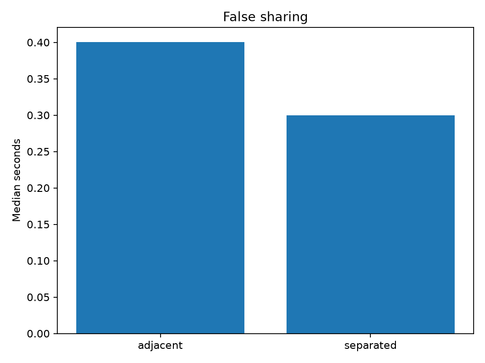

# Experiment 23 — False Sharing

[English](#english) · [한국어](#한국어)

> **Key finding:** in the checked-in Windows run, placing each worker's shared
> integer 128 bytes apart reduced the median elapsed time from **0.4004 s** to
> **0.2994 s**—a **1.34× speedup**. This is consistent with reduced cache-line
> contention, but timing alone does not prove that false sharing caused the gap.



---

## English

### Overview

This experiment measures the cost of multiple processes repeatedly writing to
independent integers in shared memory. It compares two layouts:

- **adjacent:** worker slots are 8 bytes apart and may occupy the same cache
  line;
- **separated:** worker slots are 128 bytes apart, making cache-line overlap
  between slots much less likely.

Each process writes only to its own slot, so there is no application-level data
race between workers. The performance difference comes from where those slots
are placed in memory, not from workers intentionally sharing a counter.

### Why False Sharing Matters

CPU caches exchange ownership at cache-line granularity, not at the granularity
of an individual integer. On a machine with 64-byte cache lines, four adjacent
8-byte integers can reside on one line:

```text
Adjacent (8-byte stride)
cache line: [ worker 0 ][ worker 1 ][ worker 2 ][ worker 3 ][ unused ... ]
             writes       writes       writes       writes

Separated (128-byte stride)
[ worker 0 ] ... 128 B ... [ worker 1 ] ... 128 B ... [ worker 2 ] ...
```

When workers run on different cores, a write by one core can invalidate the
line cached by another core. The line may then repeatedly move between cores
even though the processes update different values. This cache-coherence traffic
is called **false sharing**.

The benchmark uses a 128-byte separated stride rather than assuming one exact
cache-line size. It does not, however, explicitly align the underlying
allocation to a cache-line boundary.

### Research Question and Hypothesis

**Question:** does increasing the distance between per-process shared-memory
slots reduce elapsed time for a write-heavy workload?

**Hypothesis:** if workers execute concurrently on different cores, the
separated layout should be faster because it reduces the chance that their
slots share a cache line. The benefit may shrink or disappear when processes
run on the same core, migrate frequently, or when Python and process-management
overhead dominates the measurement.

### Experimental Design

| Parameter | Default | Purpose |
| --- | ---: | --- |
| Worker processes | 4 | Concurrent writers |
| Writes per worker | 1,000,000 | Repeated stores to one owned slot |
| Repeats | 7 | Timed observations per layout |
| Adjacent stride | 8 bytes | One signed 64-bit element |
| Separated stride | 128 bytes | Sixteen signed 64-bit elements |
| Shared storage | `multiprocessing.RawArray("q", ...)` | Lock-free shared allocation |
| Timer | `time.perf_counter_ns()` | Wall-clock elapsed time |

For each repeat, the benchmark runs `adjacent` and then `separated`. A fresh
shared array and fresh processes are created for every condition. Timing starts
before `Process.start()` and ends after every `Process.join()`, so process
startup, scheduling, worker execution, and teardown are all included.

Each worker executes the equivalent of:

```python
for i in range(iterations):
    values[worker_index * stride] = i
```

The multiprocessing start method is the platform default: normally `spawn` on
Windows and `fork` on Linux. This difference can affect absolute timings and
limits direct cross-platform comparison.

### Correctness Check

After all workers exit, the parent sums the final value in every worker slot.
With four workers and one million iterations, the expected checksum is:

```text
workers × (iterations - 1) = 4 × 999,999 = 3,999,996
```

Every checked-in row reports `3999996`. The checksum catches missing or failed
writes at the final slot state, while process exit codes catch worker failure.
It does not verify every intermediate write.

### Reproduction

Run commands from the repository root. Install the locked dependencies:

```bash
uv sync
```

Run the default benchmark:

```bash
uv run python experiments/exp23_false_sharing/benchmark.py
```

Run a fast smoke test:

```bash
uv run python experiments/exp23_false_sharing/benchmark.py --quick
```

`--quick` forces 10,000 writes and 3 repeats. It preserves the selected worker
count.

Choose custom settings:

```bash
uv run python experiments/exp23_false_sharing/benchmark.py \
  --workers 8 \
  --iterations 2000000 \
  --repeats 10
```

Write tabular results and metadata to another directory:

```bash
uv run python experiments/exp23_false_sharing/benchmark.py \
  --output-dir tmp/exp23-results
```

The plot is always written to this experiment's `figures/` directory, even
when `--output-dir` is set. Re-running the benchmark overwrites existing output
files. Use positive values for all numeric arguments; the current CLI does not
validate invalid or zero values explicitly.

For less noisy measurements, close CPU-intensive applications, use a stable
power profile, and run several independent benchmark sessions. Do not compare
results collected with different worker or iteration counts as if they were the
same experiment.

### Reference Result

The checked-in artifacts were produced on Windows 11 with four workers, one
million writes per worker, and seven repeats.

| Layout | Stride | Median (s) | Speedup vs adjacent |
| --- | ---: | ---: | ---: |
| Adjacent | 8 B | 0.4004102 | 1.00× |
| Separated | 128 B | 0.2994318 | 1.34× |

The separated layout reduced the median by **0.1009784 s**, or approximately
**25.2%** relative to the adjacent median. Across all seven recorded pairs, the
separated condition was faster. Individual observations still varied:

| Layout | Minimum (s) | Median (s) | Maximum (s) |
| --- | ---: | ---: | ---: |
| Adjacent | 0.3229679 | 0.4004102 | 0.4315197 |
| Separated | 0.2363531 | 0.2994318 | 0.3084458 |

These results support the hypothesis on the reference machine. They do not
establish a universal speedup or isolate cache coherence as the only causal
mechanism.

### Generated Artifacts

The default output locations are:

- `results/raw.csv`: one row per condition and repeat, including elapsed time,
  layout, parameters, stride, and checksum;
- `results/summary.csv`: median time and speedup for each layout;
- `results/metadata.json`: platform, worker count, and a hardware-counter note;
- `figures/false_sharing.png`: median elapsed-time bar chart.

The metadata currently omits the Python version, CPU model, cache-line size,
start method, affinity, iteration and repeat counts, timestamp, and dependency
versions. Keep those omissions in mind when archiving or comparing runs.

### Interpretation Guide

- Treat a repeatable separated-layout advantage as **evidence consistent with**
  false sharing, not proof by itself.
- Compare medians only when worker count, write count, start method, machine
  load, and power settings are comparable.
- The reported speedup uses the adjacent median as its baseline:
  `adjacent median / layout median`.
- `RawArray` removes the synchronization lock supplied by `multiprocessing.Array`;
  it does not bypass Python's per-assignment overhead.
- More workers do not necessarily strengthen the effect. Oversubscription,
  process migration, NUMA placement, and memory bandwidth can dominate.

### Hardware-Counter Follow-up

Wall time cannot identify why one layout is faster. On Linux, use `perf stat`
to collect available cache and coherence-related events for repeated runs:

```bash
perf stat -r 7 -e cache-references,cache-misses \
  uv run python experiments/exp23_false_sharing/benchmark.py
```

Generic cache events are only a starting point and may not directly count
cache-line ownership transfers. Event names and availability depend on the CPU
and kernel. For stronger attribution, use architecture-specific HITM or
cache-to-cache events, `perf c2c`, fixed CPU affinity, and a native tight loop
that minimizes interpreter overhead. Benchmarking both conditions within one
script also means aggregate counters cover both layouts; separate-condition
execution would be needed for clean per-layout counter comparison.

### Limitations and Threats to Validity

- The allocation is not explicitly cache-line aligned, and the benchmark does
  not detect the machine's actual cache-line size.
- Worker affinity is not fixed. Processes may share a core or migrate between
  cores during a measurement.
- Python shared-memory indexing and assignment add interpreter and ctypes
  overhead around every store.
- Process creation and joining are inside the timed region and may dilute the
  memory-layout effect, especially for short runs.
- Conditions always run in `adjacent → separated` order, so warm-up, thermal,
  background-load, and scheduler effects can correlate with layout.
- Only wall time is recorded. There are no confidence intervals, CPU-time,
  context-switch, migration, cache-miss, or coherence measurements.
- The checksum verifies only final values and cannot count intermediate stores.
- One Windows host and seven repeats are insufficient for broad hardware or
  operating-system claims.
- False sharing is hardware-dependent; cache topology, NUMA layout, virtual
  machines, and power management can change or hide the effect.

### Conclusion

Experiment 23 demonstrates that memory layout can affect parallel performance
even when workers modify logically independent values. On the reference run,
128-byte spacing was 1.34× faster than adjacent 8-byte slots. The result is a
useful timing demonstration of probable false sharing, while definitive causal
attribution requires CPU placement control and hardware coherence counters.

### Future Work

- Pin each worker to a distinct physical core and record the mapping.
- Allocate cache-line-aligned storage and detect the host cache-line size.
- Move the hot write loop to C, Cython, Numba, or a small native extension.
- Run each layout independently under `perf stat` and `perf c2c`.
- Randomize or counterbalance condition order and add confidence intervals.
- Sweep stride, worker count, write count, and physical versus logical cores.
- Record CPU, Python, start method, affinity, cache topology, and full run
  configuration in metadata.

---

## 한국어

### 개요

이 실험은 여러 프로세스가 공유 메모리의 서로 다른 정수를 반복해서
쓸 때, 슬롯 간격이 실행 시간에 미치는 영향을 측정한다.

- **인접 배치(`adjacent`)**: 슬롯 간격이 8바이트라 여러 worker의 값이
  같은 cache line에 놓일 수 있다.
- **분리 배치(`separated`)**: 슬롯 간격을 128바이트로 늘려 서로 같은
  cache line을 사용할 가능성을 크게 낮춘다.

각 프로세스는 자기 슬롯만 수정하므로 애플리케이션 수준의 동일 변수
경쟁은 없다. 하지만 CPU cache는 정수 하나가 아니라 cache line 단위로
소유권과 일관성을 관리한다. 따라서 서로 다른 정수를 쓰더라도 같은
cache line에 있다면 core 사이에서 invalidation과 소유권 이동이 반복될
수 있다. 이를 **false sharing(거짓 공유)**이라고 한다.

### 연구 질문과 가설

**질문:** 프로세스별 공유 메모리 슬롯의 간격을 넓히면 write 중심
workload의 실행 시간이 감소하는가?

**가설:** worker들이 서로 다른 core에서 동시에 실행된다면 128바이트
분리 배치가 cache-line 경합을 줄여 더 빠를 것이다. 단, 같은 core에서
실행되거나 process 이동과 Python overhead가 크면 차이가 작아질 수 있다.

### 실험 설계

| 항목 | 기본값 | 의미 |
| --- | ---: | --- |
| Worker process | 4 | 동시에 쓰기를 수행하는 프로세스 수 |
| Worker당 쓰기 | 1,000,000회 | 자기 슬롯에 반복 저장 |
| 반복 측정 | 7회 | 배치별 관측값 수 |
| 인접 stride | 8바이트 | signed 64-bit 원소 1개 |
| 분리 stride | 128바이트 | signed 64-bit 원소 16개 |
| 공유 메모리 | `multiprocessing.RawArray("q", ...)` | lock 없는 공유 배열 |
| Timer | `time.perf_counter_ns()` | wall-clock 시간 |

매 반복마다 `adjacent → separated` 순서로 실행하며, 조건마다 공유 배열과
프로세스를 새로 만든다. 측정 구간에는 `Process.start()`부터 모든
`Process.join()`이 끝날 때까지가 포함되므로 프로세스 시작·스케줄링·종료
비용도 결과에 들어간다.

Multiprocessing start method는 코드에서 강제하지 않고 운영체제 기본값을
사용한다. 일반적으로 Windows는 `spawn`, Linux는 `fork`이므로 운영체제 간
절대 시간을 직접 비교해서는 안 된다.

### 정확성 확인

모든 worker가 끝난 뒤 각 슬롯의 최종값을 더한다. 기본 설정의 기대값은
다음과 같다.

```text
4 × (1,000,000 - 1) = 3,999,996
```

저장된 14개 측정 행은 모두 checksum `3999996`을 기록했다. 이 검사는
worker 실패나 잘못된 최종 슬롯을 찾는 데 유용하지만, 중간의 모든 write가
실행되었는지 개별적으로 검증하지는 않는다.

### 실행 방법

저장소 루트에서 의존성을 설치하고 기본 benchmark를 실행한다.

```bash
uv sync
uv run python experiments/exp23_false_sharing/benchmark.py
```

빠른 smoke test:

```bash
uv run python experiments/exp23_false_sharing/benchmark.py --quick
```

`--quick`은 쓰기 횟수를 10,000회, 반복을 3회로 고정한다.

사용자 설정 예시:

```bash
uv run python experiments/exp23_false_sharing/benchmark.py \
  --workers 8 \
  --iterations 2000000 \
  --repeats 10 \
  --output-dir tmp/exp23-results
```

`--output-dir`은 CSV와 metadata 위치만 바꾼다. 그래프는 항상 실험 폴더의
`figures/false_sharing.png`에 저장되며, 재실행 시 기존 산출물을 덮어쓴다.
현재 CLI는 0이나 음수 인자를 명시적으로 검증하지 않으므로 양수만 사용한다.

### 기준 결과

저장된 결과는 Windows 11, worker 4개, worker당 1백만 write, 7회 반복으로
측정했다.

| 배치 | Stride | 중앙값 (초) | 인접 배치 대비 속도 |
| --- | ---: | ---: | ---: |
| 인접 | 8 B | 0.4004102 | 1.00× |
| 분리 | 128 B | 0.2994318 | 1.34× |

분리 배치는 인접 배치보다 중앙값 기준 **0.1009784초**, 약 **25.2%** 짧았다.
저장된 7쌍 모두에서 분리 배치가 더 빨랐다.

| 배치 | 최솟값 (초) | 중앙값 (초) | 최댓값 (초) |
| --- | ---: | ---: | ---: |
| 인접 | 0.3229679 | 0.4004102 | 0.4315197 |
| 분리 | 0.2363531 | 0.2994318 | 0.3084458 |

이 결과는 기준 장비에서 가설과 일치하지만, 1.34× 향상이 모든 환경에서
재현된다는 뜻은 아니다. 또한 시간 차이만으로 cache coherence가 유일한
원인이라고 단정할 수 없다.

### 생성 파일

- `results/raw.csv`: 조건·반복별 시간, parameter, stride, checksum
- `results/summary.csv`: 배치별 중앙값과 인접 배치 대비 speedup
- `results/metadata.json`: platform, worker 수, hardware counter 안내
- `figures/false_sharing.png`: 중앙 실행 시간 비교 그래프

현재 metadata에는 Python/CPU 버전, cache-line 크기, start method, affinity,
iteration·repeat 수, 실행 시각, 의존성 버전이 없다. 결과를 장기 보관하거나
다른 장비와 비교할 때는 이 정보를 별도로 기록하는 것이 좋다.

### 결과 해석 시 주의점

- 분리 배치의 반복적인 우위는 false sharing과 **일치하는 정황 증거**이지
  timing만으로 얻은 직접 증명은 아니다.
- Speedup은 `인접 배치 중앙값 / 해당 배치 중앙값`으로 계산한다.
- `RawArray`는 동기화 lock을 제거하지만 Python 대입 비용까지 없애지는 않는다.
- 128바이트 stride는 slot 간 거리를 확보하지만 allocation의 cache-line
  alignment 자체를 보장하지 않는다.
- worker 수가 많다고 효과가 항상 커지지는 않는다. oversubscription, process
  migration, NUMA, memory bandwidth가 결과를 지배할 수 있다.

### 한계와 타당성 위협

- CPU affinity를 고정하지 않아 worker가 같은 core를 쓰거나 이동할 수 있다.
- 프로세스 생성과 종료 시간이 측정 구간에 포함된다.
- 조건 순서가 항상 인접 배치 후 분리 배치라 warm-up, 온도, background load가
  특정 조건과 연관될 수 있다.
- Python/ctypes overhead가 각 공유 메모리 write에 포함된다.
- Wall time만 수집하며 cache miss, HITM, context switch, migration은 측정하지 않는다.
- 7회 반복과 단일 Windows 장비만으로 일반적인 성능 결론을 내릴 수 없다.
- checksum은 최종 상태만 확인하며 모든 중간 store를 세지는 못한다.

### Hardware Counter 후속 측정

Linux에서는 우선 다음과 같이 generic cache event를 수집할 수 있다.

```bash
perf stat -r 7 -e cache-references,cache-misses \
  uv run python experiments/exp23_false_sharing/benchmark.py
```

다만 generic cache miss만으로 cache line 소유권 이동을 직접 입증하기는 어렵다.
CPU별 HITM/cache-to-cache event, `perf c2c`, core affinity, native hot loop를 함께
사용해야 더 강한 근거를 얻을 수 있다. 현재 script 한 번에는 두 조건이 모두
실행되므로 조건별 counter를 깨끗하게 비교하려면 조건을 따로 실행하는 기능도
추가해야 한다.

### 결론

Experiment 23은 worker들이 논리적으로 독립된 값을 수정하더라도 메모리 배치가
병렬 성능에 영향을 줄 수 있음을 보여준다. 기준 실행에서는 128바이트 분리
배치가 8바이트 인접 배치보다 1.34× 빨랐다. 이는 false sharing을 설명하는
유용한 timing 실험이며, 인과관계를 더 확실히 하려면 CPU 고정과 hardware
coherence counter가 필요하다.

### 향후 개선

- Worker를 서로 다른 physical core에 고정하고 매핑 기록
- Cache-line-aligned allocation과 실제 cache-line 크기 감지
- Hot loop를 C, Cython, Numba 또는 native extension으로 이동
- 조건별 `perf stat`·`perf c2c` 측정
- 조건 순서 무작위화 또는 counterbalancing과 신뢰구간 추가
- Stride, worker, write 수, physical/logical core sweep
- CPU, Python, start method, affinity, cache topology를 metadata에 저장
