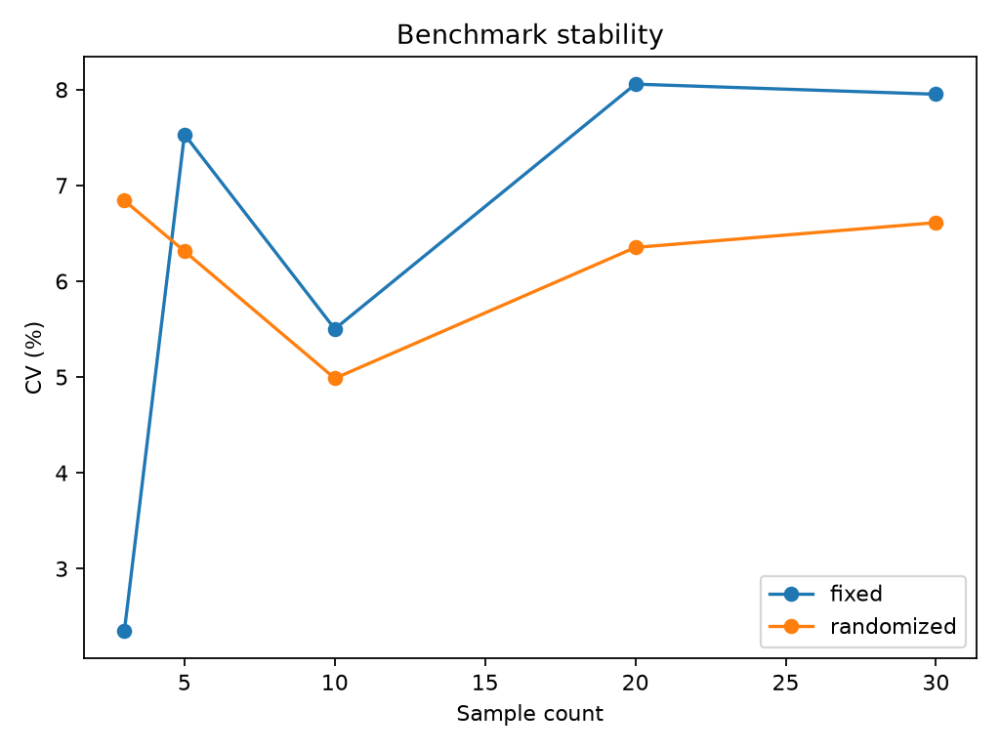

# Experiment 24 — Benchmark Stability

[English](#english) · [한국어](#한국어)

> **Key finding:** in the checked-in run, increasing the sample count generally
> reduced the uncertainty of the mean, but it did not make every dispersion
> metric decrease monotonically. For the randomized `slow` condition, the
> approximate 95% half-width fell from **0.000507 s** at 5 samples to
> **0.000288 s** at 30 samples, while its 30-sample CV was **8.05%**.



---

## English

### Overview

This experiment demonstrates why a benchmark should report repeated
measurements rather than one best time. It varies two aspects of measurement:

- **sample count:** statistics are recomputed from prefixes of 3, 5, 10, 20,
  and 30 observations;
- **condition order:** `fixed` always runs `fast → slow`, whereas `randomized`
  shuffles the two conditions on every repeat with a reproducible seed.

For every combination, the script reports the mean, median, sample standard
deviation, coefficient of variation (CV), and an approximate 95% interval
half-width for the mean.

### Why Benchmark Stability Matters

Timing observations vary because of process scheduling, background activity,
CPU frequency changes, cache state, thermal behavior, and other effects. A
small sample can therefore give an unstable estimate. A systematic condition
order can also confound a condition with warm-up or temporal drift.

Randomizing order helps distribute order-related effects, but it does not
remove noise or guarantee balance in a small sample. Increasing the sample
count usually improves precision, but the sample standard deviation and CV may
rise when later observations reveal variability absent from the first few
runs.

### Research Question and Hypothesis

**Question:** how do sample count and fixed versus randomized condition order
affect the observed mean, median, standard deviation, CV, and approximate 95%
interval half-width?

**Hypothesis:** larger samples should generally narrow uncertainty around the
mean. Randomization should reduce systematic order bias across repeated
experiments, although a particular seeded run may initially look more
variable and need not outperform fixed ordering on every metric.

### Experimental Design

| Parameter | Default | Purpose |
| --- | ---: | --- |
| Kernel iterations | 100,000 | Base work for `fast` |
| Repeats per ordering | 30 | Observations per condition |
| Random seed | 20260728 | Reproducible condition order |
| Prefix sizes | 3, 5, 10, 20, 30 | Sample-count comparison |
| Timer | `time.perf_counter_ns()` | High-resolution wall-clock timing |

The two deterministic kernels execute the same integer recurrence:

```python
x = (x + i) % 1_000_003
```

`fast` performs `iterations` loop iterations; `slow` performs twice as many.
The checksum is saved to make the work observable and to confirm consistent
outputs within each condition.

The script first collects all 30 repeats for `fixed`, then all 30 repeats for
`randomized`. Within each repeat, `run_order` records whether a condition ran
first or second. Summary rows use the first *n* observations of each condition,
so larger sample sizes reuse all observations from smaller prefixes; they are
not independent samples.

### Statistics

For timings \(x_1, \ldots, x_n\), the script computes:

```text
CV (%) = 100 × sample standard deviation / mean
approximate 95% half-width = 1.96 × sample standard deviation / √n
```

The interval can be read descriptively as `mean ± half-width`. It uses the
normal critical value `1.96`, not a Student-*t* critical value, and assumes
independent observations. It is therefore not an exact 95% confidence interval
for small, non-normal, drifting, or autocorrelated benchmark data.

### Reproduction

Run commands from the repository root. Install the locked dependencies:

```bash
uv sync
```

Run the default benchmark:

```bash
uv run python experiments/exp24_benchmark_stability/benchmark.py
```

Run a fast smoke test:

```bash
uv run python experiments/exp24_benchmark_stability/benchmark.py --quick
```

`--quick` overrides both workload and repeat count: it uses 5,000 iterations
and 5 repeats. Consequently, only prefix sizes 3 and 5 are produced.

Choose custom settings:

```bash
uv run python experiments/exp24_benchmark_stability/benchmark.py \
  --iterations 200000 \
  --repeats 50 \
  --seed 42
```

Write CSV and metadata files elsewhere:

```bash
uv run python experiments/exp24_benchmark_stability/benchmark.py \
  --output-dir tmp/exp24-results
```

`--output-dir` changes only the location of `raw.csv`, `summary.csv`, and
`metadata.json`. The plot is always written to
`experiments/exp24_benchmark_stability/figures/stability.png`. Re-running the
script overwrites existing artifacts. Use at least 2 repeats: the CLI does not
validate the value, and one repeat causes summary generation to fail because
the deduplicated prefix becomes 1 and `statistics.stdev()` requires two values.

For cleaner measurements, close CPU-intensive applications, use a stable power
profile, and run several independent sessions. Keep the workload, environment,
and software versions fixed when comparing sessions.

### Reference Result

The checked-in artifacts were produced on Windows 11 with 100,000 base
iterations, 30 repeats per ordering, and seed `20260728`.

| Ordering | Condition | n | Mean (s) | Median (s) | CV | 95% half-width (s) |
| --- | --- | ---: | ---: | ---: | ---: | ---: |
| Fixed | Fast | 5 | 0.005564 | 0.005342 | 7.53% | 0.000367 |
| Fixed | Fast | 30 | 0.005335 | 0.005246 | 7.95% | 0.000152 |
| Fixed | Slow | 5 | 0.011409 | 0.011402 | 3.80% | 0.000380 |
| Fixed | Slow | 30 | 0.011068 | 0.010973 | 7.32% | 0.000290 |
| Randomized | Fast | 5 | 0.005130 | 0.005036 | 6.31% | 0.000284 |
| Randomized | Fast | 30 | 0.004896 | 0.004780 | 6.61% | 0.000116 |
| Randomized | Slow | 5 | 0.010149 | 0.010190 | 5.69% | 0.000507 |
| Randomized | Slow | 30 | 0.010005 | 0.009808 | 8.05% | 0.000288 |

All four condition/order combinations have a smaller half-width at 30 samples
than at 5 samples. CV, however, rises between 5 and 30 samples in three of the
four combinations. This is not a contradiction: CV estimates observed spread,
whereas the half-width divides that spread by \(\sqrt{n}\) to estimate the
precision of the mean.

The randomized timings are lower than the fixed timings in this saved run, but
that gap must not be interpreted as a speedup caused by randomization. The
entire fixed block ran before the randomized block, so temporal drift and
machine state are confounded with ordering strategy. The experiment is most
useful for showing how reported stability changes with sample size, not for
estimating a causal performance benefit from randomization.

### Reading the Figure

The plot shows CV versus sample count for the **fast condition only**. Each line
represents an ordering strategy. Lower CV means timings are smaller in spread
relative to their mean; it does not mean the kernel is faster. Exact values for
both `fast` and `slow`, including interval half-widths, are available in
`results/summary.csv`.

### Generated Artifacts

- `results/raw.csv`: one row per timing observation with ordering, condition,
  repeat, within-repeat order, elapsed seconds, and checksum;
- `results/summary.csv`: prefix-level mean, median, sample standard deviation,
  CV, and approximate 95% half-width;
- `results/metadata.json`: platform string, iterations, repeats, and seed;
- `figures/stability.png`: fast-condition CV by sample count.

The metadata does not record the Python version, CPU model, power profile,
affinity, execution timestamp, dependency versions, or randomized order
sequence. Preserve `raw.csv` with the metadata when archiving a run.

### Limitations and Threats to Validity

- Only one machine and one saved benchmark session are represented.
- Fixed and randomized strategies run as separate sequential blocks rather
  than being interleaved or counterbalanced.
- Prefix estimates overlap, so the 3-, 5-, 10-, 20-, and 30-sample results are
  statistically dependent.
- Order randomization does not control CPU state, cache state, background load,
  frequency scaling, temperature, or process placement.
- The first measurement is not discarded as an explicit warm-up.
- The normal-approximation interval does not adjust for small samples,
  autocorrelation, multiple comparisons, or non-normal timing distributions.
- The plotted chart omits the slow condition and interval widths.
- The Python loop is a synthetic workload and does not represent all real
  applications.

### Conclusion

Experiment 24 makes benchmark uncertainty visible. More observations generally
improve the precision of the mean, but dispersion estimates can move in either
direction as new timings arrive. Report the sample count and distributional
summary, retain raw observations, and use randomized or counterbalanced order
when temporal effects could bias condition comparisons.

### Future Work

- Use Student-*t* or bootstrap confidence intervals.
- Run multiple independent sessions and summarize between-session variation.
- Interleave or counterbalance fixed and randomized strategies.
- Add warm-up control, blocked randomization, and an explicit outlier policy.
- Record CPU, Python, affinity, power, temperature, and dependency metadata.
- Plot both conditions with interval widths and expose the random order trace.
- Add CLI validation for positive iterations and at least two repeats.

---

## 한국어

### 개요

이 실험은 benchmark에서 최솟값 하나만 보고하지 않고 반복 측정과 불확실성을
함께 봐야 하는 이유를 보여준다. 두 요소를 비교한다.

- **표본 수:** 앞에서부터 3, 5, 10, 20, 30개 관측값으로 통계를 다시 계산한다.
- **조건 순서:** `fixed`는 항상 `fast → slow` 순서이고, `randomized`는 seed를
  사용해 매 repeat마다 두 조건의 순서를 섞는다.

각 조합에서 평균, 중앙값, 표본 표준편차, 변동계수(CV), 평균의 근사 95%
구간 half-width를 저장한다.

### Benchmark 안정성이 중요한 이유

측정 시간은 process scheduling, background 작업, CPU frequency, cache 상태,
온도 등의 영향을 받는다. 표본이 작으면 우연히 빠르거나 느린 구간만 관측할 수
있다. 조건 순서를 항상 같게 두면 warm-up이나 시간 drift가 특정 조건과 얽힐
수도 있다.

순서 무작위화는 이런 효과를 여러 조건에 분산하는 데 도움이 되지만 noise를
없애거나 작은 표본에서 완벽한 균형을 보장하지 않는다. 표본 수가 늘면 평균의
정밀도는 대체로 좋아지지만, 뒤늦게 큰 변동이 관측되면 표준편차와 CV는 오를
수 있다.

### 연구 질문과 가설

**질문:** 표본 수와 고정/무작위 조건 순서가 평균, 중앙값, 표준편차, CV,
근사 95% half-width에 어떤 영향을 주는가?

**가설:** 표본이 늘면 평균의 불확실성은 대체로 줄어든다. 무작위화는 여러
실험에 걸친 체계적인 순서 편향을 줄일 수 있지만, 특정 seed의 한 번 실행에서
항상 더 작은 변동이나 더 빠른 시간을 보장하지는 않는다.

### 실험 설계

| 항목 | 기본값 | 의미 |
| --- | ---: | --- |
| Kernel iteration | 100,000 | `fast`의 기준 작업량 |
| Ordering별 repeat | 30 | 조건별 관측값 수 |
| Random seed | 20260728 | 재현 가능한 조건 순서 |
| Prefix 크기 | 3, 5, 10, 20, 30 | 표본 수에 따른 비교 |
| Timer | `time.perf_counter_ns()` | 고해상도 wall-clock 측정 |

두 kernel은 `x = (x + i) % 1_000_003`이라는 같은 정수 연산을 실행한다.
`fast`는 지정한 iteration만큼, `slow`는 두 배만큼 반복한다. 결과가 일관적인지
확인하고 작업이 관측 가능하도록 checksum도 함께 저장한다.

Script는 fixed 30회를 전부 수집한 뒤 randomized 30회를 수집한다. 각 repeat의
`run_order`는 조건이 첫 번째인지 두 번째인지 나타낸다. 요약 통계는 조건별
관측값의 앞 *n*개를 사용하므로 큰 prefix는 작은 prefix의 관측값을 모두
재사용한다. 따라서 표본 수별 결과는 서로 독립적이지 않다.

### 통계량 해석

```text
CV (%) = 100 × 표본 표준편차 / 평균
근사 95% half-width = 1.96 × 표본 표준편차 / √n
```

구간은 기술적으로 `평균 ± half-width`로 읽을 수 있다. 그러나 Student-*t*가
아닌 정규분포 임계값 `1.96`을 사용하고 관측값의 독립성을 가정한다. 작은 표본,
비정규 분포, drift, 자기상관이 있는 timing에서는 정확한 95% 신뢰구간으로
보면 안 된다.

### 실행 방법

저장소 루트에서 의존성을 설치하고 기본 benchmark를 실행한다.

```bash
uv sync
uv run python experiments/exp24_benchmark_stability/benchmark.py
```

빠른 smoke test:

```bash
uv run python experiments/exp24_benchmark_stability/benchmark.py --quick
```

`--quick`은 workload와 repeat를 모두 덮어써 5,000 iterations와 5 repeats를
사용한다. 따라서 prefix는 3과 5만 생성된다.

사용자 설정 예시:

```bash
uv run python experiments/exp24_benchmark_stability/benchmark.py \
  --iterations 200000 \
  --repeats 50 \
  --seed 42 \
  --output-dir tmp/exp24-results
```

`--output-dir`은 CSV와 metadata 위치만 바꾼다. 그래프는 항상 실험 폴더의
`figures/stability.png`에 저장되며 재실행하면 기존 파일을 덮어쓴다. Repeat는
2 이상을 사용해야 한다. 현재 CLI가 값을 검증하지 않으며, repeat 1에서는
`statistics.stdev()`가 두 개 이상의 값을 요구해 요약 생성이 실패한다.

측정 noise를 줄이려면 CPU를 많이 사용하는 앱을 닫고 안정적인 전원 설정을
사용하며, 독립적인 benchmark session을 여러 번 실행한다. Session을 비교할
때는 workload, 실행 환경, software version을 같게 유지한다.

### 기준 결과

저장된 결과는 Windows 11, base iterations 100,000회, ordering별 repeat 30회,
seed `20260728`로 측정했다.

| 순서 | 조건 | n | 평균 (초) | 중앙값 (초) | CV | 95% half-width (초) |
| --- | --- | ---: | ---: | ---: | ---: | ---: |
| Fixed | Fast | 5 | 0.005564 | 0.005342 | 7.53% | 0.000367 |
| Fixed | Fast | 30 | 0.005335 | 0.005246 | 7.95% | 0.000152 |
| Fixed | Slow | 5 | 0.011409 | 0.011402 | 3.80% | 0.000380 |
| Fixed | Slow | 30 | 0.011068 | 0.010973 | 7.32% | 0.000290 |
| Randomized | Fast | 5 | 0.005130 | 0.005036 | 6.31% | 0.000284 |
| Randomized | Fast | 30 | 0.004896 | 0.004780 | 6.61% | 0.000116 |
| Randomized | Slow | 5 | 0.010149 | 0.010190 | 5.69% | 0.000507 |
| Randomized | Slow | 30 | 0.010005 | 0.009808 | 8.05% | 0.000288 |

네 조합 모두 표본 5개보다 30개일 때 half-width가 작다. 반면 네 조합 중
세 조합의 CV는 5개에서 30개 사이에 증가했다. 이는 모순이 아니다. CV는
관측된 상대적 산포를 나타내고, half-width는 그 산포를 `√n`으로 나눠 평균의
정밀도를 추정한다.

저장된 실행에서는 randomized 시간이 fixed보다 짧지만, 이를 무작위화가 만든
성능 향상으로 해석하면 안 된다. Fixed block 전체가 randomized block보다 먼저
실행되어 시간 drift와 장비 상태가 ordering 방식과 얽혀 있기 때문이다. 이
실험의 주된 가치는 무작위화의 인과적 speedup이 아니라 표본 수에 따라 보고된
안정성이 어떻게 달라지는지 보여주는 데 있다.

### 그래프 읽기

그래프는 **fast 조건만** 대상으로 표본 수에 따른 CV를 표시한다. 선은 ordering
방식을 뜻한다. CV가 낮다는 것은 평균 대비 timing 산포가 작다는 뜻이지 kernel이
더 빠르다는 뜻은 아니다. Slow 조건과 구간 half-width를 포함한 정확한 값은
`results/summary.csv`에서 확인할 수 있다.

### 생성 파일

- `results/raw.csv`: ordering, 조건, repeat, 실행 순서, 시간, checksum을 담은
  개별 관측값
- `results/summary.csv`: prefix별 평균, 중앙값, 표본 표준편차, CV, 근사 95%
  half-width
- `results/metadata.json`: platform, iterations, repeats, seed
- `figures/stability.png`: fast 조건의 표본 수별 CV

Metadata에는 Python version, CPU model, 전원 설정, affinity, 실행 시각,
dependency version, randomized 순서열이 없다. 결과를 보관할 때는 metadata와
`raw.csv`를 함께 보존하는 것이 좋다.

### 한계와 타당성 위협

- 한 장비의 한 번 저장된 session만 나타낸다.
- Fixed와 randomized가 교차 실행되지 않고 서로 분리된 순차 block으로 실행된다.
- Prefix가 관측값을 재사용하므로 표본 수별 결과가 통계적으로 독립적이지 않다.
- 무작위화는 CPU/cache 상태, background load, frequency, 온도, process 배치를
  통제하지 않는다.
- 첫 측정값을 명시적인 warm-up으로 버리지 않는다.
- 근사 구간은 작은 표본, 자기상관, 다중 비교, 비정규 timing을 보정하지 않는다.
- 그래프에는 slow 조건과 interval width가 나오지 않는다.
- Python loop 기반 synthetic workload이므로 모든 실제 application을 대표하지 않는다.

### 결론

Experiment 24는 benchmark의 불확실성을 눈에 보이게 한다. 관측값이 늘면 평균의
정밀도는 대체로 좋아지지만, 새 timing이 추가될 때 산포 추정치는 어느 방향으로든
움직일 수 있다. 표본 수와 분포 요약을 함께 보고하고 raw observation을 보존하며,
시간 효과가 조건 비교를 편향할 수 있다면 무작위 또는 counterbalanced 순서를
사용해야 한다.

### 향후 개선

- Student-*t* 또는 bootstrap 신뢰구간 적용
- 여러 독립 session 실행과 session 간 변동 요약
- Fixed/randomized 방식의 interleaving 또는 counterbalancing
- Warm-up 통제, block randomization, 명시적 outlier 정책
- CPU, Python, affinity, 전원, 온도, dependency metadata 기록
- 두 조건과 interval width를 함께 시각화하고 random 순서열 저장
- 양수 iterations와 최소 repeat 2에 대한 CLI 검증
