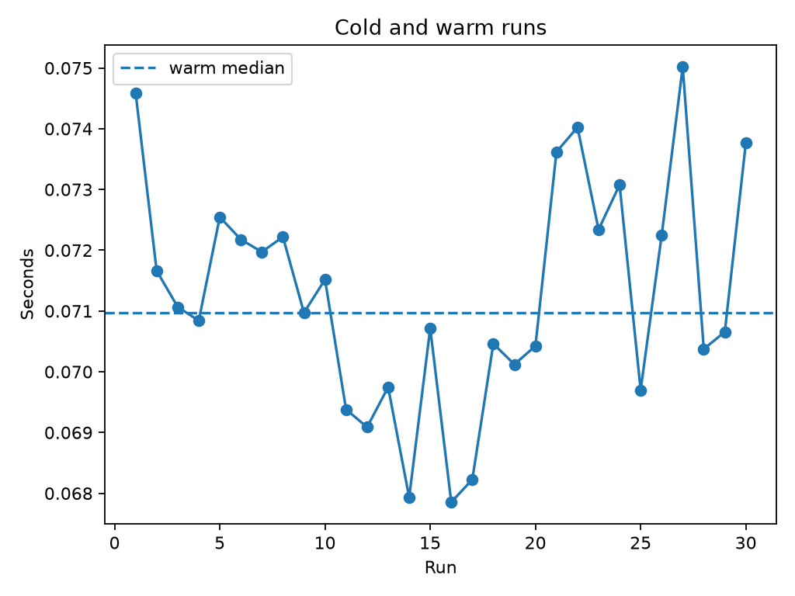

# Experiment 25 — CPU Warm-up and Frequency Scaling

[English](#english) · [한국어](#한국어) · [Repository README](../../README.md)

> **Key finding:** on the checked-in Windows run, the first execution took
> **0.074590 s**, versus a **0.070971 s** median across the next 29 executions.
> The first run was therefore **1.051× slower**. This is evidence for an early-run
> difference in this sequence—not proof that CPU frequency scaling caused it or
> that one discarded run is a sufficient warm-up policy.



---

## English

### Overview

This experiment records a CPU-bound Python kernel 30 times in one process. It
preserves every elapsed-time sample, labels the first observation `cold`, labels
the remaining observations `warm`, and samples the frequency reported by
`psutil.cpu_freq()` immediately before each timed run.

The goal is not to establish a universal warm-up count. It is to make the
usually implicit decision to discard early measurements visible and testable.

### Research Question and Hypothesis

**Question:** how does the first execution compare with the distribution of
later executions, and do the available frequency samples provide useful
supporting context?

**Hypothesis:** the first execution may be slower because code, data, memory
pages, caches, and CPU power state begin from a different state. Later timings
may converge, although scheduling, thermals, power policy, and background work
can obscure or reverse that pattern.

### Experimental Design

| Parameter | Checked-in value | Role |
| --- | ---: | --- |
| Kernel iterations | 1,000,000 | Fixed workload per run |
| Consecutive runs | 30 | One first run plus 29 later runs |
| Timer | `time.perf_counter_ns()` | Wall-clock elapsed time |
| Frequency source | `psutil.cpu_freq().current` | Pre-run observational sample |
| Correctness guard | Checksum `5,887,947` | Confirms identical kernel output |
| Platform | Windows 11 (`10.0.26200`) | Reference measurement environment |

The pure-Python kernel repeatedly evaluates:

```python
x = (x * 33 + i) % 1_000_000_007
```

All runs execute the same function, iteration count, process, and recurrence.
Run index is the explanatory variable; elapsed seconds and sampled MHz are
observations. The script does not insert an idle reset, pin the process to a
core, control the Windows power plan, or measure temperature.

### Measurement Protocol

For each run, the benchmark:

1. samples the frequency exposed by `psutil`;
2. starts `perf_counter_ns()`;
3. executes the kernel and stops the timer;
4. records the run number, phase, elapsed time, frequency, and checksum.

The first observation is a label-based operational definition of `cold`; it is
not a guarantee that every hardware and software layer was truly cold. The
`warm` median is computed from runs 2–30:

```text
first-to-warm ratio = first-run seconds / median(seconds for runs 2–30)
```

### Reproduction

Run commands from the repository root:

```bash
uv sync
uv run python experiments/exp25_cpu_warmup_frequency_scaling/benchmark.py
```

Fast smoke test:

```bash
uv run python experiments/exp25_cpu_warmup_frequency_scaling/benchmark.py --quick
```

`--quick` overrides the workload with 10,000 iterations and five runs. Custom
values can be supplied with `--iterations` and `--runs`; use at least two runs
so that the later-run median exists.

> Running the benchmark replaces the checked-in CSV, JSON, and figure in this
> experiment with measurements from the current machine.

### Checked-in Results

| Metric | Value |
| --- | ---: |
| First run | 0.074590 s |
| Later-run median (`n = 29`) | 0.070971 s |
| First / later median | 1.051× |
| Later-run mean | 0.071164 s |
| Later-run sample standard deviation | 0.001814 s |
| Later-run CV | 2.55% |
| Later-run minimum–maximum | 0.067854–0.075018 s |

The first observation was about **5.1% slower** than the later-run median, but
the later observations still varied: their maximum was about **10.6%** above
their minimum. “Warm” therefore means only “after the first observation” in
this experiment; it does not mean perfectly stationary.

Of 30 pre-run frequency samples, 29 reported 2300 MHz and one reported 1478
MHz. This near-constant, coarse series is insufficient for a meaningful
frequency–time relationship. The timing result and the frequency samples should
be read as two colocated observations, not as a causal explanation.

### Outputs

| Artifact | Contents |
| --- | --- |
| [`results/raw.csv`](results/raw.csv) | Per-run phase, seconds, sampled MHz, and checksum |
| [`results/summary.csv`](results/summary.csv) | First time, later median, ratio, and run count |
| [`results/metadata.json`](results/metadata.json) | Platform, workload size, run count, and frequency source |
| [`figures/warmup.png`](figures/warmup.png) | Time series with the later-run median reference line |

### Interpretation and Limitations

- This is one sequential series on one host, not repeated cold-start trials.
- The first run can include instruction/data-cache, page, allocator, interpreter,
  and scheduler effects; the design does not isolate any one mechanism.
- `psutil.cpu_freq()` is sampled before the timed region. Depending on the OS
  and hardware, it may be unavailable, averaged, quantized, stale, or unrelated
  to the exact core that later executes the process.
- Process affinity, core migration, temperature, power plan, background load,
  and system idle duration are not controlled or recorded.
- The benchmark reports a median ratio but no uncertainty interval across
  independent sessions. The observed 1.051× ratio is machine- and run-specific.
- A single first-vs-later comparison cannot determine the optimal number of
  warm-up runs for a different kernel.

### Conclusion and Next Steps

The checked-in sequence shows a modest first-run penalty alongside continued
later-run variation. Its practical lesson is methodological: inspect the
sequence before selecting a warm-up policy, preserve raw samples, and avoid
attributing a timing change to frequency from sparse pre-run samples alone.

A stronger follow-up would repeat the entire experiment after controlled idle
periods, randomize or pin core placement, record temperature and power policy,
sample per-core frequency during execution, and report uncertainty across
independent sessions.

---

## 한국어

### 개요

이 실험은 CPU-bound 순수 Python kernel을 한 process에서 30회 연속 실행한다.
모든 실행 시간을 보존하고 첫 관측값을 `cold`, 나머지를 `warm`으로 표시하며,
각 실행 직전에 `psutil.cpu_freq()`가 제공하는 CPU frequency를 표본으로 남긴다.

목표는 보편적인 warm-up 횟수를 정하는 것이 아니다. 흔히 암묵적으로 버리는
초기 측정값을 명시적으로 관찰하고, warm-up 정책을 데이터로 검토하는 것이다.

### 연구 질문과 가설

**질문:** 첫 실행 시간은 후속 실행 분포와 어떻게 다르며, 수집된 frequency
표본은 이를 해석하는 데 유용한 보조 정보를 제공하는가?

**가설:** code와 data, memory page, cache, CPU power state의 초기 상태 때문에
첫 실행이 느릴 수 있다. 이후 실행은 안정될 수 있지만 scheduling, 발열, 전원
정책과 background 작업이 이 경향을 가리거나 반대로 만들 수도 있다.

### 실험 설계

| 항목 | 저장된 실험값 | 역할 |
| --- | ---: | --- |
| Kernel iteration | 1,000,000 | 실행마다 동일한 작업량 |
| 연속 실행 | 30회 | 첫 실행 1회와 후속 실행 29회 |
| Timer | `time.perf_counter_ns()` | Wall-clock 실행 시간 |
| Frequency source | `psutil.cpu_freq().current` | 실행 직전 관측 표본 |
| 정확성 확인 | Checksum `5,887,947` | 모든 실행의 동일한 결과 확인 |
| Platform | Windows 11 (`10.0.26200`) | 기준 측정 환경 |

모든 실행은 같은 함수, iteration 수, process와 정수 recurrence를 사용한다.
설명 변수는 실행 순서이며, 실행 시간과 sampled MHz를 관측한다. Process affinity,
Windows power plan, 온도와 실행 전 idle 상태는 통제하지 않는다.

### 측정 절차

각 실행에서 frequency를 먼저 sampling하고, timer 안에서는 kernel만 실행한다.
이후 run 번호, `cold`/`warm` phase, 실행 시간, frequency와 checksum을 저장한다.

여기서 `cold`는 단지 첫 관측값을 뜻하는 조작적 정의다. 모든 hardware와
software 계층이 실제 cold state였음을 보장하지 않는다. `warm` 중앙값은 2–30번
실행으로 계산한다.

```text
첫 실행 대비 후속 중앙값 비율 = 첫 실행 시간 / 2–30번 실행 시간의 중앙값
```

### 재현 방법

Repository root에서 실행한다.

```bash
uv sync
uv run python experiments/exp25_cpu_warmup_frequency_scaling/benchmark.py
```

빠른 smoke test:

```bash
uv run python experiments/exp25_cpu_warmup_frequency_scaling/benchmark.py --quick
```

`--quick`은 workload를 10,000 iterations와 5회 실행으로 바꾼다.
`--iterations`, `--runs`로 값을 조절할 수 있으며, 후속 중앙값을 계산하려면
적어도 2회 실행해야 한다.

> Benchmark를 다시 실행하면 저장된 CSV, JSON과 figure가 현재 machine의
> 측정값으로 교체된다.

### 저장된 결과

| 지표 | 값 |
| --- | ---: |
| 첫 실행 | 0.074590초 |
| 후속 실행 중앙값 (`n = 29`) | 0.070971초 |
| 첫 실행 / 후속 중앙값 | 1.051× |
| 후속 실행 평균 | 0.071164초 |
| 후속 실행 표본 표준편차 | 0.001814초 |
| 후속 실행 CV | 2.55% |
| 후속 실행 최솟값–최댓값 | 0.067854–0.075018초 |

첫 실행은 후속 중앙값보다 약 **5.1% 느렸다**. 그러나 후속 실행의 최댓값도
최솟값보다 약 **10.6% 높아**, 첫 실행 뒤 시간이 완전히 안정되었다고 말할 수는
없다. 이 실험에서 `warm`은 오직 “첫 관측 이후”라는 뜻이다.

실행 전 frequency 표본 30개 중 29개는 2300 MHz, 1개는 1478 MHz였다. 거의
변하지 않는 이 coarse sample만으로 frequency와 실행 시간의 관계를 분석하거나
인과관계를 주장할 수 없다.

### 산출물

| 파일 | 내용 |
| --- | --- |
| [`results/raw.csv`](results/raw.csv) | 실행별 phase, 시간, sampled MHz, checksum |
| [`results/summary.csv`](results/summary.csv) | 첫 실행, 후속 중앙값, 비율, 실행 횟수 |
| [`results/metadata.json`](results/metadata.json) | Platform, workload, 실행 횟수, frequency source |
| [`figures/warmup.png`](figures/warmup.png) | 실행 순서별 시간과 후속 중앙값 기준선 |

### 해석과 한계

- 한 host에서 얻은 연속 sequence 하나이며, 독립적인 cold-start 반복이 아니다.
- 첫 실행에는 cache, page, allocator, interpreter와 scheduler 효과가 함께 포함될
  수 있으며 어느 한 원인을 분리하지 않는다.
- Frequency는 timed region 직전에 sampling한다. OS와 hardware에 따라 값이
  없거나 평균·양자화·지연된 값일 수 있고, 실제 실행 core와 다를 수도 있다.
- Core migration, affinity, 온도, 전원 정책, background load와 idle 시간을
  통제하거나 기록하지 않는다.
- 독립 session 사이의 uncertainty interval 없이 한 sequence의 중앙값 비율만
  보고하므로 1.051×는 이 machine과 실행에 한정된다.
- 첫 실행과 후속 실행을 한 번 비교한 결과로 다른 kernel의 최적 warm-up 횟수를
  결정할 수 없다.

### 결론과 후속 연구

저장된 sequence에서는 첫 실행이 다소 느렸지만 후속 실행에도 변동이 남았다.
따라서 warm-up 횟수를 관습적으로 정하기보다 전체 sequence를 먼저 확인하고,
raw sample을 보존하며, 드문 실행 전 frequency 표본만으로 원인을 단정하지 않는
것이 핵심이다.

후속 실험에서는 통제된 idle 뒤 전체 sequence를 여러 번 반복하고, core affinity,
온도와 power policy를 기록하며, 실행 중 per-core frequency를 수집해 독립 session
사이의 uncertainty를 보고할 수 있다.
